# WaWa Point — 아키텍처 및 모듈 상세 문서

> **버전**: 1.0.0  
> **프레임워크**: Flutter 3.11+ / Dart 3.11+  
> **아키텍처 패턴**: MVVM (Model-View-ViewModel)  
> **상태 관리**: Provider (ChangeNotifier)

---

## 목차

1. [프로젝트 개요](#1-프로젝트-개요)
2. [전체 아키텍처](#2-전체-아키텍처)
3. [디렉토리 구조](#3-디렉토리-구조)
4. [MVVM 계층 구조](#4-mvvm-계층-구조)
5. [데이터 흐름](#5-데이터-흐름)
6. [Model 계층](#6-model-계층)
7. [ViewModel 계층](#7-viewmodel-계층)
8. [View 계층 (Screens)](#8-view-계층-screens)
9. [Utils / Service 계층](#9-utils--service-계층)
10. [디자인 시스템](#10-디자인-시스템)
11. [Provider 의존성 그래프](#11-provider-의존성-그래프)
12. [데이터 영속성 전략](#12-데이터-영속성-전략)
13. [백업 / 복원 파이프라인](#13-백업--복원-파이프라인)
14. [화면 네비게이션](#14-화면-네비게이션)
15. [외부 의존성](#15-외부-의존성)

---

## 1. 프로젝트 개요

**WaWa Point**는 포인트 적립 및 사용을 추적하는 개인 재무 관리 앱입니다.

### 핵심 기능

| 기능 | 설명 |
|------|------|
| 포인트 적립 | 포인트 단위로 수입 기록, KRW 자동 환산 |
| 사용 기록 | 원화(KRW) 단위로 지출 기록, 잔액 검증 |
| 잔액 관리 | 실시간 잔액 추적, 포인트↔원화 이중 표시 |
| 거래 내역 | 전체 기록 조회, 기간별 필터, 차트 시각화 |
| 백업/복원 | JSON 포맷 내보내기/가져오기, 파일 공유 |
| 설정 | 포인트→원화 환산율 관리 |

---

## 2. 전체 아키텍처

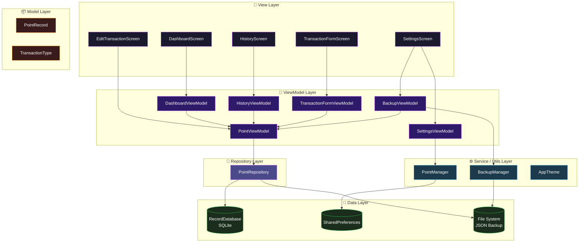

---

## 3. 디렉토리 구조

```
lib/
├── main.dart                          # 앱 진입점, Provider 등록, 테마 설정
└── src/
    ├── constants/                     # 공통 상수 및 설정값
    ├── data/                          # 로우레벨 데이터 소스 및 유틸리티
    │   ├── backup_manager.dart        # JSON 백업 직렬화/역직렬화
    │   ├── point_manager.dart         # 포인트↔원화 변환 로직
    │   └── record_database.dart       # SQLite 래퍼
    ├── models/                        # 도메인 데이터 모델
    │   └── point_record.dart          # PointRecord, TransactionType
    ├── providers/                     # 상태 관리 (ViewModel 역할)
    │   ├── backup_view_model.dart     # 백업/복원 로직
    │   ├── dashboard_view_model.dart  # 대시보드 상태 및 애니메이션
    │   ├── history_view_model.dart    # 히스토리 필터링 및 가공
    │   ├── point_view_model.dart      # 핵심 전역 상태 (잔액, 기록)
    │   ├── settings_view_model.dart   # 설정 관리
    │   └── transaction_form_view_model.dart # 입력 폼 로직
    ├── repositories/                  # 데이터 소스 추상화 레이어
    │   └── point_repository.dart      # SQLite + Legacy Migration 중재
    └── ui/                            # 시각적 요소 레이어
        ├── app_theme.dart             # 디자인 시스템 및 테마
        └── screens/                   # 앱 화면 (View)
            ├── dashboard_screen.dart  # 메인 대시보드
            ├── edit_transaction_screen.dart # 거래 수정
            ├── history_screen.dart    # 전체 내역 및 차트
            ├── settings_screen.dart   # 설정 및 데이터 관리
            └── transaction_form_screen.dart # 입력 폼
```

---

## 4. MVVM 계층 구조

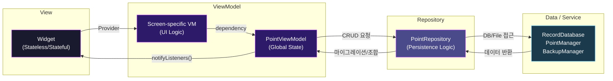

### MVVM 역할 분리 원칙

| 계층 | 책임 | 금지 사항 |
|------|------|-----------|
| **View** | UI 렌더링, 사용자 입력 수신, ViewModel 호출 | 비즈니스 로직, 직접적인 데이터 가공 |
| **ViewModel** | UI 상태 및 비즈니스 로직 관리, 데이터 바인딩 | UI 코드(`BuildContext` 보유 금지), 데이터 저장소 직접 접근 |
| **Repository** | 데이터 출처(SQLite, File) 관리 및 마이그레이션 | UI 상태 관리, 복잡한 비즈니스 로직 |
| **Model** | 데이터 구조 정의, 직렬화/역직렬화 | 로직 포함, 상태 변경 알림 |
| **Service/Utils** | 로우레벨 인프라 접근 (DB 엔진, 유틸리티) | 상태 관리, 업무 도메인 로직 |

---

## 5. 데이터 흐름

### 5.1 포인트 적립 흐름

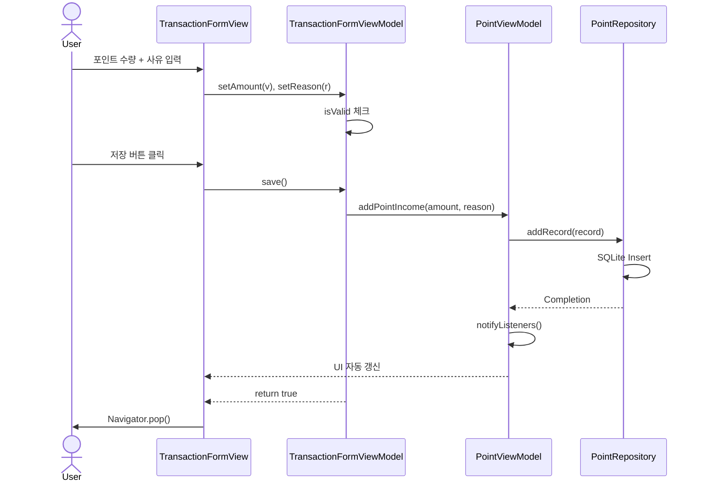

### 5.2 지출 기록 흐름

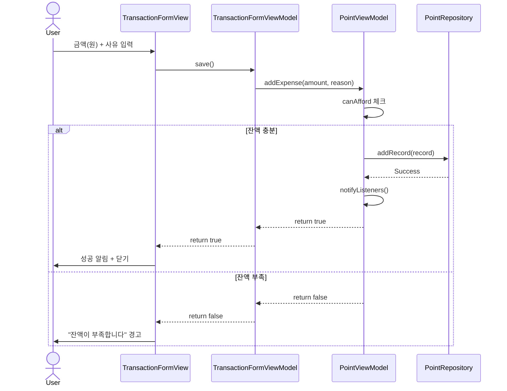

### 5.3 백업/복원 흐름

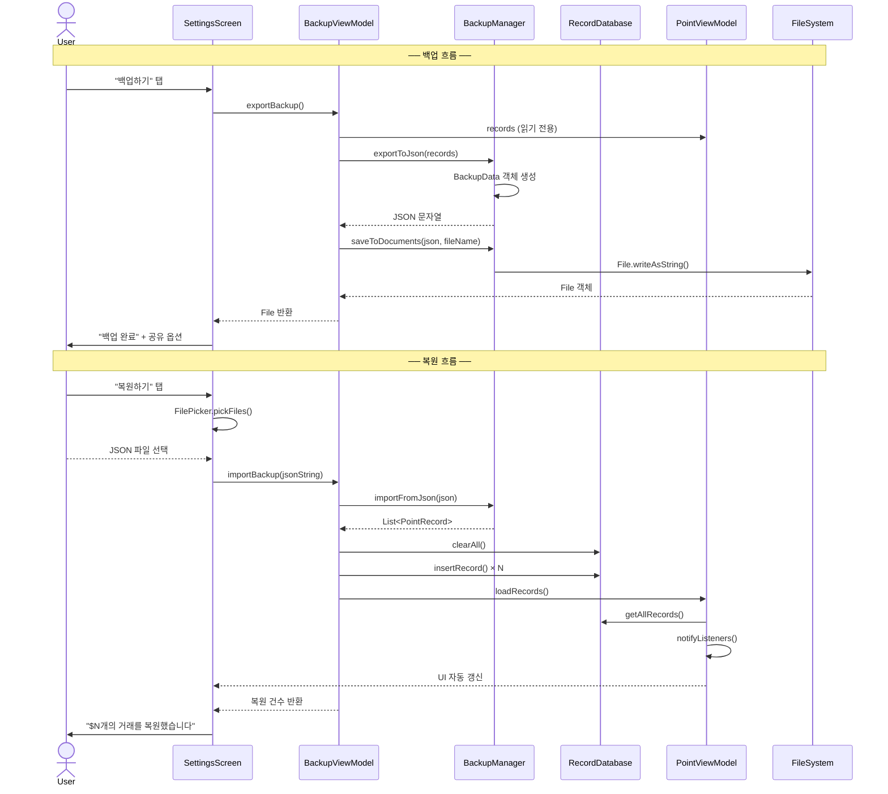

---

## 6. Model 계층

### 6.1 PointRecord

거래 하나를 표현하는 핵심 데이터 모델입니다.

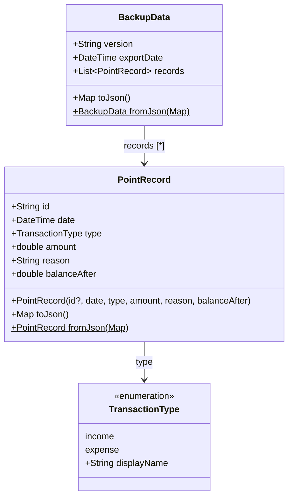

#### 필드 상세

| 필드 | 타입 | 설명 | 비고 |
|------|------|------|------|
| `id` | `String` | 고유 식별자 | UUID v4 자동 생성 |
| `date` | `DateTime` | 거래 일시 | ISO 8601 형식으로 직렬화 |
| `type` | `TransactionType` | 수입/지출 구분 | enum (`income`, `expense`) |
| `amount` | `double` | 거래 금액 | 수입: 포인트 단위, 지출: 원화 단위 |
| `reason` | `String` | 거래 사유 | 사용자 입력 |
| `balanceAfter` | `double` | 거래 후 잔액 (원화) | 자동 계산 |

#### 직렬화

`toJson()` / `fromJson()`을 통해 SQLite 저장 및 JSON 백업에 동일한 포맷을 사용합니다.

```json
{
  "id": "550e8400-e29b-41d4-a716-446655440000",
  "date": "2026-03-10T14:30:00.000",
  "type": "income",
  "amount": 5.0,
  "reason": "설문 참여",
  "balanceAfter": 12500.0
}
```

### 6.2 TransactionType

| 값 | displayName | 용도 |
|----|-------------|------|
| `income` | 포인트 지급 | 포인트 적립 거래 |
| `expense` | 사용 | 원화 사용 거래 |

### 6.3 BackupData

백업 파일의 루트 구조를 정의하는 wrapper 모델입니다.

| 필드 | 타입 | 설명 |
|------|------|------|
| `version` | `String` | 백업 포맷 버전 (`"1.0"`) |
| `exportDate` | `DateTime` | 백업 생성 시각 |
| `records` | `List<PointRecord>` | 전체 거래 기록 |

---

## 7. ViewModel 계층

### 7.1 ViewModel 관계도

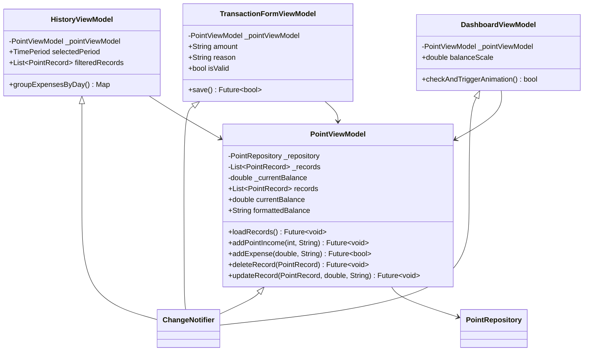

### 7.2 PointViewModel — 전역 상태 관리

거래 데이터의 원본(Single Source of Truth)과 전체 잔액을 관리합니다. 모든 데이터 변경 요청은 최종적으로 이 ViewModel을 통해 처리됩니다.

### 7.3 Screen-specific ViewModels

각 화면의 복잡한 UI 로직과 일시적인 상태를 관리합니다.
- **HistoryViewModel**: 필터링, 통계, 차트 데이터 가공
- **TransactionFormViewModel**: 입력 폼 상태, 유효성 검사, 저장 프로세스
- **DashboardViewModel**: 애니메이션 트리거, 대시보드 전용 시각적 상태
    - *특이사항*: 런타임 예외 방지를 위해 `PointViewModel`을 직접 `addListener`로 구독하여, 빌드 시점이 아닌 데이터 변경 시점에 독립적으로 애니메이션을 트리거함.

---

## 8. Repository 계층

### 8.1 PointRepository

**파일**: `lib/src/repositories/point_repository.dart`

데이터의 영속성(Persistence)을 전담하며, 다양한 데이터 소스 간의 중재자 역할을 합니다.

| 책임 | 설명 |
|------|------|
| **추상화** | ViewModel이 SQLite나 File System에 직접 접근하지 않도록 격리 |
| **마이그레이션** | 앱 초기 실행 시 레거시 JSON 데이터를 SQLite로 자동 이관 및 원본 삭제 |
| **무결성** | 데이터 저장/읽기 시 형식 검증 및 일관성 유지 (잔액 재계산 포함) |

### 7.3 BackupViewModel — 백업/복원

**파일**: `lib/src/providers/backup_view_model.dart`

데이터 내보내기/가져오기 및 전체 삭제를 전담합니다. `PointViewModel`에 대한 참조를 보유하여 복원 후 상태를 동기화합니다.

#### 주요 메서드

| 메서드 | 설명 |
|--------|------|
| `exportBackup()` | `PointViewModel.records` 읽기 → `BackupManager`로 JSON 직렬화 → 파일 저장 → `File` 반환 |
| `importBackup(jsonString)` | JSON 역직렬화 → SQLite 전체 교체 → `PointViewModel.loadRecords()` 호출 → 레코드 수 반환 |
| `clearAllData()` | SQLite 전체 삭제 → `PointViewModel.loadRecords()` 호출 (빈 상태 반영) |

#### 의존성 주입

`ChangeNotifierProxyProvider`를 통해 `PointViewModel` 인스턴스를 생성자에서 주입받습니다.

```dart
ChangeNotifierProxyProvider<PointViewModel, BackupViewModel>(
  create: (ctx) => BackupViewModel(ctx.read<PointViewModel>()),
  update: (_, pointVM, prev) => prev ?? BackupViewModel(pointVM),
)
```

### 7.4 SettingsViewModel — 설정 관리

**파일**: `lib/src/providers/settings_view_model.dart`

포인트 환산율 설정을 관리합니다. `PointManager` 싱글턴을 통해 `SharedPreferences`에 영속화합니다.

#### 주요 메서드

| 메서드 | 설명 |
|--------|------|
| `load()` | `PointManager().load()` 호출 후 현재 환산율 동기화 |
| `setRate(rate)` | 환산율 검증(>0) → `PointManager().setRate()` 호출 → 내부 상태 갱신 → 알림 |

#### 상태

| 프로퍼티 | 타입 | 설명 |
|----------|------|------|
| `pointRate` | `double` | 1 포인트당 원화 가치 |
| `formattedRate` | `String` | 소수점 제거된 표시용 문자열 |

---

## 8. View 계층 (Screens)

### 8.1 화면 구성도

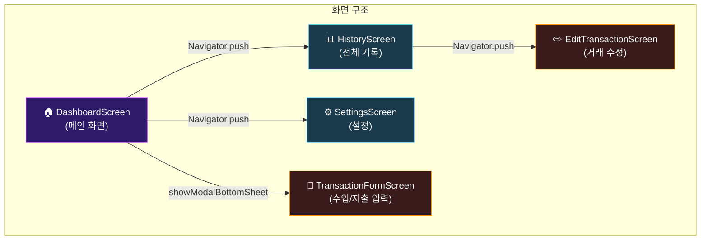

### 8.2 DashboardScreen (메인 대시보드)

**파일**: `lib/src/ui/screens/dashboard_screen.dart`

앱 실행 시 최초로 표시되는 메인 화면입니다.

#### 위젯 트리

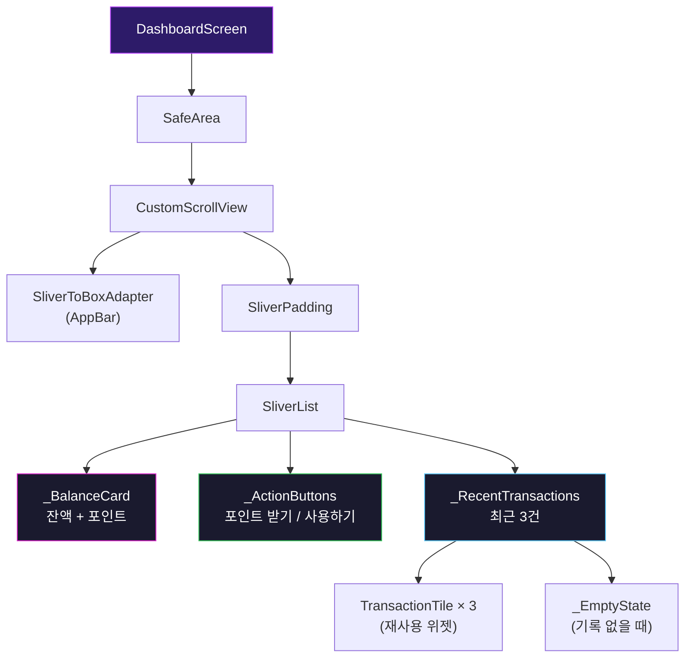

#### 주요 특징

- **Consumer\<PointViewModel\>**: 전체 화면을 감싸서 잔액/기록 변경 시 자동 리빌드
- **잔액 애니메이션**: `AnimatedScale`로 잔액 변동 시 바운스(1.0 → 1.1 → 1.0)
- **커스텀 AppBar**: SliverToBoxAdapter + Row로 설정 버튼이 포함된 슬림 앱바
- **ShaderMask**: 잔액 텍스트에 보라/마젠타 그라데이션 적용
- **TransactionTile**: HistoryScreen과 공유하는 재사용 위젯

#### ViewModel 사용

| 접근 방식 | 사용 위치 | 접근 프로퍼티/메서드 |
|-----------|-----------|---------------------|
| `Consumer<PointViewModel>` | build() 전체 | `currentBalance`, `formattedBalance`, `formattedPoints`, `records` |

### 8.3 HistoryScreen (전체 기록)

**파일**: `lib/src/ui/screens/history_screen.dart`

전체 거래 내역을 조회하고 분석하는 화면입니다.

#### 위젯 트리

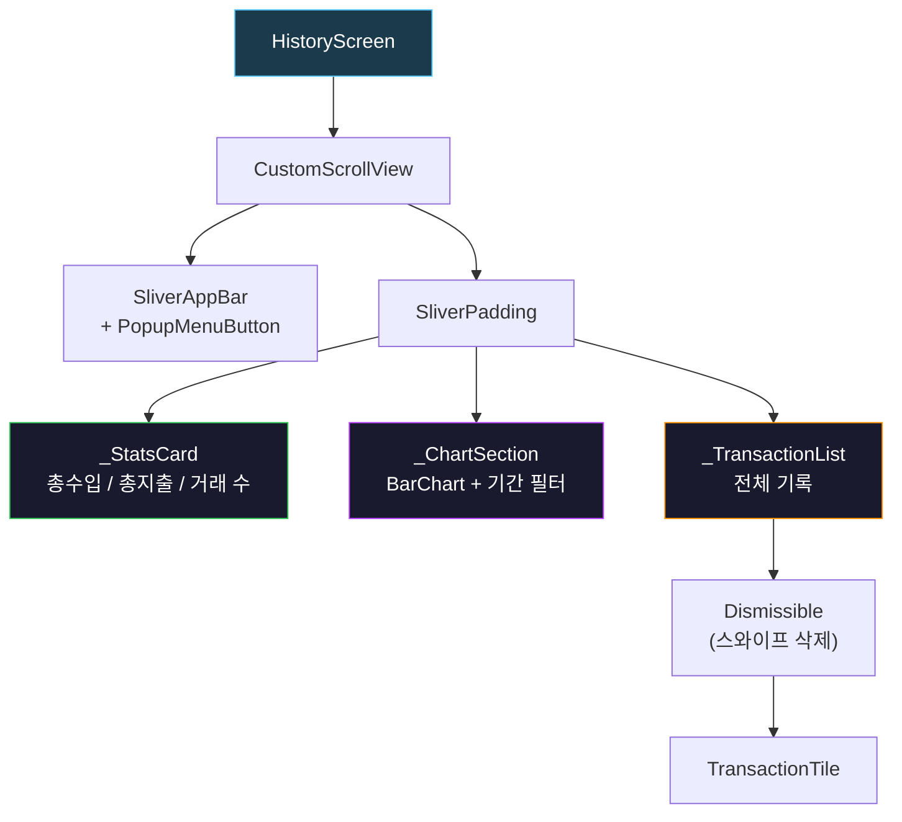

#### 주요 기능

| 기능 | 설명 |
|------|------|
| **통계 카드** | 총 수입, 총 지출, 전체 거래 건수 한눈에 표시 |
| **차트** | `fl_chart` 라이브러리의 `BarChart`로 기간별 지출 추이 시각화 |
| **기간 필터** | `SegmentedButton`으로 주간/월간/연간 전환 |
| **스와이프 삭제** | `Dismissible` 위젯으로 좌측 스와이프 → 삭제 확인 |
| **롱프레스 메뉴** | 수정/삭제 옵션이 포함된 BottomSheet |
| **잔액 재계산** | AppBar의 PopupMenuButton에서 일괄 재계산 |
| **데이터 검증** | `validateBalances()`로 불일치 검출 → 수정 제안 |

#### ViewModel 사용

| 접근 방식 | 접근 프로퍼티/메서드 |
|-----------|---------------------|
| `Consumer<PointViewModel>` | `records`, `deleteRecord()`, `validateBalances()`, `recalculateAllBalances()` |

### 8.4 TransactionFormScreen (수입/지출 입력)

**파일**: `lib/src/ui/screens/transaction_form_screen.dart`

수입 또는 지출 거래를 생성하는 Bottom Sheet 기반 폼입니다.

#### 주요 특징

- **동적 UI**: `TransactionType` 파라미터에 따라 수입/지출 모드 전환
- **수입 모드**: 포인트 단위 입력, KRW 환산 미리보기
- **지출 모드**: 원화 단위 입력, 현재 잔액 표시
- **증감 버튼**: ±1P (수입) 또는 ±1,000원 (지출) 스텝
- **입력 검증**: 금액 > 0 && 사유 비어있지 않아야 저장 가능
- **그라데이션 저장 버튼**: purple gradient + press animation

#### ViewModel 사용

| 접근 방식 | 접근 프로퍼티/메서드 |
|-----------|---------------------|
| `context.read<PointViewModel>()` | `addPointIncome()`, `addExpense()` |
| `Consumer<PointViewModel>` (중첩) | `formattedBalance` (지출 모드에서 잔액 표시) |

### 8.5 EditTransactionScreen (거래 수정)

**파일**: `lib/src/ui/screens/edit_transaction_screen.dart`

기존 거래의 금액과 사유를 수정하는 화면입니다.

#### 주요 특징

- **기존 값 프리로드**: 생성자로 `PointRecord` 전달받아 초기값 세팅
- **경고 메시지**: "금액 변경 시 이후 모든 거래의 잔액이 재계산됩니다" 표시
- **Navigator.push**: HistoryScreen에서 전체 화면으로 전환

#### ViewModel 사용

| 접근 방식 | 접근 프로퍼티/메서드 |
|-----------|---------------------|
| `context.read<PointViewModel>()` | `updateRecord()` |

### 8.6 SettingsScreen (설정)

**파일**: `lib/src/ui/screens/settings_screen.dart`

앱 설정, 백업/복원, 데이터 관리를 담당하는 화면입니다.

#### 섹션 구성

| 섹션 | 기능 | ViewModel |
|------|------|-----------|
| 포인트 설정 | 1 포인트당 원화 가치 설정 | `SettingsViewModel` |
| 백업 및 복원 | JSON 파일 내보내기/가져오기 | `BackupViewModel` |
| 앱 정보 | 버전, 개발자, 출시일 | 없음 (static) |
| 데이터 관리 | 잔액 재계산, 모든 데이터 삭제 | `PointViewModel`, `BackupViewModel` |

#### ViewModel 사용

| ViewModel | 접근 방식 | 메서드 |
|-----------|-----------|--------|
| `PointViewModel` | `context.watch` | `recalculateAllBalances()` |
| `BackupViewModel` | `context.read` | `exportBackup()`, `importBackup()`, `clearAllData()` |
| `SettingsViewModel` | `context.read` | `formattedRate`, `setRate()` |

---

## 9. Utils / Service 계층

### 9.1 전체 서비스 구조

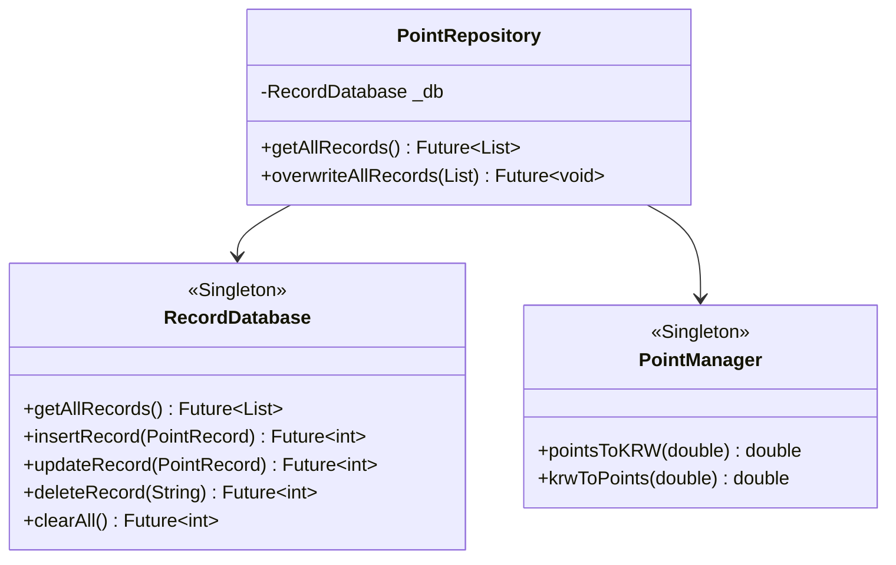

### 9.2 RecordDatabase — SQLite 래퍼

**파일**: `lib/src/data/record_database.dart`
  
**패턴**: Singleton (`RecordDatabase.instance`)

SQLite 데이터베이스에 대한 CRUD 연산을 제공합니다.

#### 데이터베이스 스키마

```sql
CREATE TABLE records (
    id          TEXT PRIMARY KEY,    -- UUID v4
    date        TEXT NOT NULL,       -- ISO 8601
    type        TEXT NOT NULL,       -- 'income' | 'expense'
    amount      REAL NOT NULL,       -- 포인트 또는 원화
    reason      TEXT NOT NULL,       -- 거래 사유
    balanceAfter REAL NOT NULL       -- 거래 후 잔액 (원화)
);
```

#### 메서드 상세

| 메서드 | SQL | 설명 |
|--------|-----|------|
| `getAllRecords()` | `SELECT * ORDER BY date DESC` | 최신순 전체 조회 |
| `insertRecord(r)` | `INSERT INTO records` | 단건 삽입 |
| `updateRecord(r)` | `UPDATE WHERE id = ?` | ID 기준 업데이트 |
| `deleteRecord(id)` | `DELETE WHERE id = ?` | ID 기준 삭제 |
| `clearAll()` | `DELETE FROM records` | 전체 삭제 |

#### 데이터베이스 위치

- **iOS**: `NSDocumentsDirectory/../Library/Application Support/databases/wawapoint.db`  
- **Android**: `/data/data/com.example.wawapoint/databases/wawapoint.db`

### 9.3 PointManager — 포인트 환산 유틸

**파일**: `lib/src/data/point_manager.dart`
  
**패턴**: Singleton (`PointManager()`)

포인트와 원화(KRW) 간 변환 및 포맷팅을 담당합니다.

#### 환산 공식

```
KRW = 포인트 × pointToKRWRate
포인트 = KRW ÷ pointToKRWRate
```

기본 환산율: **1 포인트 = 2,500원**

#### 메서드 상세

| 메서드 | 설명 | 예시 |
|--------|------|------|
| `pointsToKRW(5.0)` | 포인트→원화 | `12,500.0` |
| `krwToPoints(10000.0)` | 원화→포인트 | `4.0` |
| `canAfford(12500, 5000)` | 잔액 검증 | `true` |
| `formatKRW(12500.0)` | 원화 포맷 | `"12,500원"` |
| `formatPoints(5.0)` | 포인트 포맷 | `"5 P"` |
| `setRate(3000.0)` | 환산율 변경 | SharedPreferences 저장 |

#### 영속성

`SharedPreferences`의 `pointToKRWRate` 키에 환산율을 저장합니다.

### 9.4 BackupManager — 백업 직렬화

**파일**: `lib/src/data/backup_manager.dart`
  
**패턴**: Singleton (`BackupManager()`)

거래 기록을 JSON 포맷으로 내보내고 가져오는 기능을 제공합니다.

#### 백업 파일 구조

```json
{
  "version": "1.0",
  "exportDate": "2026-03-10T15:53:40.000",
  "records": [
    {
      "id": "550e8400-...",
      "date": "2026-03-10T14:30:00.000",
      "type": "income",
      "amount": 5.0,
      "reason": "설문 참여",
      "balanceAfter": 12500.0
    }
  ]
}
```

#### 파일명 규칙

`WaWaPoint_Backup_yyyy-MM-dd_HHmmss.json`  
예: `WaWaPoint_Backup_2026-03-10_153340.json`

#### 메서드 상세

| 메서드 | 설명 |
|--------|------|
| `exportToJson(records)` | `List<PointRecord>` → pretty-printed JSON 문자열 |
| `saveToDocuments(json, name)` | Documents 디렉토리에 파일 저장 |
| `importFromJson(json)` | JSON 문자열 → `List<PointRecord>` 파싱 |
| `validateBackupData(json)` | 파일 유효성 검증 (isValid, recordCount, exportDate) |
| `generateFileName()` | 타임스탬프 기반 파일명 생성 |

---

## 10. 디자인 시스템

**파일**: `lib/src/ui/app_theme.dart`

AMOLED 친화적인 순수 블랙 (#000000) 기반 다크 테마 디자인 시스템입니다.

### 10.1 색상 체계

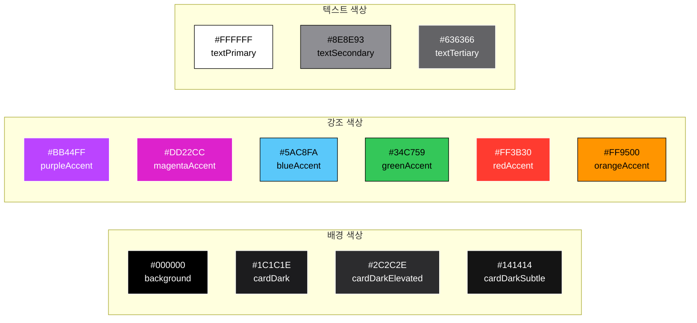

### 10.2 그라데이션

| 이름 | 색상 | 용도 |
|------|------|------|
| `balanceText` | #DD22CC → #BB44FF | 잔액 텍스트 ShaderMask |
| `incomeButton` | #2ECC71 → #27AE60 | "포인트 받기" 버튼 |
| `expenseButton` | #FF6B35 → #FF3B30 | "사용하기" 버튼 |
| `saveButton` | #5856D6 → #BB44FF | 저장 버튼 |
| `purpleGlow` | #1A0A2E → #0D0D0D | 배경 글로우 효과 |

### 10.3 데코레이션 프리셋

| 이름 | 설명 |
|------|------|
| `AppDecorations.card()` | 기본 카드 (cardDark, radius 20) |
| `AppDecorations.cardElevated()` | 강조 카드 (cardDarkElevated, radius 20) |
| `AppDecorations.balanceCard()` | 잔액 카드 (보라색 테두리 + 그림자) |
| `AppDecorations.pill()` | 알약형 컨테이너 (radius 20) |

### 10.4 주요 컴포넌트 가이드

#### 콤팩트 액션 버튼 (_ActionButton)
세로 공간 효율을 위해 로고 옆에 텍스트가 오는 가로형(Row) 레이아웃을 채택하고, 가독성을 위해 아이콘에 `weight: 900` (Bold) 및 명시적인 `alignment: Alignment.center`를 적용함.

---

## 11. Provider 의존성 그래프

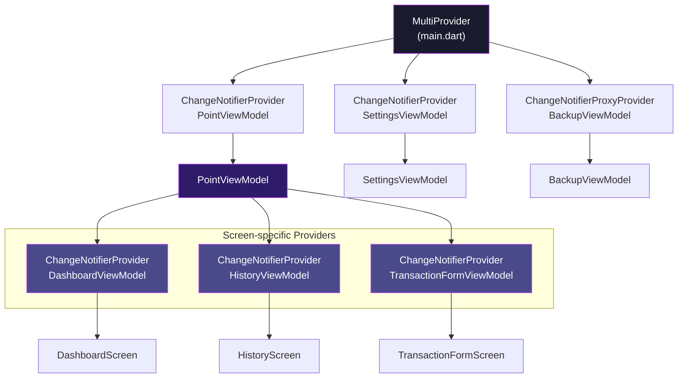

### Provider 접근 패턴 요약

| 패턴 | 용도 | 사용처 |
|------|------|--------|
| `Consumer<T>` | 위젯 리빌드 필요 시 | 전 과정 (Dashboard, History 등) |
| `ChangeNotifierProvider` | 화면 진입 시 전용 VM 생성 | Dashboard, History, TransactionForm |
| `context.read<T>()` | 이벤트 핸들러에서 1회 읽기 | 데이터 저장, 화면 전환 등 |

---

## 12. 데이터 영속성 전략

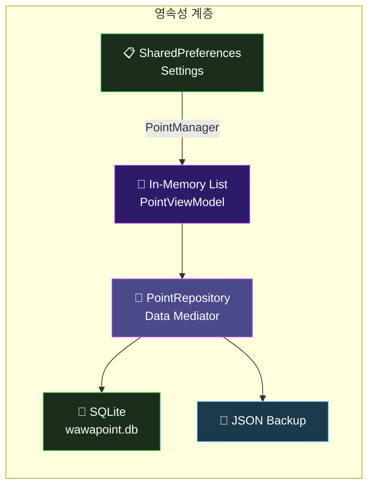

### 저장소별 역할

| 저장소 | 용도 | 데이터 |
|--------|------|--------|
| **In-Memory** | 실시간 상태 관리 | `List<PointRecord>`, `currentBalance` |
| **PointRepository** | 데이터 접근 추상화 | 데이터 결합 및 마이그레이션 로직 |
| **SQLite** | 메인 영속성 저장소 | 전체 거래 기록 |
| **SharedPreferences** | 설정값 저장 | 포인트 환산율 |

---

## 13. 백업 / 복원 파이프라인

### 13.1 백업 파이프라인

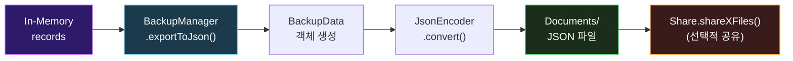

### 13.2 복원 파이프라인

```mermaid
flowchart LR
    A["FilePicker<br/>.pickFiles()"] --> B["File.readAsString()"]
    B --> C["BackupManager<br/>.importFromJson()"]
    C --> D["List&lt;PointRecord&gt;"]
    D --> E["RecordDatabase<br/>.clearAll()"]
    E --> F["RecordDatabase<br/>.insertRecord() × N"]
    F --> G["PointViewModel<br/>.loadRecords()"]
    G --> H["UI 자동 갱신"]

    style A fill:#3a1b1b,stroke:#FF9500,color:#fff
    style C fill:#1b3a4b,stroke:#5AC8FA,color:#fff
    style E fill:#1b2e1b,stroke:#34C759,color:#fff
    style G fill:#2d1b69,stroke:#BB44FF,color:#fff
    style H fill:#1a1a2e,stroke:#DD22CC,color:#fff
```

---

## 14. 화면 네비게이션

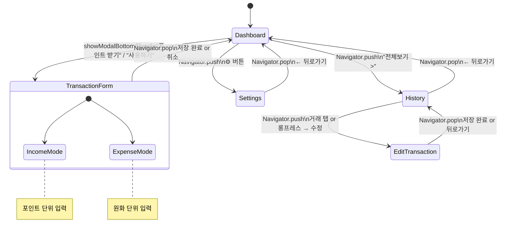

---

## 15. 외부 의존성

### 15.1 런타임 의존성

| 패키지 | 버전 | 용도 | 사용처 |
|--------|------|------|--------|
| `provider` | ^6.1.2 | 상태 관리 (MVVM) | main.dart, 모든 Screen |
| `sqflite` | ^2.2.0+3 | SQLite 데이터베이스 | RecordDatabase |
| `path` | ^1.8.3 | 파일 경로 유틸 | RecordDatabase |
| `path_provider` | ^2.1.4 | 플랫폼별 디렉토리 경로 | BackupManager, PointViewModel |
| `shared_preferences` | ^2.3.2 | 키-값 영속 저장 | PointManager |
| `intl` | ^0.19.0 | 숫자/날짜 포맷 | PointManager, Screens |
| `uuid` | ^4.4.2 | 고유 ID 생성 | PointRecord |
| `file_picker` | ^8.1.2 | 파일 선택 UI | SettingsScreen (복원) |
| `share_plus` | ^10.1.2 | 파일 공유 | SettingsScreen (백업 공유) |
| `fl_chart` | ^0.69.0 | 차트 시각화 | HistoryScreen |
| `cupertino_icons` | ^1.0.8 | iOS 스타일 아이콘 | 전체 UI |

### 15.2 개발 의존성

| 패키지 | 버전 | 용도 |
|--------|------|------|
| `flutter_test` | SDK | 위젯/유닛 테스트 |
| `sqflite_common_ffi` | ^2.3.0+2 | 데스크톱 환경 SQLite 테스트 |
| `flutter_launcher_icons` | ^0.14.3 | 앱 아이콘 생성 자동화 |

---

## 부록: 주요 설계 결정 사항

### A. 왜 SQLite를 선택했는가?

| 고려사항 | JSON 파일 | SharedPreferences | **SQLite** |
|----------|-----------|-------------------|------------|
| 구조화 쿼리 | ❌ | ❌ | ✅ |
| 대용량 데이터 | ❌ 전체 로드 | ❌ 부적합 | ✅ 인덱스 |
| ACID 트랜잭션 | ❌ | ❌ | ✅ |
| 부분 업데이트 | ❌ 전체 쓰기 | ❌ | ✅ 행 단위 |

### B. 왜 백업은 JSON인가?

- **사람이 읽을 수 있음**: 디버깅 용이
- **플랫폼 독립적**: iOS ↔ Android 이동 가능
- **버전 관리**: `version` 필드로 호환성 관리
- **공유 용이**: 일반 텍스트 파일로 이메일/메신저 전송 가능

### C. ViewModel 분리 기준

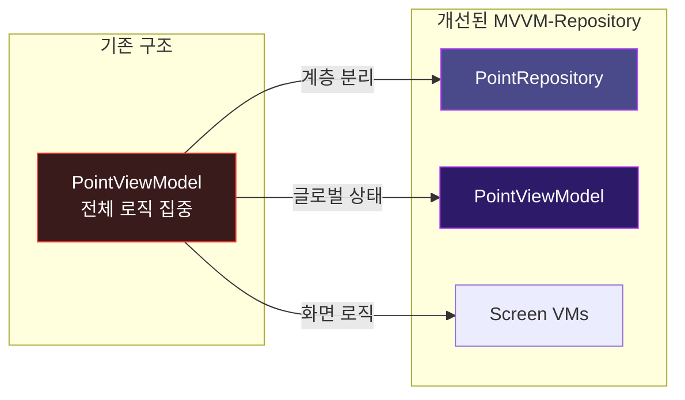

| ViewModel | 주요 역할 |
|-----------|-----------|
| `PointViewModel` | 앱 전역 데이터 및 잔액 상태 관리 |
| `HistoryViewModel` | 이력 조회 및 통계/차트 로직 |
| `TransactionFormViewModel` | 신규 거래 입력 및 유효성 검사 |
| `DashboardViewModel` | 대시보드 전용 UI 효과 관리 |
| `BackupViewModel` | 데이터 내보내기/가져오기 프로세스 |
| `SettingsViewModel` | 앱 설정 및 환경 변수 관리 |
