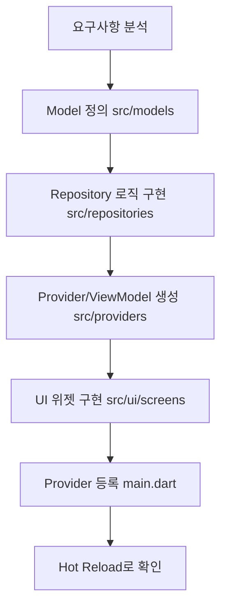
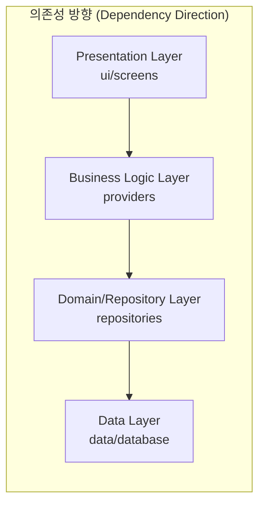
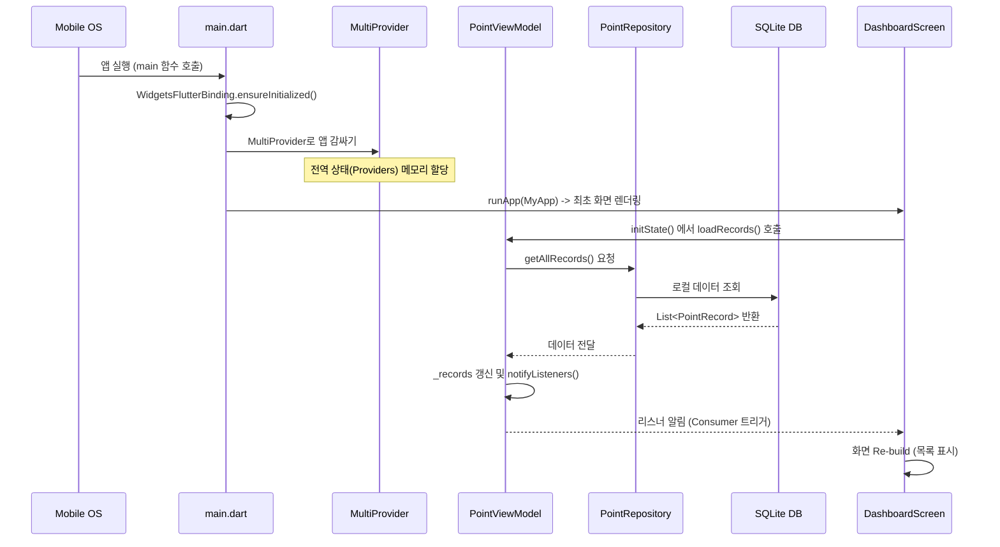
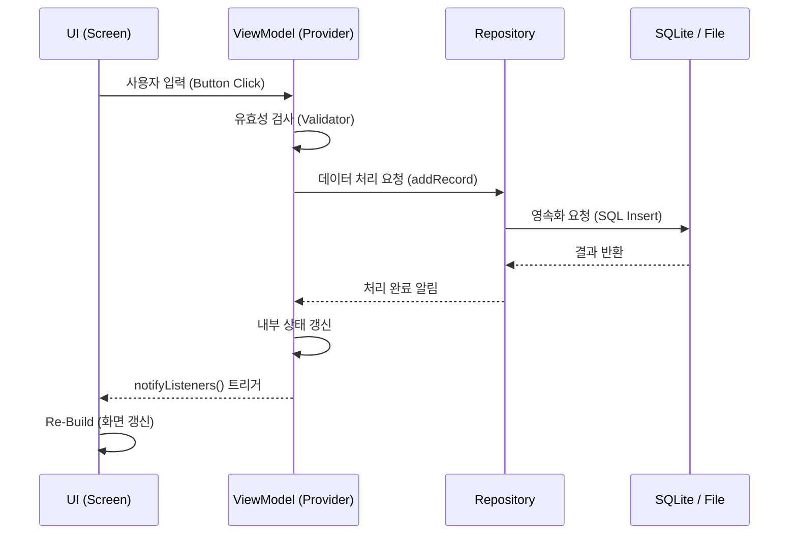

# WaWa Point — Flutter 개발자 학습 가이드 🚀

본 문서는 Flutter를 이전에 경험했으나 최신 트렌드와 본 프로젝트의 구조를 빠르게 파악하고자 하는 개발자를 위해 작성되었습니다.

---

## 1. 개요 및 워크플로우

### 1.1 핵심 프로젝트 철학
- **Declarative UI**: 모든 UI는 상태(State)의 함수입니다 ($UI = f(State)$).
- **Composition over Inheritance**: 복잡한 위젯은 작은 위젯들의 조합으로 만듭니다.
- **MVVM-Repository**: 로직, 상태, 데이터 영속성을 엄격히 분리합니다.

### 1.2 개발 워크플로우 (Feature 개발 시)



1.  **데이터 정의**: `src/models/`에 불변(immutable) 클래스를 정의합니다.
2.  **데이터 소스**: `src/data/`의 DB/파일 접근 로직을 `src/repositories/`에서 래핑합니다.
3.  **비즈니스 로직**: `src/providers/`에서 `ChangeNotifier`를 상속받아 상태 관리 로직을 구현합니다.
4.  **UI 연결**: `src/ui/screens/`에서 `Consumer` 또는 `context.watch`를 통해 상태를 구독합니다.

### 1.3 소스 폴더 구조 (`lib/src`)
Flutter의 관례에 따라 외부로 노출되지 않는 내부 구현 코드는 `lib/src` 하위에 위치합니다.

- **constants/**: 앱 전역에서 공통으로 사용되는 상수값들.
- **data/**: DB(SQLite), SharedPrefs, 백업 매니저 등 로우레벨 데이터 처리 로직.
- **models/**: 도메인 데이터 클래스 및 직렬화 logic.
- **providers/**: 상태 관리 및 비즈니스 로직 (ViewModel 역할).
- **repositories/**: 데이터 소스를 추상화하고 ViewModel에 데이터를 중재.
- **ui/**: 디자인 시스템(`app_theme.dart`) 및 화면별 위젯(`screens/`).

### 1.4 Flutter 표준 아키텍처 (Layered Architecture)
본 프로젝트는 관심사 분리(SoC)를 극대화하기 위해 Flutter 커뮤니티에서 권장하는 **Layered Architecture**를 따릅니다.



#### 계층별 핵심 역할
1.  **Presentation Layer (UI)**: 사용자와 직접 상호작용합니다. 상태를 시각화하고 이벤트를 ViewModel에 전달합니다. (Logic 포함 지양)
2.  **Business Logic Layer (Providers)**: 앱의 핵심 로직을 처리합니다. Repository를 사용해 데이터를 가공하고 UI가 쓸 수 있는 상태(State)로 제공합니다.
3.  **Domain/Repository Layer**: 데이터 소스를 추상화합니다. DB가 SQLite인지 파일인지에 관계없이 동일한 인터페이스를 ViewModel에 노출합니다.
4.  **Data Layer**: 실제 물리적인 저장소(SQLite, Local File, SharedPrefs)와 통신하는 최하단 레이어입니다.

#### 💡 설계 원칙: 단방향 의존성
- 상위 레이어는 하위 레이어를 알지만, **하위 레이어는 상위 레이어를 절대 참조해서는 안 됩니다.**
- 데이터 모델(`src/models`)은 모든 레이어에서 참조 가능하나, 가급적 불변(Immutable) 상태를 유지하여 예기치 않은 사이드 이펙트를 방지합니다.

---

## 2. Flutter 핵심 지식 (Quick Review)

### 2.1 Widget Tree & Context
- **StatelessWidget**: 불변 UI. `build` 메서드 내에서 모든 것을 결정합니다.
- **StatefulWidget**: 가변 UI. 내부 `State` 객체를 통해 `setState()`로 화면을 갱신합니다.
- **BuildContext**: 위젯 트리에서 위젯의 위치 정보입니다. `Provider.of<T>(context)` 처럼 상위 트리의 데이터를 찾을 때 사용됩니다.

### 2.2 Provider (상태 관리)
본 프로젝트는 **Provider** 패키지를 사용하여 의존성을 주입하고 상태를 알립니다.

| 개념 | 설명 | 코드 예시 |
|------|------|-----------|
| **ChangeNotifier** | 상태를 보유하고 변경 시 알림을 보냄 | `class MyVM extends ChangeNotifier { ... notifyListeners(); }` |
| **notifyListeners()** | 구독 중인 위젯들에게 리빌드를 지시 | `_count++; notifyListeners();` |
| **Consumer<T>** | 특정 타입 T의 변경을 감지하여 해당 위젯만 리빌드 | `Consumer<MyVM>(builder: (ctx, vm, child) => ... )` |
| **context.read<T>()** | 상태 변경 감지 없이 1회성 함수 호출 시 사용 | `context.read<MyVM>().save();` |
| **context.watch<T>()** | 상태 변경 시 해당 위젯 전체를 리빌드 | `final vm = context.watch<MyVM>();` |

---

## 3. 모듈별 상세 설명 및 코드 분석

### 3.1 Model Layer (`src/models/`)
순수하게 데이터 구조와 직렬화만 담당합니다.

```dart
// point_record.dart
class PointRecord {
  final String id;
  final DateTime date;
  final double amount;
  // ... 생략
  
  // JSON 직렬화 (SQLite 및 백업용)
  Map<String, dynamic> toJson() => { ... };
  
  // JSON 역직렬화
  factory PointRecord.fromJson(Map<String, dynamic> json) => ...;
}
```

### 3.2 Provider/ViewModel Layer (`src/providers/`)
비즈니스 로직의 핵심입니다. **`ChangeNotifier`**를 통해 View와 상호작용합니다.

```dart
// point_view_model.dart
class PointViewModel extends ChangeNotifier {
  final PointRepository _repository;
  List<PointRecord> _records = [];
  
  // 데이터 로드
  Future<void> loadRecords() async {
    _records = await _repository.getAllRecords();
    notifyListeners(); // UI에게 변경 알림!
  }
  
  // 수입 추가 로직
  Future<void> addPointIncome(double amount, String reason) async {
    // 1. 모델 생성 -> 2. 저장 -> 3. 알림
    final record = PointRecord(...);
    await _repository.addRecord(record);
    await loadRecords(); // 다시 로드하여 notifyListeners 호출
  }
}
```

### 3.3 UI Layer: Slivers & CustomScrollView
본 프로젝트는 고성능 스크롤과 복잡한 효과를 위해 **Sliver** 시스템을 적극 활용합니다.

- **CustomScrollView**: 여러 Sliver 위젯들을 하나로 묶어주는 스크롤 컨테이너.
- **SliverAppBar**: 스크롤에 따라 확장/축소되는 앱바.
- **SliverList / SliverPadding**: 스크롤 영역 내의 리스트와 패딩 처리.

```dart
// dashboard_screen.dart 중 일부
CustomScrollView(
  slivers: [
    SliverToBoxAdapter(child: _buildHeader()), // 일반 위젯을 Sliver로 변환
    SliverPadding(
      padding: EdgeInsets.all(16),
      sliver: SliverList(
        delegate: SliverChildBuilderDelegate(
          (context, index) => TransactionTile(record: records[index]),
          childCount: records.length,
        ),
      ),
    ),
  ],
)
```

---

## 4. 데이터베이스 레이어 상세 (SQLite / sqflite)

본 프로젝트는 **`sqflite`** 패키지를 사용하여 로컬 데이터를 영속화합니다. `src/data/record_database.dart`는 이 과정을 캡슐화한 싱글톤 클래스입니다.

### 4.1 싱글톤 패턴 및 초기화
데이터베이스 객체는 단 하나만 유지되어야 하므로 싱글톤 패턴을 적용합니다.

```dart
class RecordDatabase {
  // 1. 프라이빗 생성자 및 싱글톤 인스턴스
  static final RecordDatabase instance = RecordDatabase._init();
  static Database? _database;
  RecordDatabase._init();

  // 2. 지연 초기화 (Getter)
  Future<Database> get database async {
    if (_database != null) return _database!;
    _database = await _initDB('wawapoint.db');
    return _database!;
  }
  
  // 3. DB 파일 주소 확보 및 오픈
  Future<Database> _initDB(String fileName) async {
    final dbPath = await getDatabasesPath();
    final path = join(dbPath, fileName);
    return await openDatabase(path, version: 1, onCreate: _createDB);
  }
}
```

### 4.2 스키마 정의 (`onCreate`)
앱이 처음 실행되어 DB 파일이 없을 때 호출됩니다. ISO 8601 날짜 형식(`String`)과 금액(`REAL`)을 저장하는 구조입니다.

```dart
FutureOr<void> _createDB(Database db, int version) async {
  await db.execute('''
    CREATE TABLE records (
      id TEXT PRIMARY KEY,       -- UUID String
      date TEXT NOT NULL,        -- DateTime String (ISO 8601)
      type TEXT NOT NULL,        -- income | expense
      amount REAL NOT NULL,      -- double
      reason TEXT NOT NULL,      -- String
      balanceAfter REAL NOT NULL -- double
    )
  ''');
}
```

### 4.3 CRUD 메서드 구현 방식
모든 DB 작업은 비동기(`Future`)로 처리되며, 데이터 모델(`PointRecord`)과 SQLite의 데이터형(`Map<String, dynamic>`) 간 변환이 필요합니다.

- **조회 (`query`)**: 결과는 `List<Map>`이므로 주입받은 모델의 `fromJson` 팩토리를 통해 객체 리스트로 변환합니다.
- **삽입 (`insert`)**: 모델의 `toJson()`을 통해 `Map` 형태로 변환 후 저장합니다.

```dart
// 조회 예시
Future<List<PointRecord>> getAllRecords() async {
  final db = await instance.database;
  final result = await db.query('records', orderBy: 'date DESC');
  return result.map((json) => PointRecord.fromJson(json)).toList();
}

// 삭제 예시
Future<int> deleteRecord(String id) async {
  final db = await instance.database;
  return await db.delete('records', where: 'id = ?', whereArgs: [id]);
}
```

### 4.4 데이터 변환 지식 (Map <-> Object)
- **Object -> Map**: SQLite는 `PointRecord` 객체를 그대로 이해하지 못합니다. 따라서 `toJson()`을 통해 키-값 형태의 `Map`으로 직렬화(Serialization)합니다.
- **Map -> Object**: DB에서 읽어온 행 데이터를 앱에서 사용하기 위해 역직렬화(Deserialization)가 필요하며, 이때 `fromMap`/`fromJson` 메서드를 사용합니다.

---

## 5. 모듈별 상세 설명 (Widget Deep-Dive)

### 5.1 UI 패턴: `_BalanceCard` (Dashboard)
대시보드의 핵심 위젯으로, 상태(State)를 효율적으로 표시하고 디자인 시스템(`AppColors`, `AppDecorations`)을 활용하는 전형적인 예시입니다.

```dart
// lib/src/ui/screens/dashboard_screen.dart 인용 및 분석

class _BalanceCard extends StatelessWidget {
  const _BalanceCard({required this.scale, required this.vm});
  final double scale;
  final PointViewModel vm;

  @override
  Widget build(BuildContext context) {
    return Container(
      // 1. 공통 데코레이션 사용 (src/ui/app_theme.dart)
      decoration: AppDecorations.balanceCard(),
      child: Column(
        children: [
          // 2. 가독성 높은 아이콘 + 라벨 조합
          Row(
            children: [
              Icon(Icons.monetization_on_rounded, color: AppColors.greenAccent),
              Text('현재 잔액', style: TextStyle(color: AppColors.textSecondary)),
            ],
          ),
          // 3. 애니메이션Scale 적용 (DashboardViewModel에서 제공하는 scale 값)
          AnimatedScale(
            scale: scale,
            duration: const Duration(milliseconds: 200),
            child: Text(vm.formattedBalance, style: AppTheme.balanceTextStyle),
          ),
        ],
      ),
    );
  }
}
```
- **학습 포인트**: 
  - `StatelessWidget`이지만 상위(`Consumer`)에서 넘겨준 `scale` 변수에 의해 애니메이션이 동작합니다.
  - 모든 색상과 그림자는 전역 테마 파일에서 관리하므로, UI 일관성을 유지하기 쉽습니다.

---

## 6. Flutter 특화 팁

### 6.1 Hot Reload vs Hot Restart
- **Hot Reload**: 코드 수정 사항을 즉시 반영하며 **상태(State)를 유지**합니다. (예: 텍스트 변경)
- **Hot Restart**: 앱을 새로 고침하며 **모든 상태를 초기화**합니다. (예: 전역 변수 초기화, main 함수 수정)

### 6.2 Layout Constraints
- "Constraints go down. Sizes go up. Parent sets position."
- 부모 위젯은 자식에게 제약 조건을 전달하고, 자식은 자신의 크기를 결정하여 부모에게 알립니다.
- 만약 위젯이 화면에 안 보인다면 `Expanded`나 `Flexible`로 부모의 남은 공간을 명시했는지 확인하세요.

### 6.3 AppTheme & Colors
`src/ui/app_theme.dart`에 정의된 정적 컬러 상수를 사용하세요. 하드코딩된 색상값 사용은 지양합니다.
```dart
color: AppColors.purpleAccent, // 👍 권장
color: Color(0xFFBB44FF),     // 👎 지양
```

---

## 7. 자주 사용하는 Flutter CLI 명령어

개발 시 터미널에서 자주 사용하게 될 핵심 명령어들입니다.

### 7.1 기본 명령어 가이드

| 명령어 | 용도 | 설명 |
|--------|------|------|
| `flutter run` | 앱 실행 | 선택된 장치에서 앱을 빌드하고 실행합니다. |
| `flutter pub get` | 의존성 설치 | `pubspec.yaml`에 정의된 패키지들을 내려받습니다. |
| `flutter analyze` | 정적 분석 | 코드의 에러나 린트(Lint) 위반 사항을 체크합니다. |
| `flutter clean` | 빌드 캐시 삭제 | 빌드 오류가 해결되지 않을 때 캐시를 날리고 새로 빌드합니다. |
| `flutter test` | 테스트 실행 | `test/` 폴더 내의 유닛/위젯 테스트를 수행합니다. |
| `flutter doctor` | 환경 진단 | Flutter 설치 상태와 개발 환경에 문제가 없는지 체크합니다. |
| `flutter devices` | 장치 목록 | 현재 컴퓨터에 연결된 시뮬레이터와 실기기 목록을 보여줍니다. |

### 7.2 실행 중 인터랙티브 키 (Interactive Commands)
`flutter run`이 실행 중인 터미널에서 다음 키를 입력하여 즉각적인 액션을 수행할 수 있습니다.

- **`r` (Hot Reload)**: 변경된 코드를 즉시 앱에 반영합니다. 상태(Variable values)가 유지됩니다.
- **`R` (Hot Restart)**: 앱을 재시작합니다. 모든 상태가 초기화되지만 전반적인 구조 변경 시 유용합니다.
- **`p` (Debug Paint)**: 화면의 위젯 경계선을 그려 레이아웃 구조를 시각화합니다.
- **`h` (Help)**: 사용 가능한 모든 인터랙티브 키 목록을 보여줍니다.
- **`q` (Quit)**: 실행 중인 앱과 디버깅 세션을 종료합니다.

### 7.3 빌드 모드 옵션
실행 시 성능이나 디버깅 필요에 따라 모드를 선택할 수 있습니다.

- **`flutter run`** (기본): **Debug 모드**. 디버그 정보가 포함되어 무겁지만 Hot Reload가 가능합니다.
- **`flutter run --release`**: **Release 모드**. 최적화가 적용되어 속도가 훨씬 빠르지만 디버깅 기능이 제한됩니다.
- **`flutter run --profile`**: 성능 프로파일링 모드. 실제 기기 성능을 측정할 때 주로 활용합니다.

---

## 8. 앱 초기화 및 생명주기 (App Lifecycle)

앱이 실행되어 초기 데이터가 화면에 표시되기까지의 과정을 시퀀스 다이어그램으로 나타냈습니다. 이 흐름을 이해하면 앱의 진입점(`main.dart`)과 데이터 로드 시점을 정확히 파악할 수 있습니다.



### 8.1 주요 단계 설명
1.  **`WidgetsFlutterBinding`**: Flutter 프레임워크와 네이티브 엔진을 연결합니다. 비동기 작업(DB 초기화 등)이 `runApp` 전에 필요할 때 호출합니다.
2.  **`MultiProvider`**: 앱 전체에서 사용할 상태(`PointViewModel` 등)를 주입합니다. 위젯 트리 최상단에 위치하여 어떤 화면에서도 데이터에 접근할 수 있게 합니다.
3.  **데이터 프리로딩**: `PointViewModel`은 생성되거나 화면에 진입하는 시점에 `loadRecords()`를 호출하여 DB의 최신 상태를 메모리로 가져옵니다.
4.  **반응형 UI**: 데이터가 로드되면 `notifyListeners()`가 호출되고, 이를 구독 중인 `Consumer` 위젯들이 자동으로 다시 그려지며 사용자에게 데이터를 보여줍니다.

---

## 9. 데이터 흐름 시각화 (MVVM CRUD)



---

## 10. 테스트 가이드 (Testing Guide)

안정적인 코드 유지를 위해 유닛 테스트와 위젯 테스트 작성을 권장합니다.

### 10.1 유닛 테스트 (Unit Test)
로직이 복잡한 ViewModel이나 Repository의 기능을 검증합니다. `test/` 폴더 내에 작성합니다.

```dart
// test/example_test.dart
void main() {
  test('포인트 환산 로직 검증', () {
    final manager = PointManager();
    // 1000포인트가 설정된 환산율에 따라 올바른 원화로 변환되는지 확인
    expect(manager.pointToKrw(1000), 10000); 
  });
}
```

### 10.2 테스트 실행 방법
- **전체 테스트**: `flutter test`
- **특정 파일 테스트**: `flutter test test/migration_test.dart`

---

## 11. 흔히 발생하는 실수 및 트러블슈팅

### 11.1 화면이 갱신되지 않음 (notifyListeners 누락)
가장 빈번한 실수입니다. ViewModel의 상태를 변경한 후 반드시 `notifyListeners()`를 호출해야 이를 구독 중인 UI가 다시 그려집니다.

```dart
void updateBalance(double newBalance) {
  _balance = newBalance;
  // notifyListeners(); // ❌ 이게 빠지면 화면은 그대로입니다!
  notifyListeners();    // ✅ 필수!
}
```

### 11.2 BuildContext 분리 문제
`showDialog`나 `showModalBottomSheet` 내에서 `Provider.of(context)`를 호출할 때, 다이얼로그의 context는 원래 화면의 context와 다를 수 있습니다. 이 경우 상위 context를 변수로 저장해두거나 `Builder` 위젯을 활용하세요.

### 11.3 LateInitializationError
`late` 키워드로 선언된 변수가 초기화되기 전에 접근할 때 발생합니다. 특히 비동기(`Future`)로 데이터를 가져오는 동안 UI가 해당 변수를 참조하지 않도록 `vm.isLoading` 같은 상태 플래그를 활용하세요.

---

이제 이 가이드와 함께 WaWa Point의 핵심 개발자로 거듭나시길 응원합니다! 🚀✨
