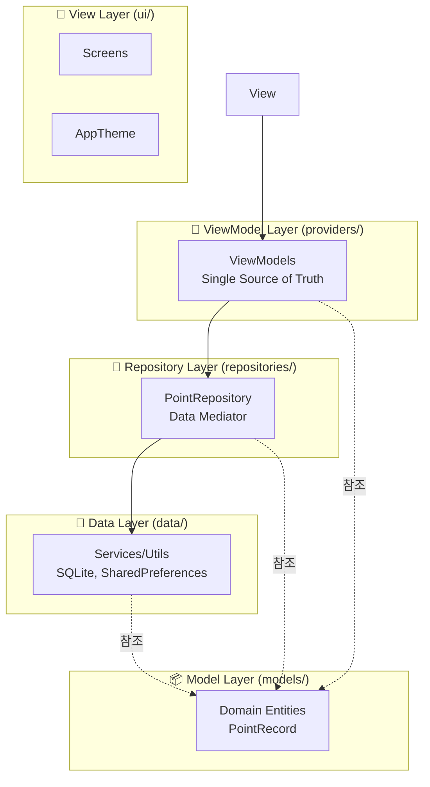
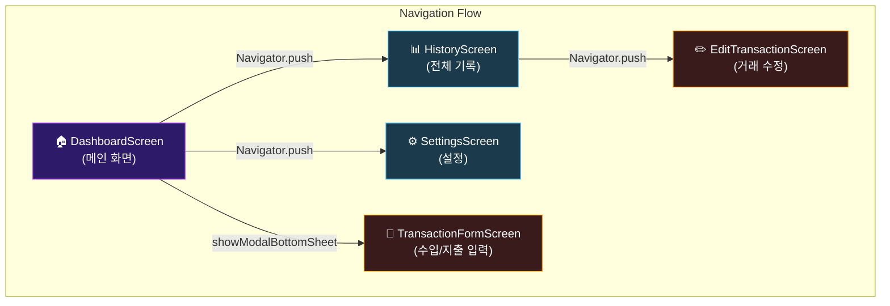
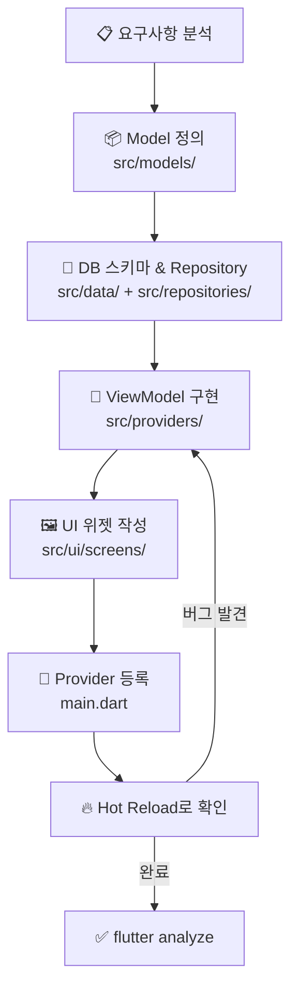
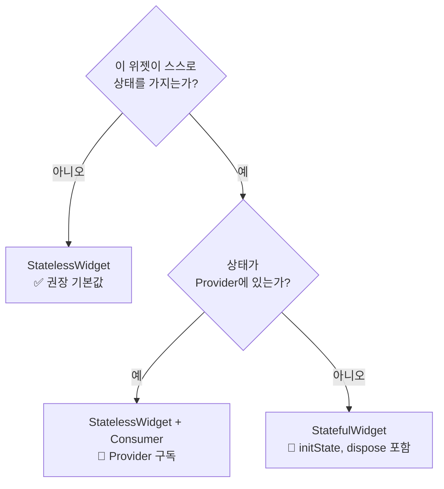
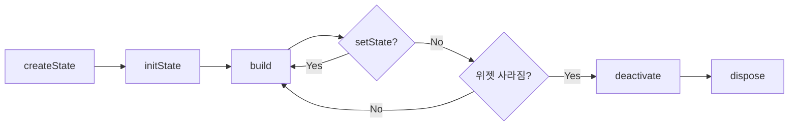
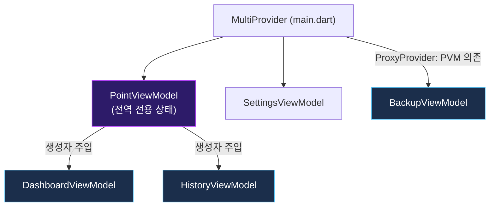
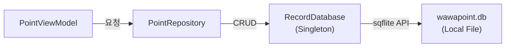
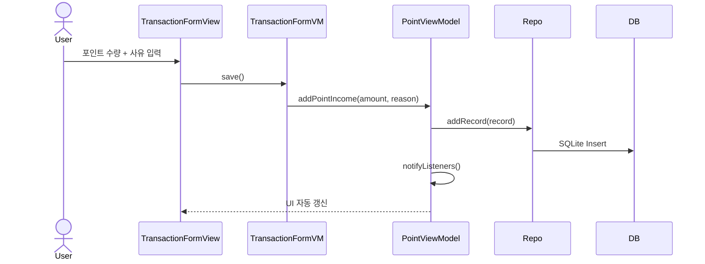
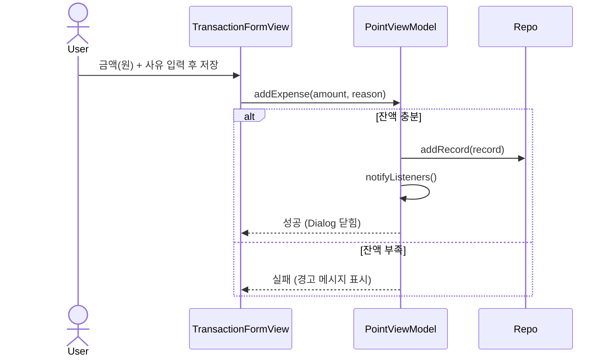

# WaWa Point — Flutter/Dart 실전 교과서 📘

> 본 문서는 단순한 가이드를 넘어, Flutter의 내부 원리와 Dart의 심화 개념, 그리고 WaWa Point의 아키텍처를 체계적으로 학습하기 위한 '교과서'로 작성되었습니다.  
> **대상**: Flutter 기초를 넘어 전문가로 도약하고자 하는 개발자

---

## 📚 목차

1. [Chapter 1: 개요 및 개발 원칙](#1-개요-및-개발-원칙)
2. [Chapter 2: Dart 언어 심화 (Deep Dive)](#2-dart-언어-심화-deep-dive)
3. [Chapter 3: Flutter 아키텍처 및 렌더링 원리](#3-flutter-아키텍처-및-렌더링-원리)
4. [Chapter 4: 상태 관리 마스터: Provider & ProxyProvider](#4-상태-관리-마스터-provider--proxyprovider)
5. [Chapter 5: 모듈별 심화 코드 분석](#5-모듈별-심화-코드-분석)
6. [Chapter 6: 영속성 레이어 (SQLite & Migration)](#6-영속성-레이어-sqlite--migration)
7. [Chapter 7: 실전 레이아웃 & Sliver 시스템](#7-실전-레이아웃--sliver-시스템)
8. [Chapter 8: CLI 및 빌드 자동화](#8-cli-및-빌드-자동화)
9. [Chapter 9: 시퀀스 다이어그램: 앱 초기화](#9-시퀀스-다이어그램-앱-초기화)
10. [Chapter 10: 시퀀스 다이어그램: 비즈니스 파이프라인](#10-시퀀스-다이어그램-비즈니스-파이프라인)
11. [Chapter 11: 테스트 전략 및 가이드](#11-테스트-전략-및-가이드)
12. [Chapter 12: 트러블슈팅 매뉴얼](#12-트러블슈팅-매뉴얼)
13. [Chapter 13: 고급 주제 (CustomPainter & Native)](#13-고급-주제-custompainter--native)
14. [Chapter 14: 아키텍처 딥다이브 (MVVM-R)](#14-아키텍처-딥다이브-mvvm-r)
15. [Chapter 15: 개발 생산성 및 성능 최적화](#15-개발-생산성-및-성능-최적화)

---

## Chapter 1. 개요 및 개발 원칙

### 1.1 핵심 프로젝트 철학
- **Declarative UI**: 모든 UI는 상태(State)의 함수입니다 — $UI = f(State)$
- **Composition over Inheritance**: 복잡한 위젯은 작은 위젯들의 조합으로 만듭니다.
- **MVVM-Repository**: 로직, 상태, 데이터 영속성을 엄격히 분리합니다.

### 1.2 Flutter 표준 아키텍처 (Layered Architecture)

WaWa Point는 관심사 분리(SoC)를 위해 엄격한 계층화 아키텍처를 따릅니다.



**단방향 의존성 원칙**: 상위 레이어는 하위 레이어를 알지만, 하위 레이어는 상위 레이어를 절대 참조하지 않아야 합니다. (예: ViewModel은 UI 위젯을 알 수 없음)

### 1.3 화면 네비게이션 구조 (Navigation Tree)

앱의 화면 전환 흐름은 아래와 같습니다.



### 1.4 소스 폴더 구조 (`lib/src`)

```
lib/
├── main.dart               # 앱 진입점, MultiProvider 등록
└── src/
    ├── constants/          # 공통 상수 및 설정값
    ├── data/               # 로우레벨: DB, Backup, 설정 매니저
    │   ├── backup_manager.dart
    │   ├── point_manager.dart
    │   └── record_database.dart
    ├── models/             # 도메인 엔티티 (불변 데이터 클래스)
    │   └── point_record.dart
    ├── providers/          # ViewModel (상태 관리 + 비즈니스 로직)
    │   ├── point_view_model.dart      ← 전역 Single Source of Truth
    │   ├── dashboard_view_model.dart  ← 화면별 특화 VM
    │   ├── history_view_model.dart
    │   ├── transaction_form_view_model.dart
    │   ├── backup_view_model.dart
    │   └── settings_view_model.dart
    ├── repositories/       # 데이터 소스 추상화 레이어
    │   └── point_repository.dart
    └── ui/                 # 시각적 요소
        ├── app_theme.dart  # 디자인 시스템 (색상, 데코레이션)
        └── screens/        # 화면 위젯
            ├── dashboard_screen.dart
            ├── history_screen.dart
            ├── transaction_form_screen.dart
            ├── edit_transaction_screen.dart
            └── settings_screen.dart
```

### 1.4 Feature 개발 워크플로우



---

---

## Chapter 2. Dart 언어 심화 (Deep Dive)

### 2.1 Null Safety & Pattern Matching

Dart 3.0부터 도입된 **Patterns**와 **Records**는 가독성을 비약적으로 향상시킵니다.

```dart
// ✅ Records: 여러 값을 간단히 반환
(String, int) getUser() => ('Alice', 30);
final (name, age) = getUser(); // Destructuring

// ✅ Switch Expression: 선언적 코드 작성
String getMessage(int status) => switch (status) {
  200 => 'Success',
  404 => 'Not Found',
  _ => 'Unknown'
};
```

#### 💡 실전 적용 사례: Named Records
WaWa Point에서는 백업 파일을 불러온 뒤, 유효성 검사 결과(성공 여부, 데이터 건수, 백업 일시)를 한 번에 구조화된 형태의 타입으로 반환하기 위해 **Named Records**를 활용하고 있습니다.
(자세한 구현 코드는 [backup_manager.dart](file:///Volumes/Development/Projects/Flutter/WaWa%20Point/wawapoint_flutter/lib/src/data/backup_manager.dart)를 참고하세요)

```dart
// 1. 함수 정의 (Named Record 반환)
({bool isValid, int recordCount, DateTime? exportDate}) validateBackupData(String jsonString) {
  try {
    final Map<String, dynamic> json = jsonDecode(jsonString);
    final backup = BackupData.fromJson(json);
    return (
      isValid: true,
      recordCount: backup.records.length,
      exportDate: backup.exportDate,
    );
  } catch (_) {
    return (isValid: false, recordCount: 0, exportDate: null);
  }
}

// 2. 구조 분해 할당(Destructuring)을 통한 사용
final (isValid: ok, recordCount: count, exportDate: date) = 
    BackupManager().validateBackupData(jsonContent);

if (ok) {
  print('$count 개의 거래 기록 복원 가능 (백업 시점: $date)');
}
```

### 2.2 Mixins & Extensions

코드 재사용과 확장을 위한 핵심 기능입니다.

#### Mixin (with 키워드)
다중 상속의 효과를 내며, 특정 기능을 '조합'할 때 사용합니다.
- **예시**: `SingleTickerProviderStateMixin` (애니메이션 지원), [Dashboard VM](file:///Volumes/Development/Projects/Flutter/WaWa%20Point/wawapoint_flutter/lib/src/ui/screens/dashboard_screen.dart)에서 활용됨.

```dart
mixin Logger {
  void log(String msg) => print('[LOG]: $msg');
}

class MyService with Logger {
  void doWork() => log('Working...'); // Logger의 기능을 직접 사용
}
```

#### Extension
이미 정의된 클래스에 새로운 메서드를 추가합니다.
- **예시**: `TimePeriodExt` ([history_view_model.dart](file:///Volumes/Development/Projects/Flutter/WaWa%20Point/wawapoint_flutter/lib/src/providers/history_view_model.dart))

```dart
extension StringExtensions on String {
  bool get isValidEmail => contains('@');
}
// 사용: "test@test.com".isValidEmail -> true
```

### 2.3 Generics & Type Safety

타입 안전성을 보장하면서 유연한 코드를 작성합니다.

```dart
// Result<T> 패턴: 결과 또는 에러를 타입 안전하게 처리
sealed class Result<T> {}
class Success<T> extends Result<T> { final T data; Success(this.data); }
class Failure<T> extends Result<T> { final String error; Failure(this.error); }
```

### 2.4 Stream & Sink (Reactive Programming)

지속적인 데이터 흐름을 다룰 때 사용합니다. `Future`가 단발성이라면, `Stream`은 파이프라인입니다.

| 요소 | 역할 |
|------|------|
| `Stream` | 데이터가 흘러나오는 통로 (읽기 전용) |
| `StreamController` | Stream을 생성하고 관리하는 제어기 |
| `Sink` | 데이터를 Stream으로 밀어넣는 입구 |

---

## Chapter 3. Flutter 아키텍처 및 렌더링 원리

### 3.1 Flutter의 세 가지 트리 (The Three Trees)

Flutter는 고성능 렌더링을 위해 세 가지 트리를 병렬적으로 관리합니다.

1. **Widget Tree**: 설계도. 불변(Immutable)하며, 상태가 바뀔 때마다 새로 생성됩니다. 매우 가볍습니다.
2. **Element Tree**: 중간 관리자. 생명주기를 관리하며, 위젯과 렌더 객체를 연결합니다. (`BuildContext`의 실체)
3. **Render Tree**: 실제 구현체. 크기(Size)와 위치(Offset)를 계산하고 화면에 그립니다. 가변(Mutable)하며 무겁습니다.

> **Why?**: 위젯이 새로 생성되어도 엘리먼트 트리가 기존 렌더 객체를 재사용할지 결정하기 때문에(Diffing 알고리즘), 매번 전체를 다시 그리지 않고도 초당 60~120fps를 유지할 수 있습니다.

### 3.2 Key 시스템의 이해

위젯이 트리 내에서 자신의 정체성을 유지하게 도와줍니다.

| 종류 | 용도 | 사용 사례 |
|------|------|-----------|
| `ValueKey` | 로컬 ID 부여 | 리스트 항목의 정렬/삭제 시 상태 보존 |
| `ObjectKey` | 객체 기반 ID | 데이터 객체 자체를 키로 사용 |
| `GlobalKey` | 전역 고유 키 | 다른 위젯에서 특정 위젯의 상태에 접근할 때 (예: Form 검증) |

### 3.3 StatelessWidget vs StatefulWidget 선택 기준



**기준**: 애니메이션 컨트롤러, `TextEditingController`, 로컬 토글 상태 등 위젯 자체에만 필요한 상태만 `StatefulWidget`을 사용합니다. 비즈니스 데이터는 반드시 `Provider`에서 관리합니다.

### 3.2 StatefulWidget 생명주기



```dart
class MyScreen extends StatefulWidget {
  const MyScreen({super.key});
  @override
  State<MyScreen> createState() => _MyScreenState();
}

class _MyScreenState extends State<MyScreen> {
  late final AnimationController _controller; // 1️⃣ 선언

  @override
  void initState() {
    super.initState();
    // 2️⃣ 초기화: 위젯이 트리에 삽입될 때 1회 호출
    // Provider 접근 불가능! (아직 BuildContext 준비 안됨)
    _controller = AnimationController(vsync: this, duration: 300.ms);
  }

  @override
  void didChangeDependencies() {
    super.didChangeDependencies();
    // 3️⃣ initState 직후, BuildContext 준비 완료
    // Provider 최초 접근은 여기서!
    final vm = context.read<PointViewModel>();
    vm.loadRecords();
  }

  @override
  Widget build(BuildContext context) {
    // 4️⃣ UI 빌드. 여러 번 호출됩니다.
    return Container(/* ... */);
  }

  @override
  void dispose() {
    // 5️⃣ 정리: 위젯이 트리에서 제거될 때 1회 호출
    // 반드시 Controller, StreamSubscription 등을 해제해야 메모리 누수 방지!
    _controller.dispose();
    super.dispose();
  }
}
```

### 3.3 주요 레이아웃 위젯 치트시트

| 위젯 | 용도 | 핵심 속성 |
|------|------|-----------|
| `Column` / `Row` | 세로/가로 배치 | `mainAxisAlignment`, `crossAxisAlignment` |
| `Stack` | 위젯 겹치기 | `alignment`, `Positioned` 자식 |
| `Expanded` | 남은 공간 차지 | `flex` |
| `SizedBox` | 고정 크기 / 빈 공간 | `width`, `height` |
| `Padding` | 내부 여백 | `padding: EdgeInsets.all(16)` |
| `Container` | 다목적 박스 | `decoration`, `padding`, `margin` |
| `GestureDetector` | 탭/스와이프 감지 | `onTap`, `onLongPress` |
| `InkWell` | 머테리얼 리플 탭 효과 | `onTap`, `borderRadius` |

---

## Chapter 4. 상태 관리 마스터: Provider & ProxyProvider

### 4.1 핵심 API 및 최적화 전략

| API | 특징 | 최적화 레벨 |
|-----|------|-------------|
| `context.watch<T>()` | VM 변경 시 위젯 전체 리빌드 | Low (단순함) |
| `context.select<T, R>()` | 특정 속성 변경 시에만 리빌드 | High (권장) |
| `Selector<T, R>` | `builder` 내부만 정밀하게 리빌드 | Ultra (복잡한 트리) |

#### Selector 활용 (성능 최적화의 핵심)
VM의 수많은 속성 중 단 하나만 관찰하여 불필요한 연산을 줄입니다.
```dart
// ✅ balance가 바뀔 때만 Text 위젯이 리빌드됨
Selector<PointViewModel, double>(
  selector: (_, vm) => vm.currentBalance,
  builder: (_, balance, __) => Text('$balance P'),
)
```

### 4.2 ProxyProvider: 객체 간 의존성 관리

하나의 Provider가 다른 Provider의 데이터를 필요로 할 때 사용합니다.
- **예시**: `BackupViewModel`은 `PointViewModel`의 데이터를 백업해야 하므로 의존성이 발생합니다.

```dart
// main.dart 등록 예시
ChangeNotifierProxyProvider<PointViewModel, BackupViewModel>(
  create: (ctx) => BackupViewModel(ctx.read<PointViewModel>()),
  update: (ctx, pointVm, prev) => prev!..updatePointViewModel(pointVm),
)
```

### 4.3 이 프로젝트의 Provider 등록 구조

앱 내의 ViewModel들은 서로 독립적이지 않으며, 상호 의존성을 가집니다. 특히 `PointViewModel`은 모든 데이터의 원본(SSOT)으로서 다른 VM들의 중심이 됩니다.



**의존성 주입 패턴**:
1. **전역 등록**: `main.dart`에서 `MultiProvider`를 통해 앱 전체에서 접근 가능한 VM을 등록합니다.
2. **ProxyProvider**: `BackupViewModel`처럼 다른 VM의 최신 상태를 실시간으로 참조해야 할 때 사용합니다.
3. **화면별 주입**: `Navigator.push` 시점에 `ChangeNotifierProvider`를 통해 해당 화면에서만 쓰이는 VM(DVM, HVM 등)을 생성하며, 이때 필요한 전역 VM을 생성자로 전달합니다.

### 4.3 화면별 Provider 주입 패턴

화면에 진입할 때만 필요한 ViewModel은 전역 등록하지 않고 해당 화면 라우트에서 생성합니다.

```dart
// Navigator.push 시, 화면 전용 ViewModel 주입
Navigator.push(context, MaterialPageRoute(
  builder: (_) => ChangeNotifierProvider(
    // PointViewModel은 전역에서 이미 존재하므로 read로 접근
    create: (ctx) => HistoryViewModel(ctx.read<PointViewModel>()),
    child: const HistoryScreen(),
  ),
));
```

---

## Chapter 5. 모듈별 심화 코드 분석

### 5.1 MVVM-Repository 역할 분리 원칙

코드의 유지보수성을 위해 각 레이어는 아래와 같은 엄격한 책임을 집니다.

| 계층 | 책임 | 금지 사항 |
|------|------|-----------|
| **View (ui/)** | UI 렌더링, 사용자 입력 수신 | 비즈니스 로직, 직접적인 데이터 가공 |
| **ViewModel (providers/)** | UI 상태 관리, 비즈니스 로직, 데이터 바인딩 | UI 코드(`BuildContext` 보유), DB 직접 접근 |
| **Repository (repositories/)** | 데이터 소스 중재, 마이그레이션, 무결성 유지 | UI 상태 관리, 복잡한 업무 로직 |
| **Model (models/)** | 데이터 구조 정의, 직렬화 | 로직 포함, 상태 변경 알림 |
| **Service (data/)** | DB 엔진, 유틸리티 등 로우레벨 인프라 | 상태 관리, 도메인 비즈니스 로직 |

### 5.2 Model Layer — `PointRecord`

순수한 데이터 클래스입니다. 로직 없이 데이터 구조와 직렬화만 담당합니다.

```dart
// lib/src/models/point_record.dart

enum TransactionType { income, expense }

class PointRecord {
  final String id;           // UUID — 고유 식별자
  final DateTime date;       // 거래 발생 시각
  final TransactionType type;// 수입 or 지출
  final double amount;       // 금액 (포인트 단위)
  final String reason;       // 사유 (메모)
  final double balanceAfter; // 거래 후 잔액 스냅샷

  const PointRecord({
    required this.id,
    required this.date,
    required this.type,
    required this.amount,
    required this.reason,
    required this.balanceAfter,
  });

  // SQLite Map → PointRecord 변환
  factory PointRecord.fromJson(Map<String, dynamic> json) => PointRecord(
    id: json['id'],
    date: DateTime.parse(json['date']),
    type: TransactionType.values.byName(json['type']),
    amount: json['amount'],
    reason: json['reason'],
    balanceAfter: json['balanceAfter'],
  );

  // PointRecord → SQLite Map 변환
  Map<String, dynamic> toJson() => {
    'id': id,
    'date': date.toIso8601String(),
    'type': type.name,
    'amount': amount,
    'reason': reason,
    'balanceAfter': balanceAfter,
  };
}
```

### 5.3 Provider/ViewModel Layer — `PointViewModel`

앱 전역의 `Single Source of Truth`입니다. 잔액과 전체 기록을 관리합니다.

```dart
// lib/src/providers/point_view_model.dart

class PointViewModel extends ChangeNotifier {
  final PointRepository _repository;

  List<PointRecord> _records = [];
  bool _isLoading = false;

  // Getter: 외부에서는 읽기 전용으로만 접근
  List<PointRecord> get records => List.unmodifiable(_records);
  bool get isLoading => _isLoading;
  double get currentBalance => _records.isEmpty
      ? 0 : _records.first.balanceAfter;

  PointViewModel(this._repository);

  Future<void> loadRecords() async {
    _isLoading = true;
    notifyListeners(); // 로딩 UI 표시

    _records = await _repository.getAllRecords();
    _isLoading = false;
    notifyListeners(); // 데이터 UI 표시
  }

  Future<void> addRecord(PointRecord record) async {
    await _repository.addRecord(record);
    await loadRecords(); // 저장 후 전체 리로드로 최신 상태 보장
  }
}
```

### 5.4 Repository Layer — `PointRepository`

ViewModel이 데이터 소스의 세부 구현을 몰라도 되도록 추상화합니다.

```dart
// lib/src/repositories/point_repository.dart

class PointRepository {
  final RecordDatabase _db;

  PointRepository() : _db = RecordDatabase.instance;

  // DB에서 전체 기록 읽기 (레거시 JSON 마이그레이션 포함)
  Future<List<PointRecord>> getAllRecords() async {
    await _migrateIfNeeded();   // 최초 1회 레거시 마이그레이션
    return await _db.getAllRecords();
  }

  Future<void> addRecord(PointRecord record) =>
      _db.insertRecord(record);

  Future<void> deleteRecord(String id) =>
      _db.deleteRecord(id);

  Future<void> _migrateIfNeeded() async {
    // JSON → SQLite 마이그레이션 로직
  }
}
```

### 5.5 UI Layer — `_BalanceCard` (Dashboard)

`StatelessWidget`이지만 상위 `Consumer`에서 전달받은 `scale`로 애니메이션이 동작합니다.

```dart
class _BalanceCard extends StatelessWidget {
  const _BalanceCard({required this.scale, required this.vm});
  final double scale;          // DashboardViewModel이 제공
  final PointViewModel vm;     // 전역 VM에서 데이터 읽기

  @override
  Widget build(BuildContext context) {
    return Container(
      decoration: AppDecorations.balanceCard(), // 전역 테마 사용
      padding: const EdgeInsets.symmetric(vertical: 32, horizontal: 24),
      child: Column(
        children: [
          Row(
            mainAxisAlignment: MainAxisAlignment.center,
            children: [
              Icon(Icons.monetization_on_rounded,
                  color: AppColors.greenAccent.withValues(alpha: 0.7)),
              const SizedBox(width: 6),
              const Text('현재 잔액',
                  style: TextStyle(color: AppColors.textSecondary)),
            ],
          ),
          const SizedBox(height: 12),
          // AnimatedScale: scale 값 변경 시 자동으로 크기 전환 애니메이션
          AnimatedScale(
            scale: scale,
            duration: const Duration(milliseconds: 300),
            curve: Curves.easeOutBack,
            child: ShaderMask(
              // 보라색 그라데이션 텍스트 효과
              shaderCallback: (bounds) =>
                  AppGradients.balanceText.createShader(bounds),
              child: Text(vm.formattedBalance,
                  style: const TextStyle(fontSize: 48, color: Colors.white)),
            ),
          ),
        ],
      ),
    );
  }
}
### 5.6 UI Layer — `TransactionDetailDialog` (기록 상세 팝업)

사용자가 개별 거래 기록을 탭했을 때 상세 정보를 보여주는 프리미엄 팝업 카드입니다. `BackdropFilter`를 사용한 글래스모피즘 블러 효과와 `showGeneralDialog`를 통한 바운스 애니메이션을 제공합니다.
(자세한 구현 코드는 [transaction_detail_dialog.dart](file:///Volumes/Development/Projects/Flutter/WaWa%20Point/wawapoint_flutter/lib/src/ui/widgets/transaction_detail_dialog.dart)를 참고하세요)

```dart
class TransactionDetailDialog extends StatelessWidget {
  final PointRecord record;
  final VoidCallback? onEdit;
  final VoidCallback? onDelete;

  const TransactionDetailDialog({
    super.key,
    required this.record,
    this.onEdit,
    this.onDelete,
  });

  // showGeneralDialog를 사용해 등장 시 바운싱 Scale & Fade 트랜지션 애니메이션 적용
  static Future<void> show(
    BuildContext context, {
    required PointRecord record,
    VoidCallback? onEdit,
    VoidCallback? onDelete,
  }) {
    return showGeneralDialog(
      context: context,
      barrierDismissible: true,
      barrierLabel: 'Dismiss Detail Dialog',
      barrierColor: Colors.black.withValues(alpha: 0.6),
      transitionDuration: const Duration(milliseconds: 300),
      pageBuilder: (context, anim1, anim2) {
        return TransactionDetailDialog(
          record: record,
          onEdit: onEdit,
          onDelete: onDelete,
        );
      },
      transitionBuilder: (context, anim1, anim2, child) {
        return Transform.scale(
          scale: CurvedAnimation(
            parent: anim1,
            curve: Curves.easeOutBack,
          ).value,
          child: FadeTransition(
            opacity: anim1,
            child: child,
          ),
        );
      },
    );
  }

  @override
  Widget build(BuildContext context) {
    // BackdropFilter를 활용해 뒷배경에 10px 블러 처리 적용
    return BackdropFilter(
      filter: ImageFilter.blur(sigmaX: 10, sigmaY: 10),
      child: Center(
        // 상세 데이터 정보 렌더링 및 수정/삭제 위임 이벤트 처리...
      ),
    );
  }
}
```

---

## Chapter 6. 영속성 레이어 (SQLite & Migration)

### 6.1 전체 흐름



### 6.2 싱글톤 패턴 & 지연 초기화

```dart
class RecordDatabase {
  // static final: 클래스 로드 시 1회 생성, 이후 재사용
  static final RecordDatabase instance = RecordDatabase._init();
  static Database? _database;
  RecordDatabase._init(); // private 생성자 → 외부 인스턴스화 불가

  // get database: 최초 접근 시에만 파일을 열고, 이후는 캐시 반환
  Future<Database> get database async {
    if (_database != null) return _database!;
    _database = await _initDB('wawapoint.db');
    return _database!;
  }

  Future<Database> _initDB(String fileName) async {
    final dbPath = await getDatabasesPath(); // 플랫폼별 기본 DB 경로
    final path = join(dbPath, fileName);
    return await openDatabase(
      path,
      version: 1,
      onCreate: _createDB,   // 최초 생성 시 스키마 실행
      onUpgrade: _upgradeDB, // 버전업 시 마이그레이션 실행
    );
  }
}
```

### 6.3 테이블 스키마 상세

| 필드 | 타입 | 설명 | 비고 |
|------|------|------|------|
| `id` | `TEXT` | 고유 식별자 | UUID v4 (Primary Key) |
| `date` | `TEXT` | 거래 일시 | ISO 8601 String |
| `type` | `TEXT` | 수입/지출 구분 | 'income' | 'expense' |
| `amount` | `REAL` | 거래 금액 | 포인트 또는 원화 |
| `reason` | `TEXT` | 거래 사유 | 사용자 입력 메모 |
| `balanceAfter` | `REAL` | 거래 후 잔액 | 원화 단위 자동 계산 |

### 6.4 주요 데이터 서비스 (Service Layer)

로우레벨 인프라를 담당하는 싱글톤 객체들입니다.

1. **PointManager**: 포인트↔원화 환산 전담. `SharedPreferences`를 통해 설정값 영속화.
2. **BackupManager**: `BackupData` 모델을 기반으로 JSON 직렬화/역직렬화 및 파일 시스템 입출력 담당.
   - *참고 (JSON 백업 선정 이유)*: 로컬 SQLite 데이터베이스 파일(`.db`)을 그대로 복사하여 백업하지 않고 JSON 구조화 방식을 사용합니다. 이는 크로스 플랫폼 호환성 확보, 앱 스키마 업데이트 시 하위 호환성 및 마이그레이션 관리, 복원 전 데이터 유효성(Validation) 사전 검사, 그리고 기존 레코드와의 안전한 데이터 병합(Merge) 연산을 가능하게 하기 위함입니다.

---

### 6.5 CRUD 구현 패턴

```dart
// ── CREATE ──────────────────────────────────────────────
Future<void> insertRecord(PointRecord record) async {
  final db = await instance.database;
  await db.insert(
    'records',
    record.toJson(),                     // Dart Object → Map
    conflictAlgorithm: ConflictAlgorithm.replace, // 중복 id 대체
  );
}

// ── READ ─────────────────────────────────────────────────
Future<List<PointRecord>> getAllRecords() async {
  final db = await instance.database;
  final result = await db.query('records', orderBy: 'date DESC');
  return result.map((r) => PointRecord.fromJson(r)).toList(); // Map → Object
}

// ── UPDATE ───────────────────────────────────────────────
Future<void> updateRecord(PointRecord record) async {
  final db = await instance.database;
  await db.update(
    'records',
    record.toJson(),
    where: 'id = ?',
    whereArgs: [record.id], // ? 플레이스홀더로 SQL Injection 방지
  );
}

// ── DELETE ───────────────────────────────────────────────
Future<void> deleteRecord(String id) async {
  final db = await instance.database;
  await db.delete('records', where: 'id = ?', whereArgs: [id]);
}

// ── DELETE ALL ───────────────────────────────────────────
Future<void> clearAll() async {
  final db = await instance.database;
  await db.delete('records');
}
```

### 6.6 데이터 직렬화 요약

| 방향 | 메서드 | 이유 |
|------|--------|------|
| Object → DB | `toJson()` | SQLite는 Dart 객체를 직접 저장 불가, `Map<String, dynamic>` 필요 |
| DB → Object | `fromJson()` | DB 조회 결과는 `List<Map>`, 앱에서는 도메인 객체로 사용 |
| DateTime → String | `.toIso8601String()` | SQLite TEXT 타입에 저장 |
| String → DateTime | `DateTime.parse()` | 읽을 때 다시 파싱 |

---

## Chapter 7. 실전 레이아웃 & Sliver 시스템

### 7.1 Hot Reload vs Hot Restart 언제 쓸까?

| 상황 | 방법 |
|------|------|
| 텍스트, 색상, 레이아웃 수정 | `r` (Hot Reload) |
| 새 ChangeNotifier 등록, main() 수정 | `R` (Hot Restart) |
| 패키지 추가, native 코드 수정 | 앱 완전 종료 후 `flutter run` |

### 7.2 Layout Constraints — "Three Rules"

> "**Constraints go down. Sizes go up. Parent sets position.**"

1. 부모가 자식에게 최대/최소 크기를 전달합니다.
2. 자식이 자신의 실제 크기를 결정하여 부모에게 알립니다.
3. 부모가 자식의 위치(offset)를 결정합니다.

```dart
// ❌ 무한 크기 에러: Column > ListView (Column이 height를 제한 안 함)
Column(children: [ListView(children: [...])])

// ✅ 해결: Expanded로 남은 공간 명시
Column(children: [Expanded(child: ListView(children: [...]))])
```

### 7.3 성능 최적화 팁

```dart
// ✅ Consumer 범위 최소화: 리빌드 영역을 가능한 작게 유지
Consumer<PointViewModel>(
  builder: (_, vm, __) => Text('잔액: ${vm.balance}'),
  // child 파라미터: 리빌드 불필요한 정적 위젯은 child로 캐시
  child: const Icon(Icons.savings),
)

// ✅ context.select(): 특정 값만 구독하여 불필요한 리빌드 방지
final balance = context.select<PointViewModel, double>((vm) => vm.currentBalance);

// ✅ const 위젯: 컴파일 타임에 생성되어 리빌드 시 재활용
const SizedBox(height: 16), // ← const 붙이기
const Text('제목'),
```

### 7.4 AppTheme & 디자인 시스템 사용법

```dart
// lib/src/ui/app_theme.dart 의 상수를 활용하세요
color: AppColors.purpleAccent,         // ✅ 권장
color: const Color(0xFFBB44FF),        // ❌ 하드코딩 지양

decoration: AppDecorations.card(),     // ✅ 재사용 가능한 데코레이션
decoration: BoxDecoration(             // ❌ 매번 중복 정의
  color: const Color(0xFF1C1C1E),
  borderRadius: BorderRadius.circular(20),
)
```

### 7.5 Sliver 시스템 (고성능 스크롤)

```dart
// 일반 ListView: 고정 영역
// CustomScrollView + Sliver: 헤더, 리스트, 섹션을 하나의 스크롤로

CustomScrollView(
  slivers: [
    SliverToBoxAdapter(child: _buildBalanceCard()), // 일반 위젯 → Sliver 변환
    SliverPadding(
      padding: const EdgeInsets.all(16),
      sliver: SliverList(
        delegate: SliverChildBuilderDelegate(
          (context, i) => TransactionTile(record: records[i]),
          childCount: records.length, // 뷰포트에 보이는 항목만 빌드 (성능)
        ),
      ),
    ),
  ],
)
```

---

## Chapter 8. CLI 및 빌드 자동화

### 8.1 기본 명령어

| 명령어 | 용도 | 설명 |
|--------|------|------|
| `flutter run` | 앱 실행 | 선택된 장치에서 Debug 모드로 실행 |
| `flutter run -d <deviceId>` | 특정 장치 실행 | `flutter devices`로 ID 확인 후 사용 |
| `flutter pub get` | 의존성 설치 | `pubspec.yaml` 변경 후 필수 |
| `flutter analyze` | 정적 분석 | 에러 및 Lint 위반 체크 |
| `flutter clean` | 캐시 삭제 | 빌드 오류 해결 시 사용 |
| `flutter test` | 테스트 실행 | `test/` 디렉토리 전체 테스트 |
| `flutter doctor` | 환경 진단 | SDK, Xcode, Android Studio 상태 확인 |
| `flutter devices` | 장치 목록 | 연결된 시뮬레이터 및 실기기 표시 |
| `flutter build ios` | iOS 빌드 | `.ipa` 배포 파일 생성 |
| `flutter build apk` | Android 빌드 | `.apk` 배포 파일 생성 |

### 8.2 실행 중 인터랙티브 키

`flutter run` 실행 중 터미널에서:

| 키 | 기능 | 상태 유지? |
|----|------|-----------|
| `r` | Hot Reload | ✅ 유지 |
| `R` | Hot Restart | ❌ 초기화 |
| `p` | Debug Paint (위젯 경계선 표시) | - |
| `o` | iOS ↔ Android 렌더러 전환 | - |
| `i` | Inspector 위젯 상세 보기 | - |
| `h` | 도움말 전체 보기 | - |
| `q` | 앱 종료 | - |

### 8.3 빌드 모드 비교

| 모드 | 명령어 | Hot Reload | 성능 | 용도 |
|------|--------|-----------|------|------|
| Debug | `flutter run` | ✅ | 보통 | 개발 |
| Profile | `flutter run --profile` | ❌ | 높음 | 성능 측정 |
| Release | `flutter run --release` | ❌ | 최고 | 배포 전 검증 |

---

## Chapter 9. 시퀀스 다이어그램: 앱 초기화

앱 실행부터 화면에 데이터가 렌더링되기까지의 전체 흐름입니다.

```mermaid
sequenceDiagram
    participant OS as 📱 Mobile OS
    participant Main as main.dart
    participant MP as MultiProvider
    participant PVM as PointViewModel
    participant DS as DashboardScreen

    OS->>Main: 앱 실행 (main())
    Main->>Main: WidgetsFlutterBinding.ensureInitialized()
    Main->>MP: MultiProvider 생성 (전역 VM 등록)
    Note over MP: PVM, SVM, BVM 인스턴스 생성 및 메모리 할당
    
    Main->>DS: runApp() → DashboardScreen 첫 렌더링
    DS->>PVM: context.read<PointViewModel>().loadRecords() (didChangeDependencies)
    
    PVM->>PVM: _isLoading = true; notifyListeners()
    PVM->>Repo: getAllRecords()
    Repo->>DB: db.query('records')
    DB-->>PVM: List<PointRecord> 반환
    PVM->>PVM: _isLoading = false; notifyListeners()
    
    PVM-->>DS: UI 리빌드 트리거 (실제 데이터 표시)
```

---

## Chapter 10. 시퀀스 다이어그램: 비즈니스 파이프라인

### 10.1 포인트 적립 흐름 (Income)



### 10.2 지출 기록 및 잔액 검증 (Expense)



### 10.3 백업 및 복원 파이프라인

```mermaid
sequenceDiagram
    participant BVM as BackupViewModel
    participant BM as BackupManager
    participant PVM as PointViewModel

    Note over BVM,PVM: ── 백업 흐름 ──
    BVM->>PVM: records 읽기
    BVM->>BM: exportToJson(records)
    BM->>FS: File.writeAsString()
    
    Note over BVM,PVM: ── 복원 흐름 ──
    BVM->>BM: importFromJson(file)
    BM-->>BVM: List<PointRecord>
    BVM->>DB: overwriteAll(records)
    BVM->>PVM: loadRecords() (상태 동기화)
### 10.4 상세 정보 조회 및 다이렉트 액션 흐름

거래 타일을 클릭하여 상세 팝업을 띄우고, 팝업 안에서 수정 혹은 삭제 버튼을 눌러 부모 화면의 이벤트 핸들러로 작업을 위임하는 상세 흐름입니다.

```mermaid
sequenceDiagram
    actor User
    participant V as HistoryView / DashboardView
    participant D as TransactionDetailDialog
    participant PVM as PointViewModel
    
    User->>V: 거래 기록 항목 탭
    V->>D: TransactionDetailDialog.show(record, onEdit, onDelete)
    D->>D: BackdropFilter 블러 + 바운스 애니메이션 실행
    D-->>User: 상세 정보 및 액션 버튼(수정, 삭제, 확인) 표시
    
    alt User가 삭제 클릭
        User->>D: "삭제" 버튼 탭
        D->>V: onDelete() 콜백 호출 (부모 위임)
        Note over D: Navigator.pop(context)로 상세 창 닫힘
        V->>V: _showDeleteConfirm() 확인 모달 출력
        User->>V: 최종 삭제 승인
        V->>PVM: deleteRecord(record)
        PVM->>PVM: recalculateAllBalances() & notifyListeners()
        PVM-->>V: UI 최종 갱신
    else User가 수정 클릭
        User->>D: "수정" 버튼 탭
        D->>V: onEdit() 콜백 호출 (부모 위임)
        Note over D: Navigator.pop(context)로 상세 창 닫힘
        V->>V: Navigator.push(EditTransactionScreen)
        Note over V: 수정 폼 이동...
    end
```

---

## Chapter 11. 테스트 전략 및 가이드

### 11.1 테스트 종류

| 종류 | 목적 | 실행 속도 | 위치 |
|------|------|-----------|------|
| Unit Test | ViewModel, Repository, 유틸 로직 검증 | 빠름 | `test/` |
| Widget Test | 특정 위젯의 렌더링 및 인터랙션 | 중간 | `test/` |
| Integration Test | 전체 앱 시나리오 E2E | 느림 | `integration_test/` |

### 11.2 Unit Test 작성 예시

```dart
// test/point_manager_test.dart
import 'package:flutter_test/flutter_test.dart';
import 'package:wawapoint/src/data/point_manager.dart';

void main() {
  group('PointManager 환산 테스트', () {
    late PointManager manager;

    setUp(() {
      manager = PointManager();
      manager.setExchangeRate(10); // 1포인트 = 10원
    });

    test('1000포인트 → 10000원 환산', () {
      expect(manager.pointToKrw(1000), equals(10000));
    });

    test('10000원 → 1000포인트 환산', () {
      expect(manager.krwToPoint(10000), equals(1000));
    });

    test('환산율 0 시 0 반환', () {
      manager.setExchangeRate(0);
      expect(manager.pointToKrw(1000), equals(0));
    });
  });
}
```

### 11.3 테스트 실행

```bash
flutter test                                    # 전체 테스트
flutter test test/point_manager_test.dart       # 특정 파일
flutter test --coverage                         # 커버리지 측정
```

---

## Chapter 12. 트러블슈팅 매뉴얼

### ❌ 화면이 갱신되지 않음

**원인**: `notifyListeners()` 누락
```dart
// ❌ 틀린 예
void updateBalance(double v) { _balance = v; }

// ✅ 올바른 예
void updateBalance(double v) {
  _balance = v;
  notifyListeners(); // 반드시 호출!
}
```

---

### ❌ `build()` 중 Provider 접근 에러

**원인**: `build()` 메서드 내에서 `context.read()`를 조건부로 호출

```dart
// ❌ 잘못된 예 — build 중 context.read 를 이벤트 핸들러에서 사용해야 함
@override
Widget build(BuildContext context) {
  final data = context.read<MyVM>().data; // 구독 없이 읽기 → 갱신 안됨
  return Text(data);
}

// ✅ 올바른 예
@override
Widget build(BuildContext context) {
  final data = context.watch<MyVM>().data; // 구독 → 변경 시 리빌드
  return Text(data);
}
```

---

### ❌ `showDialog` 또는 `showGeneralDialog` 내부에서 Provider 접근 실패

**원인**: 다이얼로그나 바텀시트가 띄워질 때의 `BuildContext`는 새로운 라우트(Route) 트리 아래에 배치되므로, 기존 위젯 트리 상위에 있던 Provider에 직접 `context.read<T>()`로 접근하면 `ProviderNotFoundException`이 발생합니다.

**해결책 A**: 다이얼로그 빌더를 실행하기 전에 필요한 ViewModel 인스턴스 참조를 변수에 저장해 두고 클로저 형식으로 활용합니다.
```dart
Future<void> _showConfirmDialog(BuildContext context) async {
  final vm = context.read<PointViewModel>(); // ← 다이얼로그 빌드 전에 미리 참조 획득
  await showDialog(
    context: context,
    builder: (_) => AlertDialog(
      actions: [
        TextButton(
          onPressed: () => vm.deleteAll(), // 획득한 참조 사용
          child: const Text('삭제'),
        ),
      ],
    ),
  );
}
```

**해결책 B (권장 - 관심사 분리)**: 커스텀 다이얼로그(예: `TransactionDetailDialog`)를 만들 때는 내부에서 직접 특정 Provider에 종속되지 않도록 설계하고, 동작이 필요한 이벤트를 콜백 함수(`VoidCallback? onEdit`, `onDelete`)로 받아 외부(부모 뷰)에서 처리하도록 위임합니다.
```dart
// 1. 다이얼로그는 순수하게 콜백만 호출하도록 설계
class CustomDetailDialog extends StatelessWidget {
  final VoidCallback? onEdit;
  
  const CustomDetailDialog({super.key, this.onEdit});
  
  // ...
  // Button 탭 시: onEdit?.call()
}

// 2. 호출처(부모 뷰)에서 Provider가 유효한 context를 기반으로 콜백 작성
CustomDetailDialog.show(
  context,
  onEdit: () {
    // 부모 context에는 PointViewModel이 주입되어 있으므로 안전하게 접근 가능
    final vm = context.read<PointViewModel>();
    Navigator.push(context, MaterialPageRoute(builder: (_) => EditScreen(vm: vm)));
  },
);
```

---

### ❌ `LateInitializationError`

**원인**: `late` 변수를 초기화 전에 접근
```dart
// ✅ 비동기 데이터 로딩 중 UI 보호: isLoading 플래그 사용
Consumer<PointViewModel>(
  builder: (_, vm, __) {
    if (vm.isLoading) return const CircularProgressIndicator();
    return ListView(...); // isLoading=false 보장 후 접근
  },
)
```

---

### ❌ iOS 빌드 실패 (Xcode)

```bash
# 1. 캐시 및 CocoaPods 재설치
flutter clean
cd ios && pod install --repo-update && cd ..
flutter run

# 2. 그래도 안 되면 DerivedData 삭제 (Xcode > Settings > Locations)
```

---

### ❌ iPad 등 iOS 환경에서 share_plus 파일 공유 시 크래시 발생

**원인**: iPadOS 등 팝오버(Popover) 스타일의 공유 창을 사용하는 iOS 환경에서 공유 창의 물리적 팝업 기준 위치(`sharePositionOrigin`)를 지정하지 않아 `sharePositionOrigin argument must be set` 에러와 함께 앱이 비정상 종료되는 현상입니다.

**해결책**:
공유 버튼이 위치한 UI context를 기반으로 렌더 객체(`RenderBox`)의 물리적 좌표와 크기 영역을 계산한 뒤, `sharePositionOrigin` 매개변수에 전달하여 해결합니다.

```dart
// 1. 위젯의 RenderBox 좌표 구하기
final box = context.findRenderObject() as RenderBox?;
final rect = box != null
    ? box.localToGlobal(Offset.zero) & box.size
    : null;

// 2. sharePositionOrigin을 설정하여 안전하게 공유 실행
await Share.shareXFiles(
  [XFile(file.path)],
  sharePositionOrigin: rect,
);
```

## Chapter 13. 고급 주제 (CustomPainter & Native)

### 13.1 CustomPainter: 선과 면으로 그리기
복잡한 그래프나 커스텀 UI가 필요할 때 사용합니다. `Canvas`에 직접 명령을 내립니다.

```dart
class MyPainter extends CustomPainter {
  @override
  void paint(Canvas canvas, Size size) {
    final paint = Paint()..color = Colors.blue;
    canvas.drawCircle(Offset(size.width/2, size.height/2), 20, paint);
  }
  @override
  bool shouldRepaint(covariant CustomPainter oldDelegate) => false;
}
```

### 13.2 MethodChannel: 네이티브 기능 호출
Flutter가 직접 지원하지 않는 하드웨어 사양(배터리 상태, 센서 등)에 접근할 때 사용합니다.

---

## Chapter 14. 아키텍처 딥다이브 (MVVM-R)

### 14.1 왜 MVVM-R 인가?
WaWa Point는 복잡한 데이터 동기화와 UI 상태 관리를 처리하기 위해 이 패턴을 선택했습니다.

1. **Model**: 순수 데이터 (JSON 직렬화 포함).
2. **ViewModel**: 비즈니스 로직 및 상태 담당. UI에 종속되지 않음.
3. **Repository**: 데이터 소스(Local DB, Backup)의 추상화.
4. **View**: UI 레이아웃만 담당. Logic-less.

### 14.2 종속성 역전 (Dependency Inversion)
ViewModel은 Repository의 인터페이스만 알 뿐, 그 구현체가 SQLite인지, Firebase인지는 알 필요가 없습니다. 이는 테스트 용이성을 극대화하며, 데이터 소스 변경 시에도 비즈니스 로직을 보호합니다.

### 14.3 Repository의 중재자 역할
- **SQLite + Lecacy Migration**: 앱 초기 실행 시 기존 JSON 파일을 파싱하여 SQLite로 이관하고 원본을 삭제하는 작업을 중재합니다.
- **데이터 무결성**: 저장/조회 시 형식을 검증하여 상위 레이어(VM)에 항상 깨끗한 도메인 객체를 전달합니다.

---

## Chapter 15. 개발 생산성 및 성능 최적화

### 15.1 Flutter DevTools 마스터하기
- **Flutter Inspector**: 위젯 트리 탐색 및 레이아웃 디버깅.
- **CPU Profiler**: 성능 병목 구간 찾기.
- **Memory**: 메모리 누수 감지.

### 15.2 성능 최적화 골든 룰
1. **리빌드 최소화**: `const` 위젯 사용, `Selector` 활용.
2. **비싼 연산 build() 밖으로**: 정렬, 필터링 등은 데이터 변경 시점에 미리 계산.
3. **이미지 최적화**: 적절한 해상도와 캐싱 사용.

---

이제 이 교과서와 함께 WaWa Point의 완성도 높은 코드를 설계하고 구현하시길 응원합니다! 🚀✨  
궁금한 점은 [ARCHITECTURE.md](file:///Volumes/Development/Projects/Flutter/WaWa%20Point/wawapoint_flutter/docs/ARCHITECTURE.md)를 함께 참고하세요.
