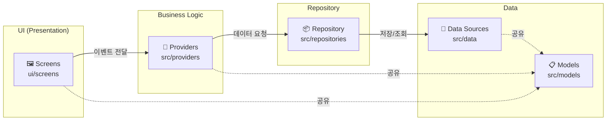
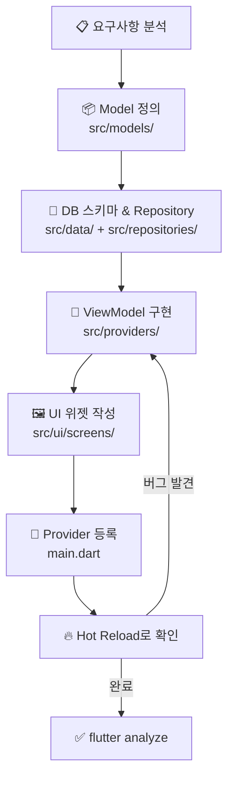
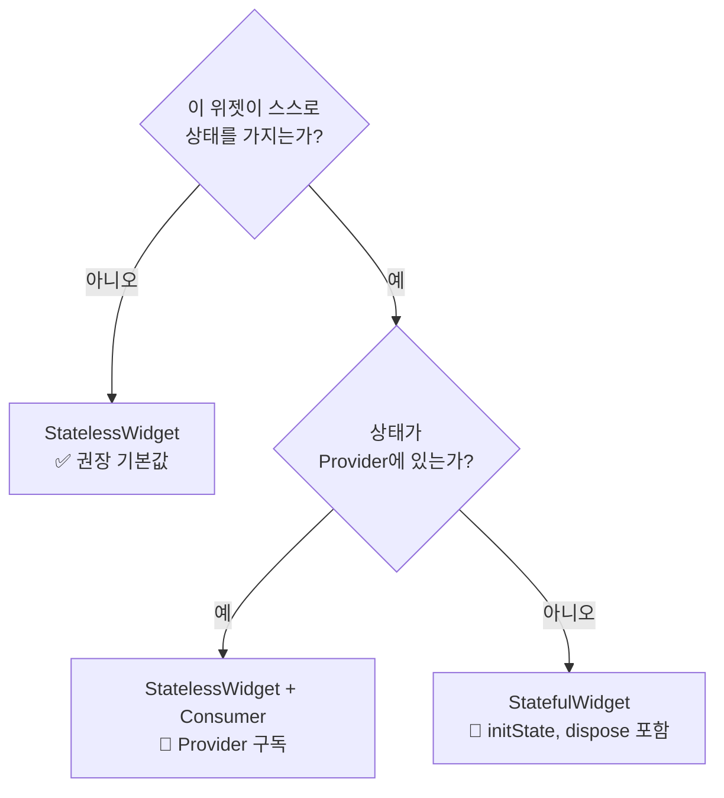
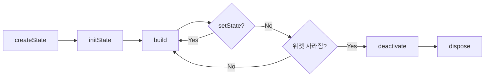
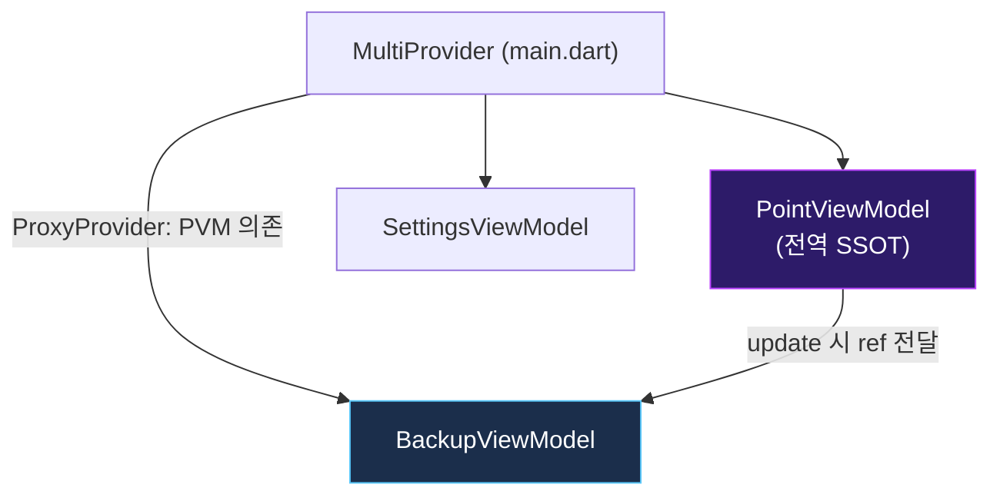
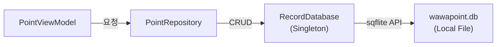
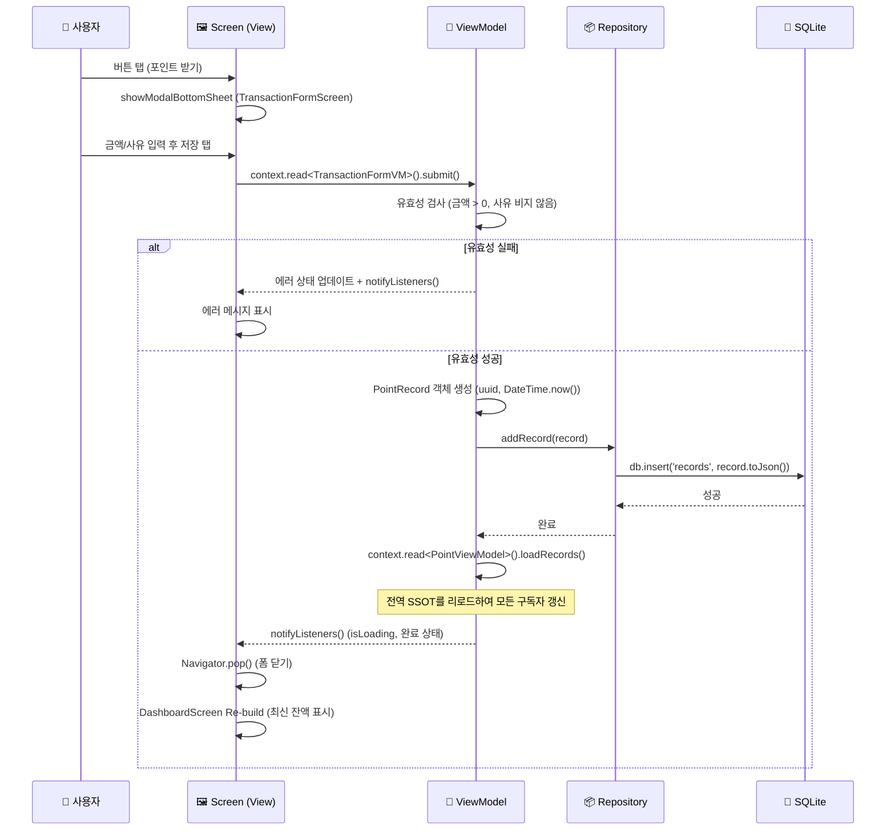

# WaWa Point — Flutter 개발자 학습 가이드 🚀

> 본 문서는 Flutter를 이전에 경험했으나 최신 트렌드와 본 프로젝트의 구조를 빠르게 파악하고자 하는 개발자를 위해 작성되었습니다.  
> **대상**: Flutter 경력자 (복귀 또는 본 프로젝트 신규 투입)

---

## 목차

1. [개요 및 워크플로우](#1-개요-및-워크플로우)
2. [Dart 언어 핵심 리마인더](#2-dart-언어-핵심-리마인더)
3. [Flutter 위젯 & 생명주기](#3-flutter-위젯--생명주기)
4. [상태 관리: Provider 심화](#4-상태-관리-provider-심화)
5. [모듈별 코드 분석](#5-모듈별-코드-분석)
6. [데이터베이스 레이어 (SQLite)](#6-데이터베이스-레이어-sqlite)
7. [Flutter 특화 팁](#7-flutter-특화-팁)
8. [Flutter CLI 명령어](#8-flutter-cli-명령어)
9. [시퀀스 다이어그램: 앱 초기화](#9-시퀀스-다이어그램-앱-초기화)
10. [시퀀스 다이어그램: MVVM CRUD 흐름](#10-시퀀스-다이어그램-mvvm-crud-흐름)
11. [테스트 가이드](#11-테스트-가이드)
12. [트러블슈팅](#12-트러블슈팅)

---

## 1. 개요 및 워크플로우

### 1.1 핵심 프로젝트 철학
- **Declarative UI**: 모든 UI는 상태(State)의 함수입니다 — $UI = f(State)$
- **Composition over Inheritance**: 복잡한 위젯은 작은 위젯들의 조합으로 만듭니다.
- **MVVM-Repository**: 로직, 상태, 데이터 영속성을 엄격히 분리합니다.

### 1.2 Flutter 표준 아키텍처 (Layered Architecture)



**단방향 의존성 원칙**: 상위 레이어는 하위 레이어를 알지만, 하위 레이어는 상위 레이어를 절대 참조하지 않습니다.

### 1.3 소스 폴더 구조 (`lib/src`)

```
lib/
├── main.dart               # 앱 진입점, MultiProvider 등록
└── src/
    ├── constants/          # 공통 상수 및 설정값
    ├── data/               # 로우레벨: DB, Backup, 설정 매니저
    │   ├── backup_manager.dart
    │   ├── point_manager.dart
    │   └── record_database.dart
    ├── models/             # 도메인 엔티티 (불변 데이터 클래스)
    │   └── point_record.dart
    ├── providers/          # ViewModel (상태 관리 + 비즈니스 로직)
    │   ├── point_view_model.dart      ← 전역 Single Source of Truth
    │   ├── dashboard_view_model.dart  ← 화면별 특화 VM
    │   ├── history_view_model.dart
    │   ├── transaction_form_view_model.dart
    │   ├── backup_view_model.dart
    │   └── settings_view_model.dart
    ├── repositories/       # 데이터 소스 추상화 레이어
    │   └── point_repository.dart
    └── ui/                 # 시각적 요소
        ├── app_theme.dart  # 디자인 시스템 (색상, 데코레이션)
        └── screens/        # 화면 위젯
            ├── dashboard_screen.dart
            ├── history_screen.dart
            ├── transaction_form_screen.dart
            ├── edit_transaction_screen.dart
            └── settings_screen.dart
```

### 1.4 Feature 개발 워크플로우



---

## 2. Dart 언어 핵심 리마인더

### 2.1 Null Safety

Dart 2.12부터 Null Safety가 기본입니다. Flutter 개발 시 가장 먼저 혼동하는 부분입니다.

```dart
// ✅ Null이 될 수 없는 타입
String name = '홍길동';

// ✅ Null이 될 수 있는 타입 (? 붙임)
String? optionalName = null;

// ✅ 늦은 초기화 (late) - 반드시 사용 전에 초기화됨을 보장할 때
late final Database _db;

// ✅ Null 체크 연산자
print(optionalName?.length);    // null이면 null 반환 (안전 호출)
print(optionalName!.length);    // null이면 런타임 에러 (개발자 책임 단언)
print(optionalName ?? '기본값'); // null이면 우측 값 사용
```

### 2.2 비동기 처리 (async / await / Future)

Flutter의 DB, 파일, 네트워크는 모두 비동기입니다.

```dart
// ❌ 나쁜 예: then() 체인이 깊어져서 콜백 지옥 발생
db.query('records').then((result) {
  result.map((r) => PointRecord.fromJson(r)).toList();
});

// ✅ 좋은 예: async/await으로 동기 코드처럼 읽힘
Future<List<PointRecord>> getAllRecords() async {
  final db = await instance.database;      // DB 연결 대기
  final result = await db.query('records'); // 조회 대기
  return result.map((r) => PointRecord.fromJson(r)).toList();
}
```

| 키워드 | 설명 |
|--------|------|
| `Future<T>` | 미래에 T 타입 값이 반환될 것을 약속 |
| `async` | 함수가 비동기임을 선언. 반환값은 자동으로 `Future`로 래핑 |
| `await` | `Future`의 완료를 기다림. `async` 함수 내에서만 사용 가능 |
| `FutureOr<T>` | `T` 또는 `Future<T>`를 모두 반환 가능한 타입 |

### 2.3 컬렉션 조작 (List, Map)

```dart
final List<PointRecord> records = [...];

// map: 각 요소를 변환하여 새 리스트 생성
final amounts = records.map((r) => r.amount).toList();

// where: 조건에 맞는 요소만 필터링
final incomes = records.where((r) => r.type == TransactionType.income).toList();

// fold: 리스트를 하나의 값으로 누적 계산
final total = records.fold<double>(0, (sum, r) => sum + r.amount);

// any / every: 조건 만족 여부 확인 (bool 반환)
final hasIncome = records.any((r) => r.type == TransactionType.income);
```

### 2.4 Spread 연산자 & Collection if/for (Dart 전용)

```dart
// Widget 리스트 동적 구성에 자주 사용됩니다
Column(
  children: [
    const Header(),
    if (isLoading) const LoadingSpinner(),   // Collection if
    for (final item in items) ItemTile(item), // Collection for
    ...extraWidgets,                           // Spread (다른 리스트 삽입)
  ],
)
```

### 2.5 Named Parameters & 기본값

```dart
// 위젯 생성자 패턴 (Flutter의 관용구)
class TransactionTile extends StatelessWidget {
  const TransactionTile({
    super.key,
    required this.record,    // required: 반드시 전달 必
    this.onTap,              // optional: null 허용
    this.showDate = true,    // default: 기본값 지정
  });

  final PointRecord record;
  final VoidCallback? onTap;
  final bool showDate;
  ...
}
```

---

## 3. Flutter 위젯 & 생명주기

### 3.1 StatelessWidget vs StatefulWidget 선택 기준



**기준**: 애니메이션 컨트롤러, `TextEditingController`, 로컬 토글 상태 등 위젯 자체에만 필요한 상태만 `StatefulWidget`을 사용합니다. 비즈니스 데이터는 반드시 `Provider`에서 관리합니다.

### 3.2 StatefulWidget 생명주기



```dart
class MyScreen extends StatefulWidget {
  const MyScreen({super.key});
  @override
  State<MyScreen> createState() => _MyScreenState();
}

class _MyScreenState extends State<MyScreen> {
  late final AnimationController _controller; // 1️⃣ 선언

  @override
  void initState() {
    super.initState();
    // 2️⃣ 초기화: 위젯이 트리에 삽입될 때 1회 호출
    // Provider 접근 불가능! (아직 BuildContext 준비 안됨)
    _controller = AnimationController(vsync: this, duration: 300.ms);
  }

  @override
  void didChangeDependencies() {
    super.didChangeDependencies();
    // 3️⃣ initState 직후, BuildContext 준비 완료
    // Provider 최초 접근은 여기서!
    final vm = context.read<PointViewModel>();
    vm.loadRecords();
  }

  @override
  Widget build(BuildContext context) {
    // 4️⃣ UI 빌드. 여러 번 호출됩니다.
    return Container(/* ... */);
  }

  @override
  void dispose() {
    // 5️⃣ 정리: 위젯이 트리에서 제거될 때 1회 호출
    // 반드시 Controller, StreamSubscription 등을 해제해야 메모리 누수 방지!
    _controller.dispose();
    super.dispose();
  }
}
```

### 3.3 주요 레이아웃 위젯 치트시트

| 위젯 | 용도 | 핵심 속성 |
|------|------|-----------|
| `Column` / `Row` | 세로/가로 배치 | `mainAxisAlignment`, `crossAxisAlignment` |
| `Stack` | 위젯 겹치기 | `alignment`, `Positioned` 자식 |
| `Expanded` | 남은 공간 차지 | `flex` |
| `SizedBox` | 고정 크기 / 빈 공간 | `width`, `height` |
| `Padding` | 내부 여백 | `padding: EdgeInsets.all(16)` |
| `Container` | 다목적 박스 | `decoration`, `padding`, `margin` |
| `GestureDetector` | 탭/스와이프 감지 | `onTap`, `onLongPress` |
| `InkWell` | 머테리얼 리플 탭 효과 | `onTap`, `borderRadius` |

---

## 4. 상태 관리: Provider 심화

### 4.1 Provider 핵심 API

| API | 언제 사용? | 코드 |
|-----|-----------|------|
| `Consumer<T>` | 위젯 트리의 특정 부분만 리빌드 | `Consumer<PointViewModel>(builder: ...)` |
| `context.watch<T>()` | 현재 위젯 전체를 구독 | `final vm = context.watch<MyVM>();` |
| `context.read<T>()` | 이벤트 핸들러 내 1회 접근 | `context.read<MyVM>().save();` |
| `context.select<T, R>()` | VM의 특정 프로퍼티만 구독해 리빌드 최소화 | `context.select((PointVM v) => v.balance)` |

> **⚠️ 주의**: `build` 메서드 외부(이벤트 핸들러)에서는 `context.watch()`가 아닌 `context.read()`를 사용해야 합니다.

### 4.2 이 프로젝트의 Provider 등록 구조

```dart
// main.dart — Provider 등록 방식
runApp(
  MultiProvider(
    providers: [
      // ChangeNotifierProvider: 새 인스턴스를 생성하여 주입
      ChangeNotifierProvider(
        create: (_) => PointViewModel(PointRepository()),
      ),
      ChangeNotifierProvider(create: (_) => SettingsViewModel()),

      // ChangeNotifierProxyProvider: 다른 Provider를 의존하는 Provider
      // PointViewModel이 변경될 때마다 BackupViewModel이 최신 참조를 받음
      ChangeNotifierProxyProvider<PointViewModel, BackupViewModel>(
        create: (ctx) => BackupViewModel(ctx.read<PointViewModel>()),
        update: (ctx, pointVm, prev) => prev!..updatePointViewModel(pointVm),
      ),
    ],
    child: const MyApp(),
  ),
);
```



### 4.3 화면별 Provider 주입 패턴

화면에 진입할 때만 필요한 ViewModel은 전역 등록하지 않고 해당 화면 라우트에서 생성합니다.

```dart
// Navigator.push 시, 화면 전용 ViewModel 주입
Navigator.push(context, MaterialPageRoute(
  builder: (_) => ChangeNotifierProvider(
    // PointViewModel은 전역에서 이미 존재하므로 read로 접근
    create: (ctx) => HistoryViewModel(ctx.read<PointViewModel>()),
    child: const HistoryScreen(),
  ),
));
```

---

## 5. 모듈별 코드 분석

### 5.1 Model Layer — `PointRecord`

순수한 데이터 클래스입니다. 로직 없이 데이터 구조와 직렬화만 담당합니다.

```dart
// lib/src/models/point_record.dart

enum TransactionType { income, expense }

class PointRecord {
  final String id;           // UUID — 고유 식별자
  final DateTime date;       // 거래 발생 시각
  final TransactionType type;// 수입 or 지출
  final double amount;       // 금액 (포인트 단위)
  final String reason;       // 사유 (메모)
  final double balanceAfter; // 거래 후 잔액 스냅샷

  const PointRecord({
    required this.id,
    required this.date,
    required this.type,
    required this.amount,
    required this.reason,
    required this.balanceAfter,
  });

  // SQLite Map → PointRecord 변환
  factory PointRecord.fromJson(Map<String, dynamic> json) => PointRecord(
    id: json['id'],
    date: DateTime.parse(json['date']),
    type: TransactionType.values.byName(json['type']),
    amount: json['amount'],
    reason: json['reason'],
    balanceAfter: json['balanceAfter'],
  );

  // PointRecord → SQLite Map 변환
  Map<String, dynamic> toJson() => {
    'id': id,
    'date': date.toIso8601String(),
    'type': type.name,
    'amount': amount,
    'reason': reason,
    'balanceAfter': balanceAfter,
  };
}
```

### 5.2 Provider/ViewModel Layer — `PointViewModel`

앱 전역의 `Single Source of Truth`입니다. 잔액과 전체 기록을 관리합니다.

```dart
// lib/src/providers/point_view_model.dart

class PointViewModel extends ChangeNotifier {
  final PointRepository _repository;

  List<PointRecord> _records = [];
  bool _isLoading = false;

  // Getter: 외부에서는 읽기 전용으로만 접근
  List<PointRecord> get records => List.unmodifiable(_records);
  bool get isLoading => _isLoading;
  double get currentBalance => _records.isEmpty
      ? 0 : _records.first.balanceAfter;

  PointViewModel(this._repository);

  Future<void> loadRecords() async {
    _isLoading = true;
    notifyListeners(); // 로딩 UI 표시

    _records = await _repository.getAllRecords();
    _isLoading = false;
    notifyListeners(); // 데이터 UI 표시
  }

  Future<void> addRecord(PointRecord record) async {
    await _repository.addRecord(record);
    await loadRecords(); // 저장 후 전체 리로드로 최신 상태 보장
  }
}
```

### 5.3 Repository Layer — `PointRepository`

ViewModel이 데이터 소스의 세부 구현을 몰라도 되도록 추상화합니다.

```dart
// lib/src/repositories/point_repository.dart

class PointRepository {
  final RecordDatabase _db;

  PointRepository() : _db = RecordDatabase.instance;

  // DB에서 전체 기록 읽기 (레거시 JSON 마이그레이션 포함)
  Future<List<PointRecord>> getAllRecords() async {
    await _migrateIfNeeded();   // 최초 1회 레거시 마이그레이션
    return await _db.getAllRecords();
  }

  Future<void> addRecord(PointRecord record) =>
      _db.insertRecord(record);

  Future<void> deleteRecord(String id) =>
      _db.deleteRecord(id);

  Future<void> _migrateIfNeeded() async {
    // JSON → SQLite 마이그레이션 로직
  }
}
```

### 5.4 UI Layer — `_BalanceCard` (Dashboard)

`StatelessWidget`이지만 상위 `Consumer`에서 전달받은 `scale`로 애니메이션이 동작합니다.

```dart
class _BalanceCard extends StatelessWidget {
  const _BalanceCard({required this.scale, required this.vm});
  final double scale;          // DashboardViewModel이 제공
  final PointViewModel vm;     // 전역 VM에서 데이터 읽기

  @override
  Widget build(BuildContext context) {
    return Container(
      decoration: AppDecorations.balanceCard(), // 전역 테마 사용
      padding: const EdgeInsets.symmetric(vertical: 32, horizontal: 24),
      child: Column(
        children: [
          Row(
            mainAxisAlignment: MainAxisAlignment.center,
            children: [
              Icon(Icons.monetization_on_rounded,
                  color: AppColors.greenAccent.withValues(alpha: 0.7)),
              const SizedBox(width: 6),
              const Text('현재 잔액',
                  style: TextStyle(color: AppColors.textSecondary)),
            ],
          ),
          const SizedBox(height: 12),
          // AnimatedScale: scale 값 변경 시 자동으로 크기 전환 애니메이션
          AnimatedScale(
            scale: scale,
            duration: const Duration(milliseconds: 300),
            curve: Curves.easeOutBack,
            child: ShaderMask(
              // 보라색 그라데이션 텍스트 효과
              shaderCallback: (bounds) =>
                  AppGradients.balanceText.createShader(bounds),
              child: Text(vm.formattedBalance,
                  style: const TextStyle(fontSize: 48, color: Colors.white)),
            ),
          ),
        ],
      ),
    );
  }
}
```

---

## 6. 데이터베이스 레이어 (SQLite)

### 6.1 전체 흐름



### 6.2 싱글톤 패턴 & 지연 초기화

```dart
class RecordDatabase {
  // static final: 클래스 로드 시 1회 생성, 이후 재사용
  static final RecordDatabase instance = RecordDatabase._init();
  static Database? _database;
  RecordDatabase._init(); // private 생성자 → 외부 인스턴스화 불가

  // get database: 최초 접근 시에만 파일을 열고, 이후는 캐시 반환
  Future<Database> get database async {
    if (_database != null) return _database!;
    _database = await _initDB('wawapoint.db');
    return _database!;
  }

  Future<Database> _initDB(String fileName) async {
    final dbPath = await getDatabasesPath(); // 플랫폼별 기본 DB 경로
    final path = join(dbPath, fileName);
    return await openDatabase(
      path,
      version: 1,
      onCreate: _createDB,   // 최초 생성 시 스키마 실행
      onUpgrade: _upgradeDB, // 버전업 시 마이그레이션 실행
    );
  }
}
```

### 6.3 테이블 스키마

```sql
CREATE TABLE records (
  id          TEXT PRIMARY KEY,  -- UUID (Dart uuid 패키지로 생성)
  date        TEXT NOT NULL,     -- ISO 8601: "2026-03-11T12:00:00.000"
  type        TEXT NOT NULL,     -- enum: "income" | "expense"
  amount      REAL NOT NULL,     -- Dart double → SQLite REAL
  reason      TEXT NOT NULL,     -- 사유 메모
  balanceAfter REAL NOT NULL     -- 거래 후 잔액 스냅샷
);
```

### 6.4 CRUD 구현 패턴

```dart
// ── CREATE ──────────────────────────────────────────────
Future<void> insertRecord(PointRecord record) async {
  final db = await instance.database;
  await db.insert(
    'records',
    record.toJson(),                     // Dart Object → Map
    conflictAlgorithm: ConflictAlgorithm.replace, // 중복 id 대체
  );
}

// ── READ ─────────────────────────────────────────────────
Future<List<PointRecord>> getAllRecords() async {
  final db = await instance.database;
  final result = await db.query('records', orderBy: 'date DESC');
  return result.map((r) => PointRecord.fromJson(r)).toList(); // Map → Object
}

// ── UPDATE ───────────────────────────────────────────────
Future<void> updateRecord(PointRecord record) async {
  final db = await instance.database;
  await db.update(
    'records',
    record.toJson(),
    where: 'id = ?',
    whereArgs: [record.id], // ? 플레이스홀더로 SQL Injection 방지
  );
}

// ── DELETE ───────────────────────────────────────────────
Future<void> deleteRecord(String id) async {
  final db = await instance.database;
  await db.delete('records', where: 'id = ?', whereArgs: [id]);
}

// ── DELETE ALL ───────────────────────────────────────────
Future<void> clearAll() async {
  final db = await instance.database;
  await db.delete('records');
}
```

### 6.5 데이터 직렬화 요약

| 방향 | 메서드 | 이유 |
|------|--------|------|
| Object → DB | `toJson()` | SQLite는 Dart 객체를 직접 저장 불가, `Map<String, dynamic>` 필요 |
| DB → Object | `fromJson()` | DB 조회 결과는 `List<Map>`, 앱에서는 도메인 객체로 사용 |
| DateTime → String | `.toIso8601String()` | SQLite TEXT 타입에 저장 |
| String → DateTime | `DateTime.parse()` | 읽을 때 다시 파싱 |

---

## 7. Flutter 특화 팁

### 7.1 Hot Reload vs Hot Restart 언제 쓸까?

| 상황 | 방법 |
|------|------|
| 텍스트, 색상, 레이아웃 수정 | `r` (Hot Reload) |
| 새 ChangeNotifier 등록, main() 수정 | `R` (Hot Restart) |
| 패키지 추가, native 코드 수정 | 앱 완전 종료 후 `flutter run` |

### 7.2 Layout Constraints — "Three Rules"

> "**Constraints go down. Sizes go up. Parent sets position.**"

1. 부모가 자식에게 최대/최소 크기를 전달합니다.
2. 자식이 자신의 실제 크기를 결정하여 부모에게 알립니다.
3. 부모가 자식의 위치(offset)를 결정합니다.

```dart
// ❌ 무한 크기 에러: Column > ListView (Column이 height를 제한 안 함)
Column(children: [ListView(children: [...])])

// ✅ 해결: Expanded로 남은 공간 명시
Column(children: [Expanded(child: ListView(children: [...]))])
```

### 7.3 성능 최적화 팁

```dart
// ✅ Consumer 범위 최소화: 리빌드 영역을 가능한 작게 유지
Consumer<PointViewModel>(
  builder: (_, vm, __) => Text('잔액: ${vm.balance}'),
  // child 파라미터: 리빌드 불필요한 정적 위젯은 child로 캐시
  child: const Icon(Icons.savings),
)

// ✅ context.select(): 특정 값만 구독하여 불필요한 리빌드 방지
final balance = context.select<PointViewModel, double>((vm) => vm.currentBalance);

// ✅ const 위젯: 컴파일 타임에 생성되어 리빌드 시 재활용
const SizedBox(height: 16), // ← const 붙이기
const Text('제목'),
```

### 7.4 AppTheme & 디자인 시스템 사용법

```dart
// lib/src/ui/app_theme.dart 의 상수를 활용하세요
color: AppColors.purpleAccent,         // ✅ 권장
color: const Color(0xFFBB44FF),        // ❌ 하드코딩 지양

decoration: AppDecorations.card(),     // ✅ 재사용 가능한 데코레이션
decoration: BoxDecoration(             // ❌ 매번 중복 정의
  color: const Color(0xFF1C1C1E),
  borderRadius: BorderRadius.circular(20),
)
```

### 7.5 Sliver 시스템 (고성능 스크롤)

```dart
// 일반 ListView: 고정 영역
// CustomScrollView + Sliver: 헤더, 리스트, 섹션을 하나의 스크롤로

CustomScrollView(
  slivers: [
    SliverToBoxAdapter(child: _buildBalanceCard()), // 일반 위젯 → Sliver 변환
    SliverPadding(
      padding: const EdgeInsets.all(16),
      sliver: SliverList(
        delegate: SliverChildBuilderDelegate(
          (context, i) => TransactionTile(record: records[i]),
          childCount: records.length, // 뷰포트에 보이는 항목만 빌드 (성능)
        ),
      ),
    ),
  ],
)
```

---

## 8. Flutter CLI 명령어

### 8.1 기본 명령어

| 명령어 | 용도 | 설명 |
|--------|------|------|
| `flutter run` | 앱 실행 | 선택된 장치에서 Debug 모드로 실행 |
| `flutter run -d <deviceId>` | 특정 장치 실행 | `flutter devices`로 ID 확인 후 사용 |
| `flutter pub get` | 의존성 설치 | `pubspec.yaml` 변경 후 필수 |
| `flutter analyze` | 정적 분석 | 에러 및 Lint 위반 체크 |
| `flutter clean` | 캐시 삭제 | 빌드 오류 해결 시 사용 |
| `flutter test` | 테스트 실행 | `test/` 디렉토리 전체 테스트 |
| `flutter doctor` | 환경 진단 | SDK, Xcode, Android Studio 상태 확인 |
| `flutter devices` | 장치 목록 | 연결된 시뮬레이터 및 실기기 표시 |
| `flutter build ios` | iOS 빌드 | `.ipa` 배포 파일 생성 |
| `flutter build apk` | Android 빌드 | `.apk` 배포 파일 생성 |

### 8.2 실행 중 인터랙티브 키

`flutter run` 실행 중 터미널에서:

| 키 | 기능 | 상태 유지? |
|----|------|-----------|
| `r` | Hot Reload | ✅ 유지 |
| `R` | Hot Restart | ❌ 초기화 |
| `p` | Debug Paint (위젯 경계선 표시) | - |
| `o` | iOS ↔ Android 렌더러 전환 | - |
| `i` | Inspector 위젯 상세 보기 | - |
| `h` | 도움말 전체 보기 | - |
| `q` | 앱 종료 | - |

### 8.3 빌드 모드 비교

| 모드 | 명령어 | Hot Reload | 성능 | 용도 |
|------|--------|-----------|------|------|
| Debug | `flutter run` | ✅ | 보통 | 개발 |
| Profile | `flutter run --profile` | ❌ | 높음 | 성능 측정 |
| Release | `flutter run --release` | ❌ | 최고 | 배포 전 검증 |

---

## 9. 시퀀스 다이어그램: 앱 초기화

앱 실행부터 화면에 데이터가 렌더링되기까지의 전체 흐름입니다.

```mermaid
sequenceDiagram
    participant OS as 📱 Mobile OS
    participant Main as main.dart
    participant MP as MultiProvider
    participant PVM as PointViewModel
    participant Repo as PointRepository
    participant DB as SQLite DB
    participant DS as DashboardScreen

    OS->>Main: 앱 실행 (main())
    Main->>Main: WidgetsFlutterBinding.ensureInitialized()
    Main->>MP: MultiProvider 생성 (전역 VM 등록)
    Note over MP: PVM, SVM, BVM 인스턴스 생성 및 메모리 할당
    Main->>DS: runApp() → DashboardScreen 첫 렌더링 (loading 상태)

    DS->>PVM: didChangeDependencies() → loadRecords()
    PVM->>PVM: _isLoading = true; notifyListeners()
    DS->>DS: Re-build → LoadingSpinner 표시

    PVM->>Repo: getAllRecords()
    Repo->>Repo: _migrateIfNeeded() (레거시 JSON 확인)
    Repo->>DB: db.query('records')
    DB-->>Repo: List<Map> 반환
    Repo-->>PVM: List<PointRecord> 반환

    PVM->>PVM: _records 갱신; _isLoading = false
    PVM->>PVM: notifyListeners()
    PVM-->>DS: Consumer/watch 트리거
    DS->>DS: Re-build → 실제 데이터 리스트 표시
```

---

## 10. 시퀀스 다이어그램: MVVM CRUD 흐름

사용자 인터랙션부터 DB 저장, UI 갱신까지의 전체 CRUD 흐름입니다.



---

## 11. 테스트 가이드

### 11.1 테스트 종류

| 종류 | 목적 | 실행 속도 | 위치 |
|------|------|-----------|------|
| Unit Test | ViewModel, Repository, 유틸 로직 검증 | 빠름 | `test/` |
| Widget Test | 특정 위젯의 렌더링 및 인터랙션 | 중간 | `test/` |
| Integration Test | 전체 앱 시나리오 E2E | 느림 | `integration_test/` |

### 11.2 Unit Test 작성 예시

```dart
// test/point_manager_test.dart
import 'package:flutter_test/flutter_test.dart';
import 'package:wawapoint/src/data/point_manager.dart';

void main() {
  group('PointManager 환산 테스트', () {
    late PointManager manager;

    setUp(() {
      manager = PointManager();
      manager.setExchangeRate(10); // 1포인트 = 10원
    });

    test('1000포인트 → 10000원 환산', () {
      expect(manager.pointToKrw(1000), equals(10000));
    });

    test('10000원 → 1000포인트 환산', () {
      expect(manager.krwToPoint(10000), equals(1000));
    });

    test('환산율 0 시 0 반환', () {
      manager.setExchangeRate(0);
      expect(manager.pointToKrw(1000), equals(0));
    });
  });
}
```

### 11.3 테스트 실행

```bash
flutter test                                    # 전체 테스트
flutter test test/point_manager_test.dart       # 특정 파일
flutter test --coverage                         # 커버리지 측정
```

---

## 12. 트러블슈팅

### ❌ 화면이 갱신되지 않음

**원인**: `notifyListeners()` 누락
```dart
// ❌ 틀린 예
void updateBalance(double v) { _balance = v; }

// ✅ 올바른 예
void updateBalance(double v) {
  _balance = v;
  notifyListeners(); // 반드시 호출!
}
```

---

### ❌ `build()` 중 Provider 접근 에러

**원인**: `build()` 메서드 내에서 `context.read()`를 조건부로 호출

```dart
// ❌ 잘못된 예 — build 중 context.read 를 이벤트 핸들러에서 사용해야 함
@override
Widget build(BuildContext context) {
  final data = context.read<MyVM>().data; // 구독 없이 읽기 → 갱신 안됨
  return Text(data);
}

// ✅ 올바른 예
@override
Widget build(BuildContext context) {
  final data = context.watch<MyVM>().data; // 구독 → 변경 시 리빌드
  return Text(data);
}
```

---

### ❌ `showDialog` 내부에서 Provider 접근 실패

**원인**: 다이얼로그의 context는 원래 위젯 트리와 다름

```dart
// ✅ 해결법: 다이얼로그 호출 전에 Provider 참조를 저장
Future<void> _showConfirmDialog(BuildContext context) async {
  final vm = context.read<PointViewModel>(); // ← 호출 전에 저장
  await showDialog(
    context: context,
    builder: (_) => AlertDialog(
      actions: [
        TextButton(
          onPressed: () => vm.deleteAll(), // 저장된 참조 사용
          child: const Text('삭제'),
        ),
      ],
    ),
  );
}
```

---

### ❌ `LateInitializationError`

**원인**: `late` 변수를 초기화 전에 접근
```dart
// ✅ 비동기 데이터 로딩 중 UI 보호: isLoading 플래그 사용
Consumer<PointViewModel>(
  builder: (_, vm, __) {
    if (vm.isLoading) return const CircularProgressIndicator();
    return ListView(...); // isLoading=false 보장 후 접근
  },
)
```

---

### ❌ iOS 빌드 실패 (Xcode)

```bash
# 1. 캐시 및 CocoaPods 재설치
flutter clean
cd ios && pod install --repo-update && cd ..
flutter run

# 2. 그래도 안 되면 DerivedData 삭제 (Xcode > Settings > Locations)
```

---

이제 이 가이드와 함께 WaWa Point의 핵심 개발자로 거듭나시길 응원합니다! 🚀✨  
궁금한 점은 `ARCHITECTURE.md`를 함께 참고하세요.
