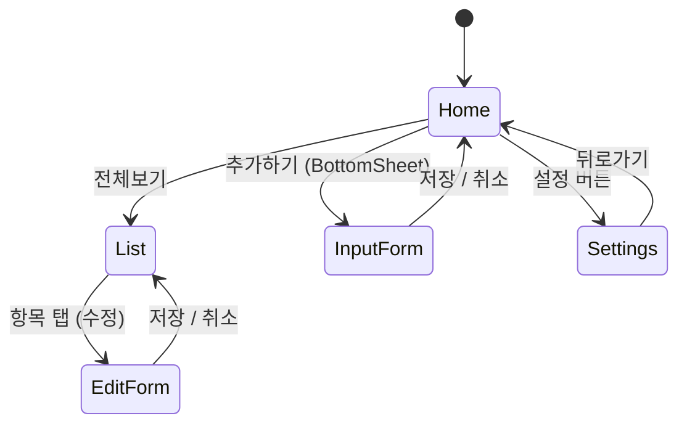

# [프로젝트명] — Product Requirements Document (PRD)

> **버전**: 0.1.0 (Draft)
> **작성일**: YYYY-MM-DD
> **작성자**: [이름]
> **상태**: `Draft` | `Review` | `Approved` | `Archived`

---

## 목차

1. [제품 개요](#1-제품-개요)
2. [목표 및 성공 지표](#2-목표-및-성공-지표)
3. [타겟 사용자](#3-타겟-사용자)
4. [기능 요구사항](#4-기능-요구사항)
5. [비기능 요구사항](#5-비기능-요구사항)
6. [데이터 모델](#6-데이터-모델)
7. [화면 및 네비게이션](#7-화면-및-네비게이션)
8. [기술 스택](#8-기술-스택)
9. [아키텍처 방향](#9-아키텍처-방향)
10. [마일스톤 및 개발 단계](#10-마일스톤-및-개발-단계)
11. [향후 고려사항](#11-향후-고려사항)

---

## 1. 제품 개요

### 1.1 앱 한 줄 소개
> 한 문장으로 앱의 가치 제안을 작성하세요.
> 예) WaWa Point는 포인트 적립/사용 내역을 손쉽게 관리하고 시각화하는 개인 재무 관리 도구입니다.

`[앱 이름]`은 `[타겟 사용자]`가 `[핵심 문제]`를 해결할 수 있도록 돕는 `[앱 카테고리]` 앱입니다.

### 1.2 배경 및 문제 정의

> 왜 이 앱이 필요한지 배경과 해결하려는 핵심 문제를 기술하세요.

- **현재 문제점**: ...
- **기회**: ...
- **제안 솔루션**: ...

---

## 2. 목표 및 성공 지표

### 2.1 제품 목표

| # | 목표 | 설명 |
|---|------|------|
| G1 | ... | ... |
| G2 | ... | ... |

### 2.2 성공 지표 (KPI / KSI)

| 지표 | 목표값 | 측정 방법 |
|------|--------|-----------|
| 앱 리텐션 (D7) | 50% 이상 | Analytics |
| 주요 기능 사용률 | 70% 이상 | 로그 분석 |
| 크래시율 | 0.1% 미만 | Firebase Crashlytics |

---

## 3. 타겟 사용자

### 3.1 메인 페르소나

```
이름: [가상의 사용자 이름]
나이: [연령대]
직업: [직업군]
기술 수준: 초급 / 중급 / 고급

핵심 니즈:
- ...
- ...

페인 포인트:
- ...
- ...
```

### 3.2 사용 시나리오

> 사용자가 앱을 어떻게 활용하는지의 핵심 시나리오를 기술합니다.

1. **시나리오 A**: ...
2. **시나리오 B**: ...

---

## 4. 기능 요구사항

### 4.1 기능 목록 (Feature List)

> 우선순위: `P0` (Must Have) / `P1` (Should Have) / `P2` (Nice to Have)

| # | 기능명 | 설명 | 우선순위 | 화면 |
|---|--------|------|----------|------|
| F01 | ... | ... | P0 | 홈 |
| F02 | ... | ... | P0 | ... |
| F03 | ... | ... | P1 | ... |
| F04 | ... | ... | P2 | 설정 |

### 4.2 기능 상세 (Feature Detail)

#### F01. [기능명]

- **설명**: ...
- **입력**: ...
- **출력**: ...
- **엣지 케이스**:
  - ...
  - ...
- **수용 기준 (Acceptance Criteria)**:
  - [ ] ...
  - [ ] ...

#### F02. [기능명]

> (같은 형식으로 반복)

---

## 5. 비기능 요구사항

### 5.1 성능

| 항목 | 요구사항 |
|------|----------|
| 앱 초기 실행 시간 (Cold Start) | 3초 이내 |
| 화면 전환 | 300ms 이내 |
| DB 읽기/쓰기 응답 | 100ms 이내 |

### 5.2 보안

- 민감 데이터(사용자 ID 등)는 `flutter_secure_storage` 또는 Keychain 활용
- 백업 파일 공유 시 암호화 여부 결정 필요

### 5.3 오프라인 지원

- [ ] 완전한 오프라인 지원 필요 (로컬 DB 기반)
- [ ] 일부 기능 오프라인 지원
- [ ] 온라인 필수

### 5.4 플랫폼 지원

| 플랫폼 | 지원 여부 | 최소 버전 |
|--------|-----------|-----------|
| iOS | ✅ | iOS 15+ |
| Android | ✅ | API 26+ (Android 8.0+) |
| Web | ❌ | - |

---

## 6. 데이터 모델

### 6.1 핵심 엔티티

> 앱의 핵심 데이터 객체를 명세합니다.

```
Entity: [엔티티명]
----------------------------------
id         : String (UUID)
createdAt  : DateTime
updatedAt  : DateTime
[field1]   : [type]  // 설명
[field2]   : [type]  // 설명
```

### 6.2 로컬 데이터 영속성 전략

| 저장소 | 용도 | 라이브러리 |
|--------|------|-----------|
| SQLite | 주요 거래 기록 | `sqflite` |
| SharedPreferences | 앱 설정 | `shared_preferences` |
| File System | 백업 파일 | `path_provider` |

---

## 7. 화면 및 네비게이션

### 7.1 화면 목록

| 화면 ID | 화면명 | 설명 |
|---------|--------|------|
| SCR-01 | 홈 (Home) | 메인 대시보드 |
| SCR-02 | 목록 (List) | 전체 내역 조회 |
| SCR-03 | 입력 폼 | 데이터 입력 (Bottom Sheet) |
| SCR-04 | 설정 | 앱 및 데이터 관리 |

### 7.2 네비게이션 흐름



---

## 8. 기술 스택

### 8.1 런타임 의존성 (Dependencies)

| 패키지 | 버전 | 용도 |
|--------|------|------|
| `provider` | ^6.x | 상태 관리 |
| `sqflite` | ^2.x | 로컬 DB |
| `path_provider` | ^2.x | 플랫폼 경로 |
| `shared_preferences` | ^2.x | 키-값 저장 |
| `intl` | ^0.x | 날짜/숫자 포맷 |
| `uuid` | ^4.x | 고유 ID 생성 |
| `file_picker` | ^8.x | 파일 선택 |
| `share_plus` | ^10.x | 공유 기능 |
| `fl_chart` | ^0.x | 차트 |

> 추가 패키지는 [pub.dev](https://pub.dev) 에서 검색하여 채워주세요.

### 8.2 개발 의존성 (Dev Dependencies)

| 패키지 | 버전 | 용도 |
|--------|------|------|
| `flutter_test` | SDK | 위젯/유닛 테스트 |
| `flutter_launcher_icons` | ^0.x | 앱 아이콘 생성 |

---

## 9. 아키텍처 방향

본 프로젝트는 **MVVM + Repository 패턴**의 **Layered Architecture**를 기반으로 합니다.

```
lib/
├── main.dart                   # 앱 진입점, Provider 등록
└── src/
    ├── constants/              # 공통 상수
    ├── data/                   # DB 래퍼, 백업 매니저 (Data Layer)
    ├── models/                 # 도메인 엔티티 (Model)
    ├── repositories/           # 데이터 접근 추상화 (Repository)
    ├── providers/              # ViewModel, 비즈니스 로직 (ViewModel)
    └── ui/                     # 위젯, 화면 (View)
        ├── app_theme.dart
        └── screens/
```

### 9.1 상태 관리
- **Primary**: `provider` 패키지 (`ChangeNotifier`)
- **Migration Path**: 추후 `Riverpod` 도입 고려 가능

### 9.2 의존성 규칙 (단방향)
```
UI → ViewModel → Repository → Data
```
- 상위 레이어만 하위 레이어를 참조합니다.
- 하위 레이어는 상위 레이어를 절대 참조하지 않습니다.

---

## 10. 마일스톤 및 개발 단계

| 단계 | 목표 | 주요 작업 | 예상 기간 |
|------|------|-----------|-----------|
| **Phase 0** | 환경 세팅 | 프로젝트 생성, 폴더 구조 설정, 패키지 설치 | 1일 |
| **Phase 1** | 핵심 기능 (MVP) | 모델, DB, Repository, 핵심 화면(홈, 입력) | 1-2주 |
| **Phase 2** | 기능 확장 | 목록, 필터, 차트, 설정 화면 | 1-2주 |
| **Phase 3** | 품질 개선 | 백업/복원, 마이그레이션, 테스트 | 3-5일 |
| **Phase 4** | 마무리 | UI 폴리싱, AppIcon, 배포 준비 | 3-5일 |

---

## 11. 향후 고려사항

> 현재 범위 밖(Out-of-Scope)이지만 향후 검토할 항목들입니다.

- [ ] **클라우드 동기화**: Firebase 또는 iCloud를 통한 크로스 기기 동기화
- [ ] **다국어 지원 (i18n)**: `flutter_localizations` 활용
- [ ] **위젯 (Widget Extension)**: iOS/Android 홈 화면 위젯
- [ ] **Push 알림**: 정기 리마인더 기능
- [ ] **Riverpod 전환**: 고급 상태 관리 도입

---

*이 문서는 개발이 진행됨에 따라 지속적으로 업데이트되어야 합니다.*
