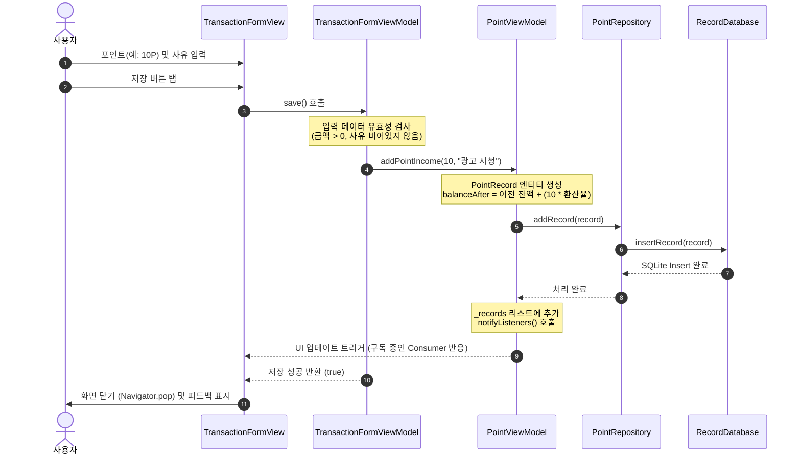
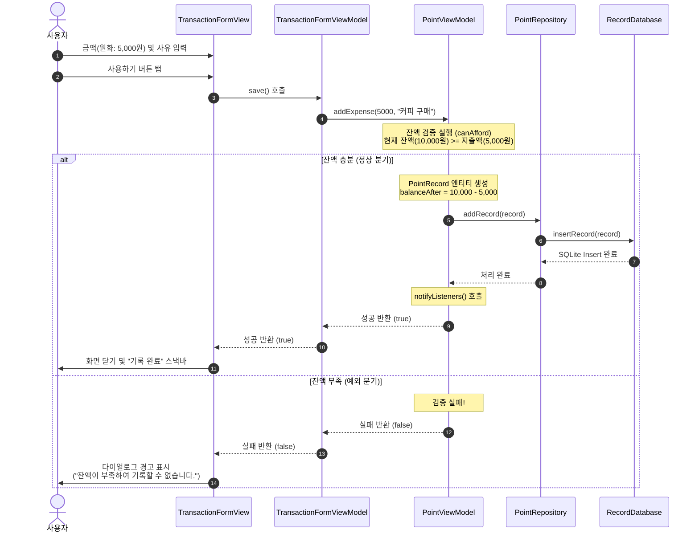
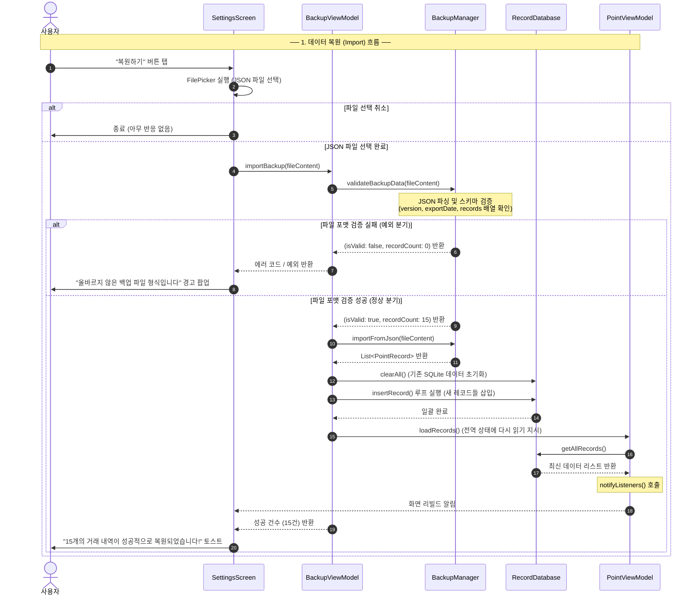

# 비즈니스 파이프라인 데이터 흐름 🔄

앱 내에서 사용자가 저장 버튼을 누르거나, 백업 파일을 가져올 때 내부 데이터는 어떻게 움직이고 계층 간에 어떤 상호작용이 일어날까요? 

가장 빈번하게 일어나는 3가지 주요 시나리오의 데이터 흐름을 <strong>시퀀스 다이어그램(Sequence Diagram)</strong>을 통해 알아봅니다.

---

## 1. 포인트 적립 흐름 (Income Flow)

사용자가 광고를 보거나 설문에 참여하여 <strong>포인트를 적립(수입)</strong>하는 경우입니다.

### 💡 포인트 적립의 핵심 원리
1. <strong>환산율 적용</strong>: 수입은 '포인트' 단위로 입력받지만, 데이터베이스에 저장할 때는 설정된 환산율(예: 1P = 1,000원)을 적용하여 <strong>원화(KRW)</strong> 가치로 변환 후 `balanceAfter`에 누적합니다.
2. <strong>SSOT(Single Source of Truth) 로드</strong>: 7번 과정에서 SQLite 저장이 완전히 끝나면, `PointViewModel`은 상태 변수 `_records`를 업데이트하고 `notifyListeners()`를 뿌려 화면을 자동으로 갱신합니다.

---

## 2. 지출 기록 흐름 (Expense Flow — 잔액 검증 포함)

원화(KRW)를 사용해 물건을 사는 등 <strong>포인트를 소비(지출)</strong>하는 흐름입니다. 이 과정에서는 <strong>"잔액이 충분한가?"</strong>라는 비즈니스 유효성 검사가 매우 중요합니다.

### ⚠️ 예외 처리 설계의 중요성
* <strong>서버나 DB에 쓰기 전 예방</strong>: 잔액 부족 검증은 데이터베이스 트랜잭션이 일어나기 전인 <strong>ViewModel(비즈니스 상태 계층)에서 판단</strong>합니다. 덕분에 무의미한 DB 쓰기 요청(I/O 비용)을 방지하고 사용자에게 빠르게 실패 응답을 돌려줄 수 있습니다.

---

## 3. 백업 및 복원 흐름 (Backup & Import Flow — 파일 검증 포함)

사용자가 기기를 변경하거나 앱 데이터를 다른 곳으로 공유하고자 할 때 수행하는 <strong>백업 파일 가져오기(Import)</strong> 및 <strong>내보내기(Export)</strong> 흐름입니다. 특히 복원 시 파일이 변조되었거나 구조가 망가진 경우에 대한 예외 처리가 들어있습니다.

### 🛡️ 안전장치: 방어적 데이터 복원
* <strong>유효성 선 검사(Validation Check)</strong>: 기존 데이터를 모두 지우는 `clearAll()` 명령은 <strong>반드시 백업 파일의 정합성이 100% 검증된 후에만 호출</strong>됩니다. 만약 파일이 깨져있다면 삭제 연산 자체가 실행되지 않아 기존 데이터를 보호합니다.
* <strong>비동기 동기화</strong>: `BackupViewModel`은 데이터 저장 작업을 마친 후 `PointViewModel.loadRecords()`를 호출하여, 완전히 독립된 두 ViewModel 사이의 상태 일관성을 맞춰줍니다.
