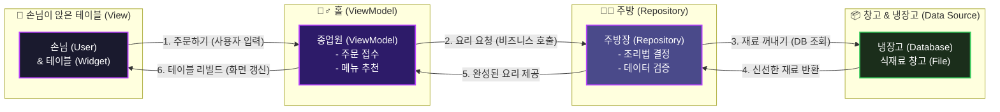
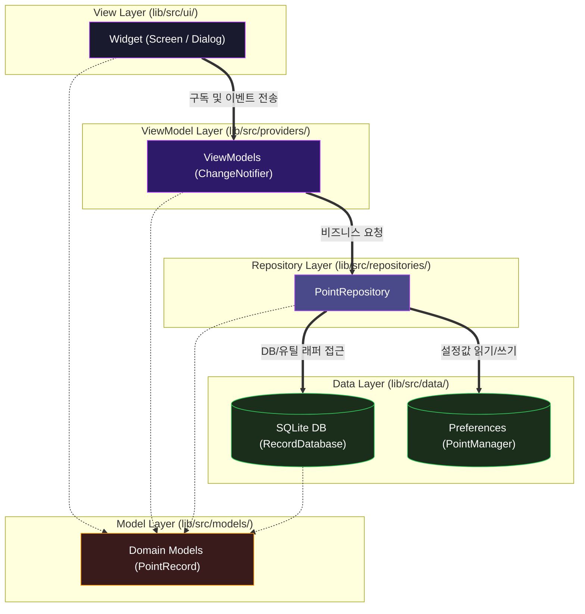

# 아키텍처 개요 및 레이어 분리 🧱

소프트웨어가 커질수록 코드가 서로 복잡하게 얽혀, 코드 한 줄을 고쳤는데 엉뚱한 곳에서 버그가 발생하는 일이 잦아집니다. 이를 방지하기 위한 가장 훌륭한 방법이 바로 **계층형 아키텍처(Layered Architecture)**와 **MVVM-Repository 패턴**입니다.

WaWa Point 프로젝트는 모든 구성 요소의 역할과 책임을 명확히 구분하여 개발의 편의성과 유지보수성을 극대화했습니다.

---

## 🍽️ 초보자를 위한 레스토랑 비유

아키텍처가 어렵게 느껴진다면, 맛있는 음식을 서빙하는 **레스토랑**을 떠올려 보세요. 앱의 아키텍처와 레스토랑의 운영 구조는 1:1로 매칭할 수 있습니다.

* **View (손님 / 테이블)**: 
  직접 요리를 하거나 재료를 냉장고에서 꺼내오지 않습니다. 손님은 오직 주문서(입력 폼)를 작성하고, 종업원이 가져다주는 완성된 요리(UI 상태)를 눈으로 보고 즐길 뿐입니다.
* **ViewModel (종업원)**: 
  손님의 주문을 받아 주방에 전달하고, 주방에서 나온 요리를 예쁜 그릇에 담아 손님에게 어울리는 형태로 서빙합니다. 식재료를 직접 썰거나(DB 쿼리 실행) 하지는 않지만, 주방에서 온 데이터를 손님이 먹기 좋게 가공합니다.
* **Repository (주방장)**: 
  오늘 요리에 필요한 신선한 재료가 냉장고(SQLite DB)에 있는지, 혹은 외부 백업 창고(JSON 파일)에서 가져와야 하는지 판단합니다. 재료들을 조합해 하나의 완성된 요리를 만들어 종업원에게 돌려줍니다.
* **Data Source (냉장고 / 창고)**: 
  데이터가 가득 보관되어 있는 곳입니다. 요리사가 재료를 달라고 하면 찾아주고, 남은 음식을 넣어두라고 하면 보관해 주는 기계적인 역할만 수행합니다.

---

## 📐 MVVM-R 계층 구조와 단방향 의존성

레스토랑의 역할이 섞이면(예: 손님이 주방에 들어가 요리하거나, 주방장이 손님 테이블을 닦는 등), 가게는 난장판이 될 것입니다. 이처럼 앱에서도 **단방향 의존성 규칙**을 철저히 지켜야 합니다.

### 💡 핵심: 단방향 의존성이란 무엇인가요?
* 화살표는 **"알고 있다 (참조한다)"**를 뜻합니다.
* **View**는 **ViewModel**을 알지만, **ViewModel**은 **View**를 절대 모릅니다. 즉, ViewModel 코드 안에는 `BuildContext`나 `Widget` 같은 UI 관련 코드가 단 한 줄도 들어가서는 안 됩니다.
* **ViewModel**은 **Repository**를 알지만, **Repository**는 **ViewModel**을 모릅니다.
* **Model**은 순수한 데이터 정의일 뿐이므로, 모든 계층에서 자유롭게 가져다 쓸 수 있습니다. 단, Model 스스로가 어떤 로직을 실행하여 위나 아래 계층을 참조하는 일은 없습니다.

---

## 🚫 계층별 책임 및 Do's & Don'ts

| 계층 (Layer) | 권장 사항 (Do) | 금지 사항 (Don't) |
| :--- | :--- | :--- |
| **View (UI)** | <ul><li>`StatelessWidget`을 기본으로 사용합니다.</li><li>사용자 인터랙션을 감지하여 ViewModel의 메서드를 단순 호출합니다.</li></ul> | <ul><li>DB에 직접 연결하거나 SQL을 호출하지 마세요.</li><li>비즈니스 로직(예: "잔액 검증하기")을 위젯 안에서 구현하지 마세요.</li></ul> |
| **ViewModel (State)** | <ul><li>UI를 구성하기 위한 화면 상태(State) 변수를 보관합니다.</li><li>상태가 변경되면 `notifyListeners()`로 UI에 갱신을 알립니다.</li></ul> | <ul><li>위젯이나 `BuildContext`를 내부 변수로 가지지 마세요.</li><li>DB에서 불러온 원시 데이터를 가공 없이 그대로 UI에 밀어 넣지 마세요.</li></ul> |
| **Repository (Domain)** | <ul><li>데이터 영속화에 필요한 정책(예: "레거시 데이터를 SQLite로 마이그레이션")을 구현합니다.</li><li>여러 데이터 소스(DB + File System)를 중재합니다.</li></ul> | <ul><li>특정 화면 UI에 종속된 일시적인 상태 변수(예: '로딩 여부')를 들고 있지 마세요.</li></ul> |
| **Data Source (Infra)** | <ul><li>SQLite CRUD, SharedPreferences 키-값 매핑, JSON 파싱 등 로우 레벨 API를 캡슐화합니다.</li><li>싱글톤 패턴을 활용하여 인스턴스를 하나만 유지합니다.</li></ul> | <ul><li>상태를 가지고 있거나 화면 UI를 리로드하는 트리거를 작동시키지 마세요.</li></ul> |

> [!WARNING]
> **초보자가 가장 많이 하는 실수!**
> "편하니까" 혹은 "빠르니까"라는 이유로 `View` 위젯 내부에서 `RecordDatabase.instance.insertRecord()`를 직접 호출하는 경우가 있습니다. 
> 이는 당장 동작할지 몰라도 코드의 결합도를 급격히 높여, 나중에 데이터베이스를 SQLite에서 다른 엔진(Hive, Realm 등)으로 변경하거나 테스트 코드를 작성할 때 커다란 부메랑이 되어 돌아옵니다. 
> 반드시 **View ➔ ViewModel ➔ Repository ➔ Data Source** 단계를 밟도록 설계하세요.
