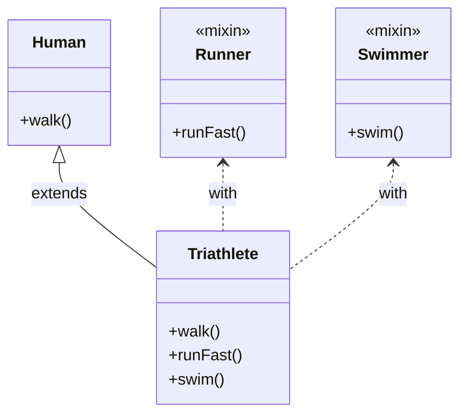
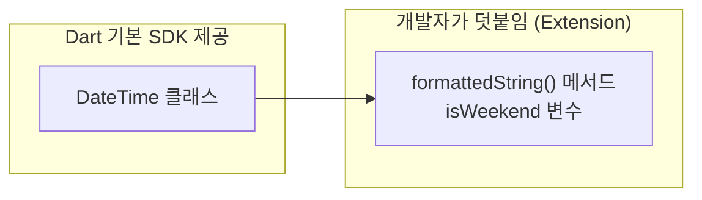

# Mixins & Extensions 🧩

객체지향 설계에서 가장 큰 실수 중 하나는 바로 <strong>"무분별한 클래스 상속(Inheritance)"</strong>입니다. 상속 관계가 깊어질수록 부모 클래스의 수정이 수많은 자식 클래스의 버그를 낳게 됩니다.

Dart는 상속의 단점을 보완하면서 코드 재사용을 극대화하기 위해 <strong>Mixins(믹스인)</strong>과 <strong>Extensions(익스텐션)</strong>이라는 획기적인 무기를 제공합니다.

---

## 1. Mixins: 코드 조립하기 (Composition)

믹스인은 <strong>"다중 상속"의 안전한 대체품</strong>입니다. 부모 클래스로부터 성질을 고스란히 물려받는 상속(`extends`)과 달리, 믹스인(`mixin`)은 <strong>특정 기능들을 조립식 장난감처럼 끼워 맞추는(`with`)</strong> 방식입니다.



* 철수는 `Human` 클래스를 상속받아 걷는 기능(`walk`)을 가집니다.
* 철수에게 수영 기능(`swim`)과 빠른 달리기 기능(`runFast`)을 추가하고 싶다면, 각각 `mixin`으로 만들어서 `with Swimmer, Runner`와 같이 주입해 줄 수 있습니다.

---

## 🛠️ WaWa Point 실전 프로젝트 분석: Mixin

WaWa Point의 메인 화면인 `DashboardScreen`에서는 잔액 변동 애니메이션을 구현하기 위해 Flutter SDK가 제공하는 애니메이션 자원 믹스인을 사용하고 있습니다.

### 📍 실제 활용 코드 ([dashboard_screen.dart](file:///Volumes/Development/Projects/Flutter/WaWa%20Point/wawapoint_flutter/lib/src/ui/screens/dashboard_screen.dart))
```dart
// State 클래스 뒤에 'with SingleTickerProviderStateMixin'을 붙여
// 애니메이션 구동에 필수적인 VSync(화면 재생률 동기화 신호)를 주입받음
class _DashboardScreenState extends State<DashboardScreen>
    with SingleTickerProviderStateMixin {
  
  late final AnimationController _controller;

  @override
  void initState() {
    super.initState();
    // vsync 파라미터에 'this'를 넘길 수 있는 이유가 
    // 바로 SingleTickerProviderStateMixin을 with로 조립했기 때문입니다.
    _controller = AnimationController(
      vsync: this, 
      duration: const Duration(milliseconds: 300),
    );
  }

  @override
  void dispose() {
    _controller.dispose();
    super.dispose();
  }
}
```

---

## 2. Extensions: 기존 클래스 확장하기 (Extension)

익스텐션은 <strong>"내가 손댈 수 없는 외부 라이브러리나 SDK 클래스에 나만의 편리한 기능을 덧붙이는 것"</strong>입니다. 

예를 들어, Flutter SDK에 구현된 `String` 클래스나 `DateTime` 클래스의 내부 코드를 직접 고칠 수는 없지만, 익스텐션을 쓰면 마치 원래 그 클래스에 내장되어 있던 메서드처럼 사용할 수 있는 커스텀 메서드를 부착할 수 있습니다.



---

## 🛠️ WaWa Point 실전 프로젝트 분석: Extension

WaWa Point의 지출 통계 화면에서는 거래 필터링 기준이 되는 <strong>기간 열거형(TimePeriod Enum)</strong>에 대해 날짜 계산 메서드를 부착하기 위해 Extension을 적극적으로 활용합니다.

### 📍 실제 활용 코드 ([history_view_model.dart](file:///Volumes/Development/Projects/Flutter/WaWa%20Point/wawapoint_flutter/lib/src/providers/history_view_model.dart))

```dart
// 1. 단순한 Enum(열거형) 정의
enum TimePeriod { week, month, year, all }

// 2. Extension을 사용해 Enum 객체에 비즈니스 로직(날짜 연산) 부착
extension TimePeriodExt on TimePeriod {
  // 현재 기간 필터가 시작하는 기준 날짜를 계산하여 반환하는 Getter
  DateTime get startDate {
    final now = DateTime.now();
    final today = DateTime(now.year, now.month, now.day);
    
    return switch (this) {
      TimePeriod.week => today.subtract(Duration(days: today.weekday - 1)), // 이번 주 월요일
      TimePeriod.month => DateTime(today.year, today.month, 1),             // 이번 달 1일
      TimePeriod.year => DateTime(today.year, 1, 1),                       // 올해 1월 1일
      TimePeriod.all => DateTime(1970),                                    // 태초의 시간
    };
  }

  // 화면에 표시될 직관적인 한글 이름을 반환하는 Getter
  String get displayName => switch (this) {
    TimePeriod.week => '주간 내역',
    TimePeriod.month => '월간 내역',
    TimePeriod.year => '연간 내역',
    TimePeriod.all => '전체 내역',
  };
}

// 3. 실전 사용 예시
void main() {
  TimePeriod selectedFilter = TimePeriod.week;
  
  // 원래 Enum에는 없는 'displayName'과 'startDate'를 
  // 마치 내장 프로퍼티인 것처럼 자연스럽게 호출합니다.
  print(selectedFilter.displayName); // 출력: 주간 내역
  print(selectedFilter.startDate);   // 출력: 2026-06-22 00:00:00.000 (이번주 월요일)
}
```

---

## 🆚 Mixin vs Extension 요약 테이블

| 구분 | Mixin (with) | Extension (on) |
| :--- | :--- | :--- |
| <strong>핵심 목적</strong> | 내 클래스에 새로운 기능/상태를 조립 주입하기 | 남이 만든 클래스에 편리한 헬퍼 메서드 부착하기 |
| <strong>적용 대상</strong> | 내가 직접 새로 정의하는 클래스 | SDK 제공 클래스(`String`, `DateTime`, `Enum` 등) 및 외부 패키지 클래스 |
| <strong>상태 보관</strong> | <strong>변수(State)를 직접 보관할 수 있음</strong> | <strong>상태(Instance Field)를 직접 보관할 수 없음</strong> (오직 Getter/Setter, Method만 가능) |
| <strong>실전 예시</strong> | 애니메이션 자원 주입(`SingleTickerProviderStateMixin`) | 날짜 포맷팅 변환(`DateTime.toFormattedString()`) |
