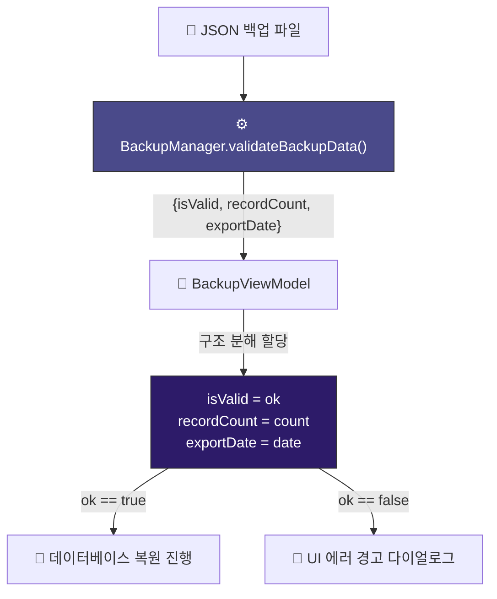

# Pattern Matching & Records 🧩

Dart 3.0 버전부터 언어의 기본 패러다임을 바꿀 만큼 강력한 기능이 도입되었습니다. 바로 **Records(레코드)**와 **Pattern Matching(패턴 매칭)**입니다. 

이 두 기능을 조합하면 복잡한 데이터 구조를 다룰 때 수십 줄에 달하던 코드를 단 몇 줄로 대폭 줄이고, 타입 안전성(Type Safety)까지 보장받을 수 있습니다.

---

## 1. Records (레코드) 란 무엇인가요?

기존 Dart에서는 함수가 2개 이상의 값을 반환해야 할 때 매우 골치 아팠습니다. 
* 임시 데이터를 담을 별도의 클래스를 매번 새로 정의하거나,
* `Map<String, dynamic>` 형태로 묶어서 반환해야 했습니다.

레코드는 **임시 클래스를 선언하지 않고도 여러 타입의 여러 값을 하나의 묶음으로 처리**할 수 있게 해주는 익명 컨테이너입니다.

### 🆚 Before vs After: 여러 개의 값 반환하기

#### ❌ Dart 2.x 이전 방식 (Map 사용 - 런타임 에러 위험)
```dart
// 반환 타입을 Map으로 지정하면 어떤 Key가 들어있는지 IDE가 알지 못함
Map<String, dynamic> getUserInfo() {
  return {
    'name': '홍길동',
    'age': 20,
    'isAdmin': false,
  };
}

void main() {
  final info = getUserInfo();
  // 오타가 나도 컴파일 시점에 알 수 없고, 런타임에 null 에러가 날 수 있음
  String name = info['nmae']; // ⚠️ 'name'의 오타이지만 에러가 안 남!
  int age = info['age'];
}
```

####  Dart 3.x 방식 (Named Records 사용 - 컴파일러가 타입 체크)
```dart
// 함수 선언부에서 반환할 값들의 이름과 타입을 정확히 명시
({String name, int age, bool isAdmin}) getUserInfo() {
  return (
    name: '홍길동',
    age: 20,
    isAdmin: false,
  );
}

void main() {
  final info = getUserInfo();
  // IDE 자동완성이 지원되며, 존재하지 않는 이름 입력 시 컴파일 에러 발생!
  String name = info.name; 
  int age = info.age;
}
```

---

## 2. Pattern Matching & Destructuring

패턴 매칭은 들어오는 데이터의 **'생김새(구조)'를 확인하여 데이터를 쪼개거나 분기 처리**하는 기능입니다. 이를 **구조 분해(Destructuring)**라고 부릅니다.

### 🆚 Before vs After: Switch 문 분기

#### ❌ Dart 2.x 이전 방식 (명령형 코딩)
```dart
String getStatusMessage(int statusCode) {
  switch (statusCode) {
    case 200:
      return "성공";
    case 404:
      return "페이지 없음";
    case 500:
      return "서버 오류";
    default:
      return "알 수 없는 에러";
  }
}
```

####  Dart 3.x 방식 (선언형 Switch Expression)
```dart
// 식(Expression)으로 동작하여 바로 대입 가능, 훨씬 직관적
String getStatusMessage(int statusCode) => switch (statusCode) {
  200 => "성공",
  404 => "페이지 없음",
  500 => "서버 오류",
  _ => "알 수 없는 에러" // default는 _ 기호로 표시
};
```

---

## 🛠️ WaWa Point 실전 프로젝트 분석

WaWa Point에서는 사용자가 선택한 **백업 JSON 파일이 유효한지 사전 정합성을 검사할 때** Named Records와 Destructuring 패턴을 함께 사용하고 있습니다.



### 1. 백업 데이터 정합성 검사 함수
[backup_manager.dart](file:///Volumes/Development/Projects/Flutter/WaWa%20Point/wawapoint_flutter/lib/src/data/backup_manager.dart) 의 실제 구현 로직을 추상화한 예제입니다.

```dart
// Named Record 형태로 성공 여부, 거래 개수, 백업 날짜를 한 번에 반환
({bool isValid, int recordCount, DateTime? exportDate}) validateBackupData(String jsonString) {
  try {
    final Map<String, dynamic> json = jsonDecode(jsonString);
    
    // 필수 메타데이터가 존재하고 포맷이 맞는지 검사
    if (json['version'] == null || json['records'] == null) {
      return (isValid: false, recordCount: 0, exportDate: null);
    }
    
    final recordsList = json['records'] as List;
    final date = json['exportDate'] != null 
        ? DateTime.parse(json['exportDate']) 
        : null;

    return (
      isValid: true,
      recordCount: recordsList.length,
      exportDate: date,
    );
  } catch (e) {
    // 파싱 중 에러 발생 시 안전하게 실패 정보 반환
    return (isValid: false, recordCount: 0, exportDate: null);
  }
}
```

### 2. ViewModel에서의 구조 분해 사용
[backup_view_model.dart](file:///Volumes/Development/Projects/Flutter/WaWa%20Point/wawapoint_flutter/lib/src/providers/backup_view_model.dart) 에서 위 검사 결과를 받아 로직을 분기하는 부분입니다.

```dart
Future<void> processRestore(String fileContent) async {
  // 결과 값을 받아 즉시 개별 변수로 쪼개어 할당 (Destructuring)
  final (isValid: ok, recordCount: count, exportDate: date) = 
      _backupManager.validateBackupData(fileContent);

  if (!ok) {
    // ⚠️ 파일이 손상되었으므로 진행하지 않고 종료
    _errorMessage = "올바르지 않은 백업 파일 포맷입니다.";
    notifyListeners();
    return;
  }

  // 정상적인 경우 백업 진행
  print("$count개의 거래 데이터를 찾았습니다. 백업 시점: $date");
  await _db.clearAll();
  // ... SQLite 삽입 처리
}
```

> [!TIP]
> **컴파일러가 제공하는 안전 벨트**
> 레코드를 구조 분해할 때 변수명을 다르게 매칭하거나 타입을 잘못 매칭하면, 실행되기도 전에 IDE에서 빨간색 에러 라인이 표시됩니다. 
> 타입 캐스팅 실수(`as Map`)로 발생하는 런타임 크래시를 컴파일 타임에 철저하게 예방할 수 있으므로, 다중 값 리턴에는 항상 레코드 사용을 습관화하세요!
