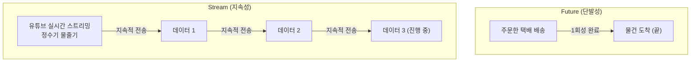
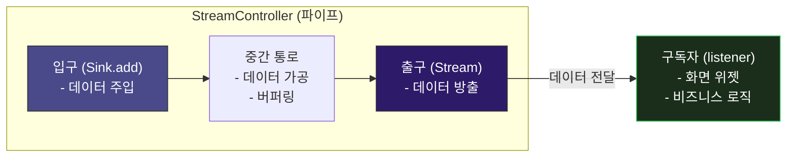
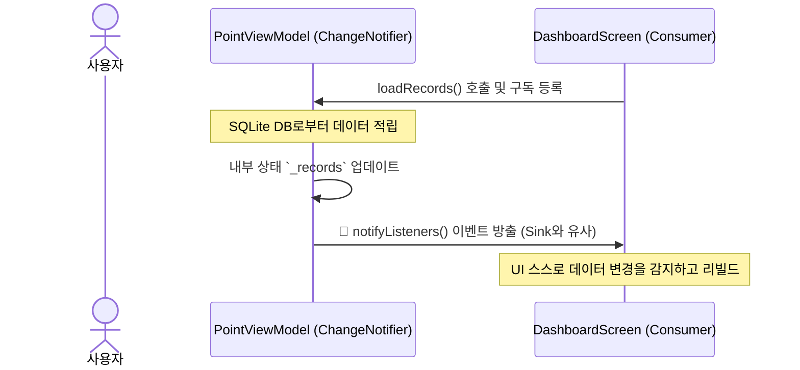

# Stream & Reactive Programming 🌊

모바일 앱은 사용자의 끊임없는 입력, 비동기 네트워크 요청, 로컬 데이터베이스 조회 등으로 가득 차 있습니다. 이러한 비동기적 흐름을 깔끔하고 반응성 있게 처리하기 위해 Dart는 **Future**와 **Stream**이라는 장치를 제공합니다.

이번 장에서는 반응형 프로그래밍(Reactive Programming)의 원리와 비동기 데이터 파이프라인의 핵심인 Stream에 대해 알아봅니다.

---

## 1. Future vs Stream: 비동기 데이터의 비유

비동기 작업(언제 끝날지 모르는 작업)의 결과를 반환받을 때, 데이터가 일회성인지 혹은 지속적으로 쏟아져 들어오는지에 따라 사용하는 도구가 달라집니다.

### 🆚 Future와 Stream 비교표
| 구분 | Future | Stream |
| :--- | :--- | :--- |
| **반환 개수** | 단 **1개**의 값 또는 에러만 반환하고 소멸 | 시간에 따라 **여러 개**의 값(0개~무한대)을 지속적으로 반환 |
| **비유** | 레스토랑에서 진동벨이 울려 음식을 한 번 받아오는 것 | 정수기 꼭지를 틀어놓아 물이 졸졸 흐르는 것 |
| **Dart 선언** | `Future<int> fetchResult()` | `Stream<int> countSeconds()` |
| **데이터 소비** | `await` 또는 `.then()` | `await for` 또는 `.listen()` |

---

## 2. StreamController의 구조 (데이터 파이프라인)

Stream을 직접 생성하고 제어하기 위해 Dart는 **StreamController**를 제공합니다. StreamController는 물을 주입하는 **입구(Sink)**와 물이 흘러나오는 **출구(Stream)**로 구성된 파이프와 같습니다.

* **Sink**: 데이터의 투입구입니다. 개발자가 `controller.sink.add(value)`를 통해 새로운 데이터를 밀어 넣습니다.
* **Stream**: 데이터의 출구입니다. 외부에서는 이 Stream을 통해 데이터의 변화를 감지합니다.
* **Listener**: 출구에서 흘러나오는 데이터를 실시간으로 귀 기울여 듣고 있는(구독하는) 대상입니다. 데이터가 흘러나오면 그에 맞춰 UI를 갱신하거나 다른 로직을 수행합니다.

---

## 3. 반응형 프로그래밍(Reactive Programming) 이란?

반응형 프로그래밍이란 **"데이터 스트림을 중심으로, 어떤 값이 변경되면 이를 구독하고 있던 화면이나 컴포넌트가 자동으로 알아서 갱신되는 선언적 프로그래밍 패러다임"**입니다.

### 🆚 명령형 vs 반응형

* **명령형 (Imperative)**: A가 바뀌었으니, 수동으로 B와 C에게 알려서 각각 리로드하라고 명령해야 함. (코드가 길어지고 일부 화면 누락 시 버그 발생)
* **반응형 (Reactive)**: B와 C가 A를 미리 구독하고 있음. A가 바뀌면 B와 C는 지시하지 않아도 **자동으로 스스로의 화면을 새로 고침**.

### 🛠️ WaWa Point의 반응형 상태 모델

WaWa Point 프로젝트는 완전히 날것의 `StreamController`를 직접 쓰기보다, Flutter에서 제공하는 가벼운 반응형 메커니즘인 **ChangeNotifier(Provider)**를 사용합니다. 
ChangeNotifier 내부도 근본적으로는 **이벤트 스트림의 발행-구독(Pub-Sub) 모델**로 움직입니다.

1. **상태 변경**: 사용자가 새로운 포인트를 획득하면 `PointViewModel` 내부에서 데이터 추가 연산이 일어납니다.
2. **이벤트 전파**: 연산 완료 후 호출되는 `notifyListeners()`는 일종의 **Sink 에 데이터를 밀어 넣어 이벤트를 흘려보내는 행위**와 같습니다.
3. **자동 갱신**: 해당 ViewModel을 구독(`context.watch` 또는 `Consumer`)하고 있던 `DashboardScreen`과 `HistoryScreen` 등 모든 화면 위젯들이 이벤트를 수신하여 **스스로 화면을 리빌드(갱신)**합니다.

> [!WARNING]
> **초보자가 놓치기 쉬운 Stream의 메모리 누수(Memory Leak)**
> `Stream`을 `.listen()` 메서드로 구독하여 사용하는 경우, 위젯이 화면에서 사라질 때(`dispose`) 반드시 **구독을 취소(`subscription.cancel()`)**해 주어야 합니다. 
> 그렇지 않으면 화면이 종료되어도 데이터 파이프라인이 백그라운드 메모리에 계속 살아있어, 결국 앱이 느려지거나 팅기는 메모리 누수가 발생합니다. 
> * 다행히 Flutter의 `StreamBuilder` 위젯을 사용하거나 `Provider` 패키지를 적절히 쓰면, 위젯이 해제될 때 구독을 자동으로 취소해 줍니다.
