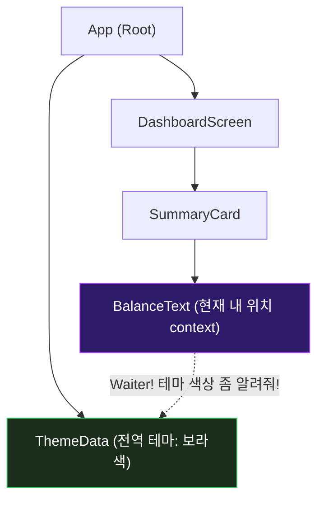
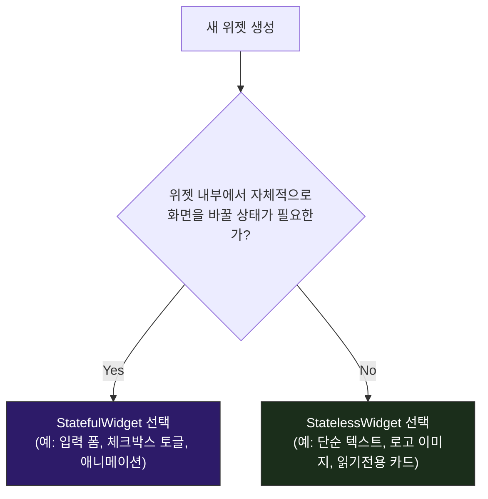
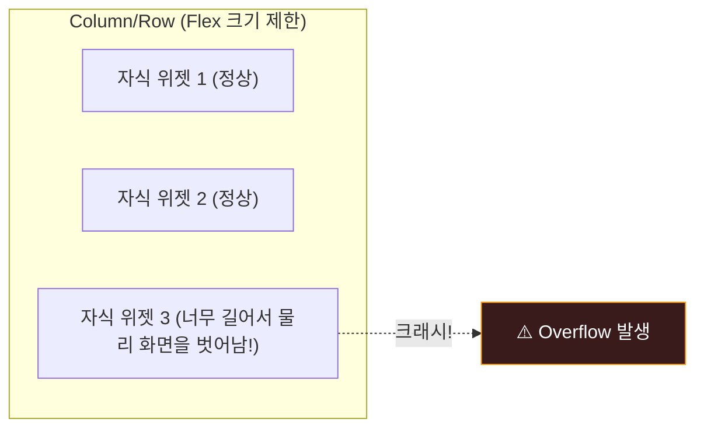
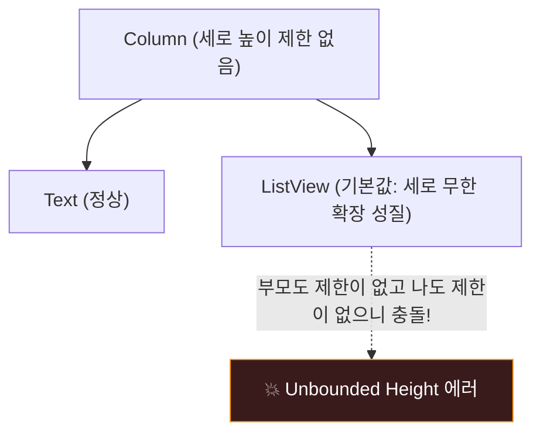

# Flutter 초보자 가이드: 핵심 입문 팁 🔰

Flutter 월드에 오신 것을 환영합니다! Flutter는 선언형 UI 프레임워크로, 처음 접할 때 기존 명령형 프레임워크(예: Android XML, iOS Storyboard)와는 다른 패러다임 때문에 몇 가지 난관에 부딪히기 쉽습니다. 

이 장에서는 초보 개발자가 가장 많이 헷갈려하는 핵심 개념들을 쉽게 풀어서 설명하고, 개발 중 단골로 마주치는 화면 크래시(레이아웃 에러) 해결법을 소개합니다.

---

## 1. BuildContext의 명쾌한 이해 🗺️

Flutter 코드를 작성하다 보면 모든 `build` 메서드의 인자로 `BuildContext context`가 넘어오는 것을 볼 수 있습니다. 대체 이 `context`는 무엇이고 왜 필요할까요?

### 🏠 식당의 "웨이터" 비유로 이해하기

`BuildContext`는 위젯 트리에서 **"현재 이 위젯이 어디에 위치하고 있는지 알려주는 주소록이자 신분증"**입니다.



* **역할 1: 나의 위치 식별**: `context`는 현재 위젯(예: `BalanceText`)이 트리 상에서 어느 부모 밑에 있고 자식은 누구인지 알고 있는 정보 객체입니다.
* **역할 2: 조상 위젯 찾기 (조회 도구)**: "내 위에 있는 가장 가까운 테마(`Theme`) 정보를 알려줘", "내 위에 있는 상태 관리자(`Provider`)를 불러줘"라고 요청할 때, 이 `context`를 기반으로 트리를 거슬러 올라가 찾아냅니다.

### 📍 실전 코드 예시
```dart
@override
Widget build(BuildContext context) {
  // context를 통해 트리 조상에 있는 Theme 위젯에 접근하여 주조색을 가져옵니다.
  final primaryColor = Theme.of(context).primaryColor; 
  
  // context를 통해 조상에 있는 PointViewModel 인스턴스를 찾습니다.
  final pointVM = Provider.of<PointViewModel>(context); 

  return Text(
    "잔액",
    style: TextStyle(color: primaryColor),
  );
}
```

> [!WARNING]
> **초보자의 실수: 다른 위치의 context 사용하기**
> 다이얼로그(`showDialog`)를 띄우거나 Navigator를 통해 새 화면으로 이동할 때, 종종 `BuildContext`가 유효하지 않거나 엉뚱한 위치를 가리켜 "Navigator operation requested with a context that does not include a Navigator." 같은 에러가 발생합니다. 비동기 작업(`await`) 후에 `context`를 사용할 때는 반드시 **`if (mounted)`**를 검사하여 위젯이 여전히 트리 상에 존재하는지 확인해야 합니다.

---

## 2. StatelessWidget vs StatefulWidget 선정 가이드 🆚

위젯을 새로 만들 때 "둘 중 무엇으로 상속받아야 할지" 망설여진다면 아래의 단 한 가지만 자문해보세요.

> **"이 위젯 안에서 스스로 화면을 바꾸는 데이터(상태)가 필요한가?"**



### 🧱 StatelessWidget (정적 위젯)
* **특징**: 생성 시 부모로부터 넘겨받은 프로퍼티(`final` 변수)만 그대로 그리며, 화면이 생성된 후에는 스스로 변하지 않습니다.
* **비즈니스 적용 예**: WaWa Point의 `TransactionDetailDialog` 처럼 특정 거래의 상세 내역을 파라미터로 받아 화면에 보여주기만 하는 경우.

### 🔄 StatefulWidget (동적 위젯)
* **특징**: 화면 내부에 독립된 `State` 객체를 가집니다. 사용자 인터랙션 등으로 `setState()`를 호출하면 상태가 변경되고 화면의 해당 부위가 다시 그려집니다.
* **비즈니스 적용 예**: `TransactionFormScreen` 처럼 사용자가 금액을 타이핑하거나 수입/지출 라디오 버튼을 토글할 때마다 입력 상태를 임시로 간직하고 보여줘야 하는 경우.

---

## 3. 초보자를 절망시키는 2대 레이아웃 에러 해결법 🚨

Flutter 개발을 시작하면 화면에 노란색과 검은색 빗금 패턴의 경고가 뜨거나, 화면 전체가 붉은색 에러로 덮이는 현상을 반드시 겪게 됩니다. 당황하지 마세요. 원인은 명확합니다.

### 3.1. `RenderFlex overflowed` (화면 영역 초과)

* **에러 메시지**: `A RenderFlex overflowed by xxx pixels on the bottom/right.`
* **발생 원인**: `Row`나 `Column` 같은 Flex 위젯 내부의 자식들이 화면 크기(폭 또는 높이)보다 커서 넘쳤을 때 발생합니다. 특히 가로 화면에서 긴 텍스트를 `Row`로 감싸거나, 가상 키보드가 올라오면서 세로 공간이 부족해질 때 자주 일어납니다.



#### 💡 해결 방법 1: `Expanded` 또는 `Flexible`로 감싸기
* 자식 위젯이 남은 공간만큼만 늘어나거나 줄어들도록 강제합니다. (가로 넘침 해결에 탁월)
```dart
// 에러 발생 코드
Row(
  children: [
    const Icon(Icons.star),
    Text("아주아주아주 긴 텍스트입니다. 화면을 뚫고 나가겠죠?"), // ➔ Overflow!
  ],
)

// 수정 코드
Row(
  children: [
    const Icon(Icons.star),
    Expanded(
      child: Text("아주아주아주 긴 텍스트입니다. 자동으로 줄바꿈 처리됩니다."),
    ),
  ],
)
```

#### 💡 해결 방법 2: `SingleChildScrollView`로 스크롤 가능하게 만들기
* 화면 하단에 입력 폼이 있을 때 키보드가 올라오면서 화면을 가리는 현상은 `Column`을 스크롤 뷰로 감싸 해결합니다.
```dart
@override
Widget build(BuildContext context) {
  return Scaffold(
    body: SingleChildScrollView( // ➔ 키보드가 올라와도 스크롤하여 오버플로우 방지
      child: Column(
        children: [
          TextField(),
          ElevatedButton(onPressed: () {}, child: const Text("제출")),
        ],
      ),
    ),
  );
}
```

---

### 3.2. `Vertical viewport was given unbounded height` (높이 무한대 오류)

* **에러 메시지**: `Vertical viewport was given unbounded height` 또는 `RenderBox was not laid out`
* **발생 원인**: 높이가 무한히 늘어날 수 있는 무제한 영역(`Column`) 안에, 마찬가지로 자식의 개수에 맞춰 무한히 늘어나려고 하는 스크롤 위젯(`ListView`, `GridView`)이 직접 중첩되어 들어가 배치 방향의 한계점 계산이 불가능해질 때 일어납니다.



#### 💡 해결 방법 1: `ListView`를 `Expanded`로 감싸기
* `Column` 내부에서 `ListView`가 차지할 수 있는 명확한 크기 한계선(남은 스크린 영역 전체)을 지정해줍니다.
```dart
// 에러 발생 코드
Column(
  children: [
    const Text("최근 거래 내역"),
    ListView.builder( // ➔ 크래시 발생!
      itemCount: 10,
      itemBuilder: (_, index) => ListTile(title: Text("기록 $index")),
    ),
  ],
)

// 수정 코드
Column(
  children: [
    const Text("최근 거래 내역"),
    Expanded( // ➔ ListView가 남은 영역에 딱 맞게 스냅됩니다.
      child: ListView.builder(
        itemCount: 10,
        itemBuilder: (_, index) => ListTile(title: Text("기록 $index")),
      ),
    ),
  ],
)
```

#### 💡 해결 방법 2: `shrinkWrap: true` 및 `physics` 지정
* 만약 다른 스크롤 뷰 안에 들어가서 자체 스크롤은 비활성화하고 전체 높이를 자식 개수만큼만 딱 맞추고 싶을 때는 `shrinkWrap` 옵션을 켭니다.
```dart
ListView.builder(
  shrinkWrap: true, // ➔ 전체 리스트 아이템 높이의 총합만큼만 자리를 차지하게 제한
  physics: const NeverScrollableScrollPhysics(), // ➔ 중첩 스크롤 충돌 방지를 위해 리스트 스크롤 비활성화
  itemCount: 5,
  itemBuilder: (_, index) => ListTile(title: Text("아이템 $index")),
)
```
