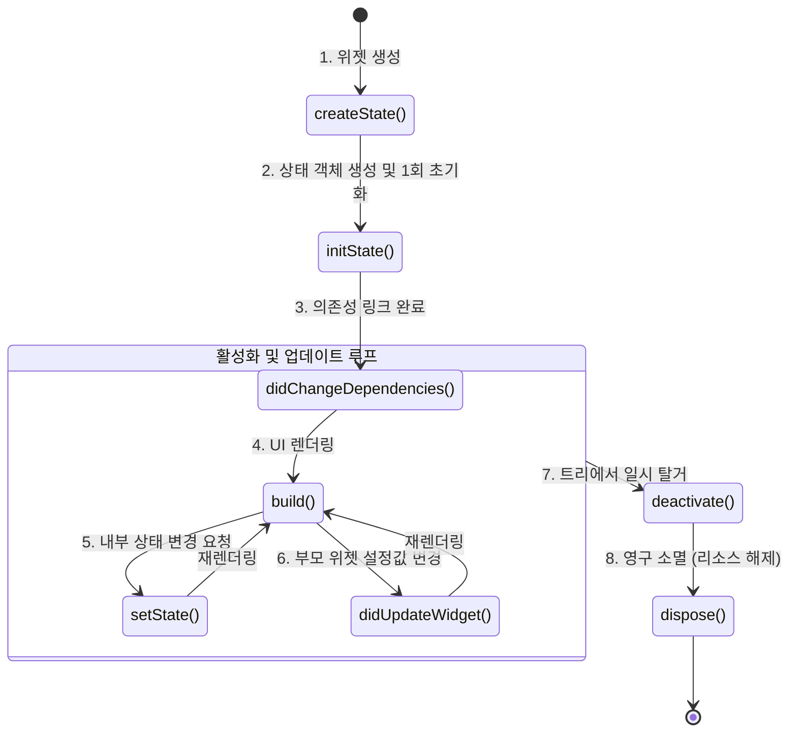

# StatefulWidget 생명주기 및 리소스 관리 🔄

`StatelessWidget`은 한 번 렌더링되면 화면을 스스로 바꿀 수 없습니다. 반면, `StatefulWidget`은 화면이 살아있는 동안 데이터가 바뀌면 여러 번 다시 그려질 수 있고, 앱의 상태 변화에 따라 다양한 시스템 이벤트와 맞물려 움직입니다.

이 장에서는 StatefulWidget의 생성부터 소멸까지의 **생명주기(Lifecycle)** 흐름과, 메모리 누수를 방지하기 위한 올바른 리소스 해제 규칙을 알아봅니다.

---

## 🗺️ 생명주기 메서드 전체 흐름도

StatefulWidget의 생명주기는 크게 **초기화(Initialization) ➔ 활성화(State Mutation) ➔ 해제(Destruction)**의 3단계로 분류됩니다.



---

## 🔍 핵심 생명주기 메서드 세부 분석

### 1. `initState()`
* **호출 시점**: 위젯이 트리 상에 최초로 삽입될 때 **딱 한 번만** 실행됩니다.
* **주요 용도**: `AnimationController`, `TextEditingController` 등 화면 내부에서 사용되는 컨트롤러 객체를 할당하거나 API 첫 호출을 걸어둡니다.
* **⚠️ 주의점**: 이 시점에는 아직 위젯 트리에 완전히 소속되지 않아 `BuildContext`를 안전하게 다룰 수 없습니다. `context.watch<T>()` 같은 코드를 여기서 실행하면 **즉시 크래시**가 납니다.

### 2. `didChangeDependencies()`
* **호출 시점**: `initState()` 직후에 1회 호출되며, 그 이후에는 구독하고 있는 `InheritedWidget`(예: 테마 `Theme.of`, 화면 크기 `MediaQuery.of`, 상태 관리 `Provider.of`)의 값이 변경될 때마다 호출됩니다.
* **주요 용도**: BuildContext가 준비된 시점이므로, **상태 관리 패키지(Provider)의 데이터를 처음 읽어와 바인딩할 때** 가장 안전하게 사용할 수 있습니다.

### 3. `build()`
* **호출 시점**: 화면을 그려야 할 때 호출되며, `setState()`가 실행될 때마다 반복해서 작동합니다.
* **⚠️ 주의점**: 빌드 메서드는 초당 수십 번 호출될 수 있으므로, 내부에서 파일 읽기/쓰기, SQLite 조회, 복잡한 반복 연산 같은 **무거운 작업을 절대 실행해서는 안 됩니다**. 빌드는 오직 설계도만 반환해야 합니다.

### 4. `didUpdateWidget(covariant MyWidget oldWidget)`
* **호출 시점**: 부모 위젯이 리빌드되어 자식 위젯(나)에게 새로운 설정값(Property)을 전달했을 때 실행됩니다.
* **주요 용도**: 부모가 준 값이 변경되었을 때, 이에 반응하여 애니메이션을 다시 시작하거나 컨트롤러의 값을 변경하고 싶을 때 유용합니다.

### 5. `dispose()`
* **호출 시점**: 위젯이 완전히 파괴되어 화면에서 사라질 때 **마지막으로 딱 한 번** 호출됩니다.
* **주요 용도**: 생성했던 모든 컨트롤러, 스트림 리스너, 타이머 등을 끄고 청소합니다.

---

## 🛠️ WaWa Point 실전 프로젝트 분석: 리소스 관리

애니메이션 카드가 들어있는 `DashboardScreen`의 상태 클래스에서 컨트롤러를 선언하고 올바르게 청소하는 과정의 예제입니다.

### 📍 올바른 리소스 관리 코드 ([dashboard_screen.dart](file:///Volumes/Development/Projects/Flutter/WaWa%20Point/wawapoint_flutter/lib/src/ui/screens/dashboard_screen.dart))
```dart
class _DashboardScreenState extends State<DashboardScreen>
    with SingleTickerProviderStateMixin {
  
  // 1. 변수를 late 선언하여 메모리에 올릴 준비만 해둡니다.
  late final AnimationController _controller;

  @override
  void initState() {
    super.initState();
    // 2. initState() 단계에서 단 1회 컨트롤러 인스턴스를 확보합니다.
    _controller = AnimationController(
      vsync: this,
      duration: const Duration(milliseconds: 300),
    );
  }

  @override
  Widget build(BuildContext context) {
    // 3. build() 메서드는 오직 렌더링에만 집중합니다.
    return ScaleTransition(
      scale: _controller,
      child: const Text("애니메이션 카드"),
    );
  }

  @override
  void dispose() {
    // 4. 중요: 화면이 닫힐 때 컨트롤러의 하드웨어 리소스를 반드시 해제합니다.
    _controller.dispose();
    // 부모 클래스의 dispose는 내 정리가 다 끝난 맨 마지막에 호출합니다.
    super.dispose(); 
  }
}
```

> [!WARNING]
> **초보자가 자주 만드는 최악의 메모리 누수 버그!**
> `AnimationController`나 `StreamSubscription`을 `dispose()` 단계에서 해제하지 않으면, 사용자가 해당 화면을 닫고 홈 화면으로 돌아가도 해당 리소스가 CPU와 RAM 점유율을 차지하며 영구히 유지됩니다. 
> 사용자가 화면을 들어왔다 나갔다 할 때마다 수십 개의 쓰레기 인스턴스가 램에 누적되어 결국 앱이 강제 종료(`Out of Memory`)에 이르게 됩니다. 
> **"생성은 initState, 소멸은 dispose"** 공식을 철저하게 준수하세요!
