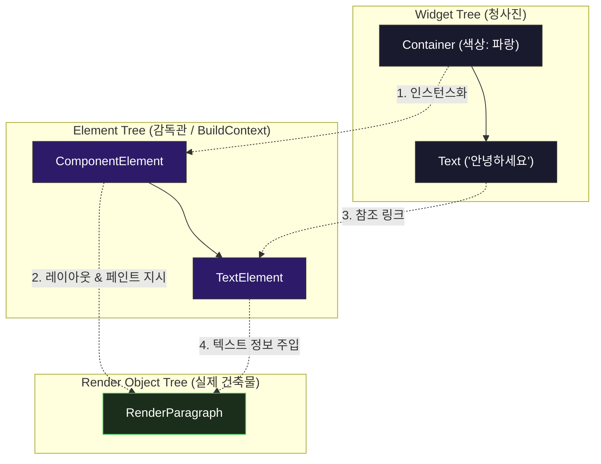
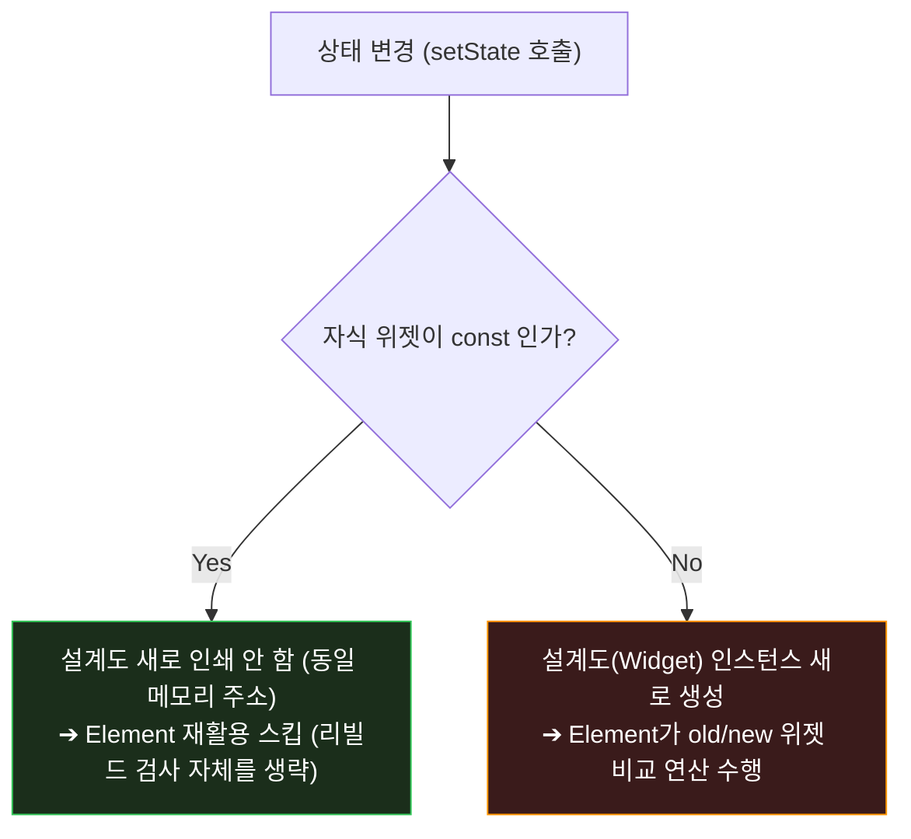

# 세 가지 트리와 const 최적화 🌲

Flutter의 슬로건 중 하나는 **"초당 60~120 프레임의 부드러운 애니메이션을 보장한다"**는 것입니다. 모바일 화면에서 매초 120번씩 화면을 다시 그리려면 엄청난 계산이 수반되어야 할 텐데, 어떻게 기기 배터리를 보존하면서 이것이 가능할까요?

그 비밀은 Flutter 엔진이 내부적으로 관리하는 **세 가지 트리(The Three Trees)**와, 개발자가 코드 앞에 작성하는 **`const`** 키워드에 숨겨져 있습니다.

---

## 1. Flutter를 구성하는 세 가지 트리

Flutter는 위젯 코드를 분석하여 화면에 그릴 때, 역할을 세분화하여 세 개의 트리를 병렬로 유지합니다.



### 🧱 건축 현장 비유로 이해하기

1. **Widget Tree (설계도 / 청사진)**:
   * **특징**: 매우 가볍고, 값이 바뀌면 기존 설계도를 찢어버리고 **새로 설계도를 뽑아냅니다(Immutable)**. 설계도를 수십 번 새로 출력해도 종이 값(메모리 비용)은 거의 들지 않습니다.
2. **Element Tree (건축 감독관)**:
   * **특징**: 설계도와 실제 건물을 중개하는 영속적인 관리자입니다. 설계도가 매번 바뀌어도, 감독관은 현장을 떠나지 않고 뼈대(`BuildContext`의 실체)를 지키며 기존 건물을 재사용할지 부술지 판단합니다.
3. **RenderObject Tree (실제 건물 / 벽돌)**:
   * **특징**: 실제로 땅을 파고 벽돌을 올려 화면 크기(`Size`)를 계산하고 픽셀을 칠하는(`Paint`) 무거운 객체입니다. 이 단계는 연산 비용이 매우 비쌉니다.

---

## 🔄 트리 재활용 매커니즘 (Diffing)

화면이 리빌드될 때, Flutter는 화면 전체를 다 부수고 새로 짓지 않습니다. 
감독관(Element)은 이전 위젯과 새로 들어온 위젯의 **타입(RuntimeType)**과 **키(Key)**를 비교합니다 (`canUpdate` 함수).

```dart
// Flutter Framework 내부 canUpdate 메서드
static bool canUpdate(Widget oldWidget, Widget newWidget) {
  return oldWidget.runtimeType == newWidget.runtimeType 
      && oldWidget.key == newWidget.key;
}
```

* **동일한 경우 (True)**: 감독관은 무거운 RenderObject를 부수지 않고 재사용하며, 변경된 텍스트나 색상 정보만 RenderObject에 새로 덮어씌웁니다. (초고속 화면 갱신)
* **다른 경우 (False)**: 기존 엘리먼트와 RenderObject를 트리에서 파괴하고, 완전히 처음부터 새로 생성합니다. (비용 발생)

---

## ⚡ `const` 키워드가 성능을 끌어올리는 원리

우리는 위젯을 작성할 때 IDE로부터 "Prefer const with constant constructors" 라는 경고선을 자주 봅니다. 
단순히 보기 좋으라고 붙이는 것이 아닙니다. `const`는 **렌더링 파이프라인의 연산을 통째로 스킵하게 만드는 치트키**입니다.



### 1. 컴파일 타임 상수 등록
`const`로 선언된 위젯(예: `const SizedBox(height: 16)`)은 앱이 켜질 때 단 **한 번만 메모리에 생성**되고, 이후 리빌드가 아무리 많이 발생해도 동일한 메모리 주소를 가리킵니다.

### 2. Element Tree의 리빌드 조기 탈출 (Early Exit)
부모 위젯이 리빌드되어 자식들을 훑을 때, 자식 위젯의 메모리 주소가 이전과 완전히 동일하다면 엘리먼트는 **"설계도에 변화가 전혀 없음"을 100% 확신**합니다. 
따라서 `canUpdate` 검사 조차도 하지 않고 자식 위젯 하위의 모든 트리에 대한 **리빌드 처리를 즉시 스킵(Early Exit)**합니다.

### 🆚 코드 비교로 보는 const의 이점

#### ❌ 매번 무의미한 인스턴스를 찍어내는 코드
```dart
Widget build(BuildContext context) {
  return Column(
    children: [
      // 화면이 1초에 60번 빌드될 때마다 SizedBox 인스턴스가 60개 생성됨
      SizedBox(height: 20), 
      Text("결과"),
    ],
  );
}
```

####  불필요한 리빌드 검사를 전면 차단하는 최적화 코드
```dart
Widget build(BuildContext context) {
  return const Column( // 자식들 전체가 상수로 메모리에 박힘
    children: [
      SizedBox(height: 20), // 리빌드 시 0.0001초의 검사 시간조차 소모하지 않음
      Text("결과"),
    ],
  );
}
```

> [!TIP]
> **위젯 클래스 분리의 또 다른 이유**
> 거대한 단일 위젯 안에서 헬퍼 메서드(`_buildHeader()`)를 만들어 위젯을 쪼개면 `const`를 붙일 수 없습니다. 
> 하지만 독립된 `StatelessWidget` 클래스로 위젯을 분리하면 생성자에 `const`를 부여할 수 있게 되어, 리빌드 범위를 획기적으로 격리하고 성능 향상을 이끌어낼 수 있습니다.
