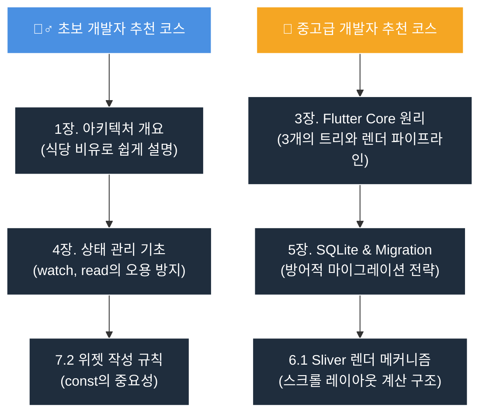

# WaWa Point Flutter 개발 가이드북 📘

안녕하세요! <strong>WaWa Point</strong> 프로젝트 개발 가이드북에 오신 것을 환영합니다.

이 문서는 단순한 소스코드 설명서를 넘어, Flutter 프레임워크와 Dart 언어의 심화 원리를 배우고 이를 실제 모바일 앱에 어떻게 깔끔하게 녹여낼 수 있는지 학습할 수 있도록 돕는 <strong>'실전 교과서'</strong>입니다.

---

## 🎯 왜 이 가이드북이 필요한가요?

모바일 앱 개발을 처음 시작하거나 Flutter 기초 단계를 지난 개발자분들은 다음과 같은 의문이 들기 마련입니다.
1. "코드들을 어떻게 배치해야 나중에 수정하기 편할까?" (아키텍처)
2. "상태 관리 패키지(Provider)를 쓸 때 불필요한 리렌더링을 줄여 성능을 올리려면 어떻게 해야 할까?" (성능 최적화)
3. "로컬 데이터베이스(SQLite)와 기존 백업 파일은 어떻게 안전하게 병합하고 업그레이드할까?" (데이터 무결성)

이 가이드북은 <strong>WaWa Point</strong>라는 실제 서비스 중인 포인트 관리 앱의 소스코드를 예시로 들어, 위 질문들에 대한 해답을 아주 자세하게(동작 원리, 도식화, Before/After 코드 비교 등) 제공합니다.

---

## 🧩 WaWa Point 프로젝트 소개

<strong>WaWa Point</strong>는 개인의 포인트 적립 내역과 지출 내역을 기록하는 재무 관리 앱입니다.

### 핵심 비즈니스 요구사항
- <strong>포인트 적립</strong>: 포인트 단위로 수입을 기록하며, 설정된 환산율에 따라 원화(KRW)로 자동 변환됩니다.
- <strong>포인트 사용</strong>: 원화(KRW) 단위로 지출을 기록하고 잔액을 차감합니다.
- <strong>실시간 잔액 관리</strong>: 포인트와 원화가 동시에 표시되며, 지출 시 잔액이 부족하면 거래가 차단되어야 합니다.
- <strong>백업 및 복원</strong>: 데이터를 JSON 파일 형태로 안전하게 내보내고, 언제든 복원할 수 있어야 합니다.

---

## 🛠️ 가이드북 로컬 빌드 및 실행 방법

이 책은 `mdbook`을 기반으로 빌드되어 오프라인 환경에서도 웹 브라우저를 통해 읽을 수 있습니다.

### 1. mdbook CLI 설치
가장 먼저 시스템에 `mdbook` 도구를 설치해야 합니다.

* <strong>macOS (Homebrew 사용)</strong>
  ```bash
  brew install mdbook
  ```
* <strong>Windows (Cargo 사용)</strong>
  ```bash
  cargo install mdbook
  ```

### 2. 로컬 웹 서버 실행
mdBook 디렉토리로 이동하여 실시간으로 변경 사항을 확인하며 책을 읽을 수 있는 로컬 개발 서버를 띄웁니다.

```bash
# mdbook 폴더가 있는 위치에서 실행
mdbook serve --open
```
위 명령어를 실행하면 웹 브라우저가 자동으로 열리며, 로컬 서버(`http://localhost:3000`)를 통해 가이드북을 탐색할 수 있습니다.

---

## 📖 학습 로드맵 및 다이어그램 가이드

이 책은 학습자의 숙련도에 따라 유연하게 읽어갈 수 있도록 아래와 같이 분류되어 있습니다.



각 장에는 개념을 명확히 이해할 수 있도록 <strong>Mermaid 다이어그램</strong>을 적극적으로 사용하였습니다. 
도식화된 화살표와 구조를 먼저 눈에 익히고 실제 소스코드 예시를 읽는 순서로 학습하시기를 권장합니다!
