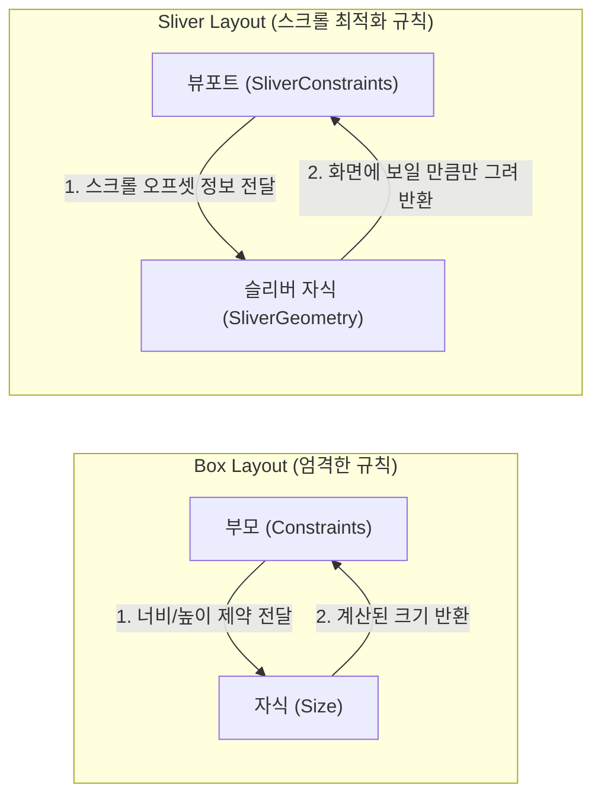

# Sliver 시스템 렌더링 최적화 📊

모바일 앱의 가장 흔한 레이아웃 중 하나는 바로 <strong>"무한 스크롤 리스트"</strong>입니다. 수백, 수천 개의 아이템이 든 리스트를 그냥 그리면 앱이 급격히 느려지거나 먹통이 될 수 있습니다. 

Flutter는 대규모 스크롤 영역을 극도로 최적화하여 렌더링하기 위해 <strong>Sliver(슬리버)</strong> 시스템을 제공합니다. 

이번 장에서는 Sliver의 렌더링 원리인 <strong>Sliver Layout 프로토콜</strong>을 배우고, WaWa Point에서 사용된 레이아웃 구조를 분석합니다.

---

## 🧩 Sliver란 무엇인가요?

Sliver는 영어로 <strong>"조각(Slice)"</strong>이라는 뜻입니다. 즉, 전체 스크롤 뷰 화면 내에서 <strong>자신의 크기와 스크롤 비율에 맞춰 유동적으로 변화하는 하나의 '스크롤 조각 위젯'</strong>들을 말합니다.


* <strong>SliverAppBar</strong>: 스크롤을 올리면 점점 줄어들거나 고정되는 다이내믹 앱바입니다.
* <strong>SliverToBoxAdapter</strong>: `Padding`, `Container` 같은 일반 Box 레이아웃 위젯을 Sliver 전용 스크롤 뷰포트 내부에 끼워 넣기 위한 변환 래퍼입니다.
* <strong>SliverList</strong>: 스크롤되는 영역 내부에서 사용자 화면에 보이는 영역(Viewport)만큼만 동적으로 아이템을 생성하여 렌더링하는 리스트입니다.

---

## ⚡ Box Layout vs Sliver Layout 프로토콜

일반 위젯은 <strong>Box Layout 프로토콜</strong>로 동작하는 반면, 스크롤 영역은 <strong>Sliver Layout 프로토콜</strong>로 동작합니다. 이 차이가 렌더링 최적화의 핵심입니다.



### 🆚 프로토콜 비교

* <strong>Box Layout 프로토콜 (`Constraints ➔ Size`)</strong>:
  * 부모 위젯이 자식에게 최대/최소 크기 제약을 주면, 자식은 자신의 물리적 크기(`Size`)를 결정해 부모에게 전달합니다. 
  * 이 방식은 스크롤 외부 영역의 모든 아이템 크기를 미리 다 계산해 두어야 하므로, 리스트가 길어지면 심각한 연산 지연이 발생합니다.
* <strong>Sliver Layout 프로토콜 (`SliverConstraints ➔ SliverGeometry`)</strong>:
  * 스크롤 뷰포트(부모)가 자식 슬리버에게 <strong>"현재 스크롤 위치(ScrollOffset)는 어디이고, 남은 화면 크기는 얼마인가?"</strong>라는 정보를 담은 `SliverConstraints`를 넘깁니다.
  * 자식 슬리버는 이 정보에 기반하여 <strong>"그렇다면 나는 화면에 노출되는 영역인 $X$픽셀 만큼만 물리적 영역(`SliverGeometry`)을 차지해서 그리겠다"</strong>라고 반응합니다. 
  * 즉, 화면 밖의 보이지 않는 위젯들은 레이아웃 계산과 페인트 단계를 완전히 생략하여 메모리를 아낍니다.

---

## 🛠️ WaWa Point 실전 프로젝트 분석: CustomScrollView

WaWa Point의 메인 화면인 [dashboard_screen.dart](file:///Volumes/Development/Projects/Flutter/WaWa%20Point/wawapoint_flutter/lib/src/ui/screens/dashboard_screen.dart)는 Sliver 시스템을 사용하여 부드러운 스크롤을 구현하고 있습니다.

### 📍 실제 슬리버 레이아웃 구성 코드
```dart
@override
Widget build(BuildContext context) {
  return Scaffold(
    body: SafeArea(
      // 전체 스크롤 뷰포트를 선언합니다.
      child: CustomScrollView(
        slivers: [
          // 1. 스크롤 시 화면 상단으로 자연스럽게 접히는 AppBar
          const SliverAppBar(
            floating: true,
            title: Text('대시보드'),
          ),
          
          // 2. 일반 Box 위젯(BalanceCard)을 Sliver 공간에 채우기 위해 Adapter 사용
          SliverToBoxAdapter(
            child: Padding(
              padding: const EdgeInsets.all(16.0),
              child: _BalanceCard(vm: vm),
            ),
          ),
          
          // 3. Sliver Padding 아래에 가변 리스트 배치
          SliverPadding(
            padding: const EdgeInsets.symmetric(horizontal: 16.0),
            // SliverList: 대량의 내역 아이템을 화면 크기만큼만 동적으로 인스턴스화
            sliver: SliverList(
              delegate: SliverChildBuilderDelegate(
                (context, index) {
                  return TransactionTile(record: vm.records[index]);
                },
                childCount: vm.records.length,
              ),
            ),
          ),
        ],
      ),
    ),
  );
}
```

> [!TIP]
> <strong>SliverList vs ListView 성능 비교</strong>
> `ListView.builder` 도 내부적으로 슬리버(`SliverList`)를 감싸 만든 편의용 위젯입니다. 
> 다만, 상단에 배너 카드나 헤더가 있고 그 밑에 리스트가 이어지는 복잡한 구조일 때 `SingleChildScrollView` 안에 `ListView`를 중첩해 넣으면 <strong>"높이를 계산할 수 없다"는 에러(Vertical viewport was given unbounded height)</strong>가 납니다. 
> 이때 무리하게 `shrinkWrap: true` 옵션을 켜면 `ListView`가 최적화 메커니즘을 끄고 전체 아이템을 한 번에 메모리에 올리게 되어 성능이 붕괴합니다. 
> 복잡한 스크롤 레이아웃은 무조건 <strong>`CustomScrollView`와 `Sliver`들의 조합</strong>으로 짜는 것이 성능의 기본 정석입니다.
