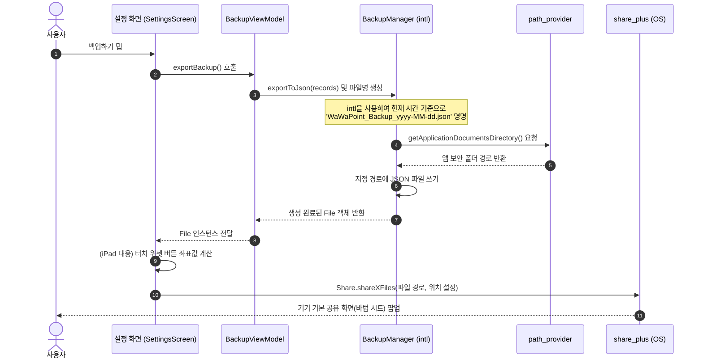
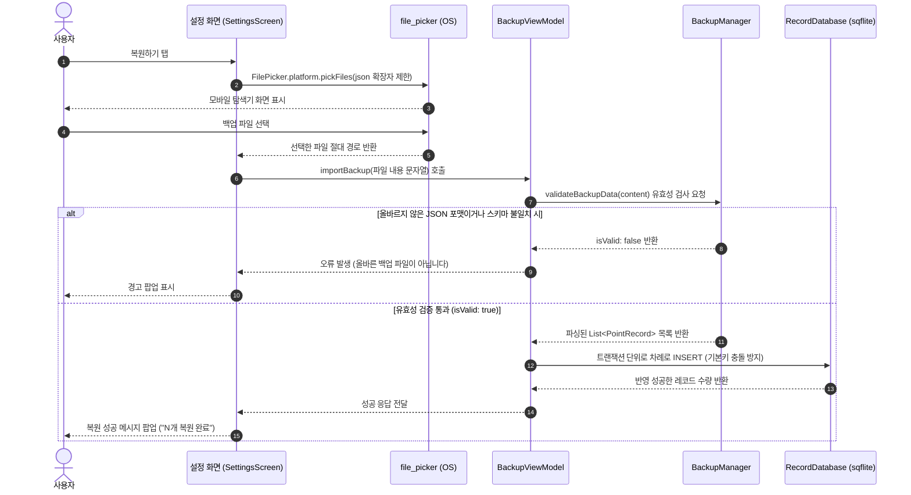

# 시스템 연동: 백업 및 공유 패키지 🔄

앱 내부의 로컬 데이터를 유실 없이 보관하기 위해서는 데이터를 하나의 단일 규격 파일(JSON)로 **내보내기(Export)**하고 필요할 때 다시 **가져와 복원(Import)**하는 백업 기능이 필수적입니다.

WaWa Point 프로젝트는 단순 데이터 쓰기를 넘어 모바일 OS의 보안 샌드박스를 뚫고 플랫폼 기능과 긴밀하게 연동해야 하는 복합 파이프라인을 구축했습니다. 이를 위해 5개의 라이브러리가 조화롭게 협력하고 있습니다.


---

## 1. 개별 패키지의 핵심 역할과 도입 이유 🛠️

### 💾 1.1. `path_provider` (로컬 보안 경로 조회)
안드로이드와 iOS는 보안 상의 이유로 앱이 OS 전체 폴더에 접근하는 것을 철저하게 통제합니다. 앱에 할당된 전용 보안 샌드박스 영역 내의 **앱 문서 디렉토리(Application Documents Directory)**에만 온전히 데이터를 쓰고 읽을 수 있습니다. 
* **도입 이유**: 플랫폼마다 다른 환경 변수를 추상화하여, 개발자가 동일한 Dart API(`getApplicationDocumentsDirectory()`)를 호출하면 디바이스에 맞는 올바른 디렉토리 절대 경로를 즉시 얻게 돕습니다.

### 📤 1.2. `share_plus` (시스템 공유 시트 연동)
생성된 백업 JSON 파일을 타인에게 카카오톡으로 전송하거나, 구글 드라이브/메일로 내보낼 수 있도록 운영체제(OS) 레벨의 공유 바텀 시트를 구동합니다.
* **도입 이유**: 디바이스에 탑재된 모든 공유 가능 애플리케이션 목록을 실시간으로 감지하고, 생성된 임시 파일 바이너리를 외부 앱에 전달하는 네이티브 바인딩을 Dart 수준에서 지원합니다.

### 📥 1.3. `file_picker` (시스템 탐색기 호출)
내 폰의 다운로드 폴더나 외부 저장소에 들어있는 백업용 JSON 파일을 사용자가 직접 눈으로 보고 선택할 수 있도록 파일 브라우저 UI를 띄웁니다.
* **도입 이유**: 파일 시스템의 탐색 기능을 직접 구현하지 않고, 모바일 OS가 안전하게 보증하는 순정 탐색기 창을 호출하여 확장자 필터링(`json`만 선택) 등을 적용한 파일을 손쉽게 반환받기 위함입니다.

### 🔑 1.4. `uuid` (고유값 발행)
데이터를 JSON으로 변환하여 백업하거나 복원할 때, 거래들 간에 중복된 ID가 있다면 데이터베이스의 기본키(Primary Key)가 충돌하여 복원이 실패하거나 기존 데이터가 덮어씌워져 유실될 위험이 있습니다.
* **도입 이유**: 데이터 모델 생성 시 고유한 식별자를 부여하기 위해 임의의 36자리 문자열 구조를 가진 `v4 UUID(Universally Unique Identifier)`를 발행하여 데이터 충돌을 완전 차단합니다.

### 📅 1.5. `intl` (파일명 포맷터)
백업 파일이 생성된 정확한 시간을 파일명에 포함(`WaWaPoint_Backup_2026-06-26_134000.json`)시켜 여러 개의 백업본을 사용자가 직관적으로 식별할 수 있도록 돕습니다.
* **도입 이유**: 숫자나 날짜 형식을 간결한 코드 형태로 포맷팅(`DateFormat('yyyy-MM-dd_HHmmss')`)하기에 가장 효율적입니다.

---

## 2. 전체 비즈니스 시퀀스 흐름도 🗺️

### 2.1. 데이터 내보내기 (Export & Share Flow)
사용자가 설정 화면에서 **[백업하기]** 버튼을 누른 순간부터 시스템에 공유 시트가 뜨기까지의 전 과정을 보여주는 다이어그램입니다.



---

### 2.2. 데이터 가져오기 (File Pick & Import Flow)
사용자가 **[복원하기]** 버튼을 눌러 JSON 파일을 선택하고 데이터베이스에 최종 병합하기까지의 흐름입니다.



---

## 3. 실전 개발자 가이드: iPad 공유창 크래시 주의보 🚨

초보 개발자들이 가장 흔히 저지르는 치명적인 결함 중 하나는 **안드로이드나 iPhone에서 완벽히 돌아가는 공유하기 코드가 iPad 실기기에서 실행하면 즉시 앱이 비정상 종료(Crash)**되는 현상입니다.

### 💥 원인
iOS 정책 상 화면이 넓은 iPad 환경에서는 공유창(`share_plus`)을 전체 화면의 바텀 시트로 띄우지 않고, 클릭한 버튼 위치에 풍선 모양의 팝오버(Popover) 형태로 띄워야 합니다. 이때 **공유창이 팝업될 위치 기준점(`sharePositionOrigin`)을 지정하지 않고 실행하면 즉시 크래시**가 터집니다.

### 💡 해결책: 렌더 객체 좌표 계산 후 전달
WaWa Point는 설정 화면([settings_screen.dart](file:///Volumes/Development/Projects/Flutter/WaWa%20Point/wawapoint_flutter/lib/src/ui/screens/settings_screen.dart))에서 이 위치 추적 로직을 안전하게 처리하였습니다.

```dart
// settings_screen.dart 내 _backup 메서드 일부
Future<void> _backup(BackupViewModel backupVM) async {
  try {
    final file = await backupVM.exportBackup();
    
    // ... 다이얼로그에서 공유하기를 선택했을 때 ...
    if (result == true) {
      if (!mounted) return;

      // 1. BuildContext로부터 이 위젯이 배치된 RenderBox 정보를 가져옵니다.
      final box = context.findRenderObject() as RenderBox?;
      
      // 2. 위젯의 글로벌 화면상 절대 위치 좌표와 위젯 크기를 합쳐 사각형(Rect) 영역을 구합니다.
      final rect = box != null
          ? box.localToGlobal(Offset.zero) & box.size
          : null;

      // 3. sharePositionOrigin 인자에 좌표 범위를 전달합니다.
      // 안드로이드/아이폰은 이 인자를 무시하며, 오직 iPad에서만 팝오버 정렬 기준으로 사용합니다.
      await Share.shareXFiles(
        [XFile(file.path)],
        sharePositionOrigin: rect,
      );
    }
  } catch (e) {
    if (mounted) _showError(e.toString());
  }
}
```
위 코드를 참고하면, 기종에 상관없이 어떠한 폼 팩터 디바이스에서도 백업 파일을 완벽하고 조화롭게 외부에 전송할 수 있습니다.
