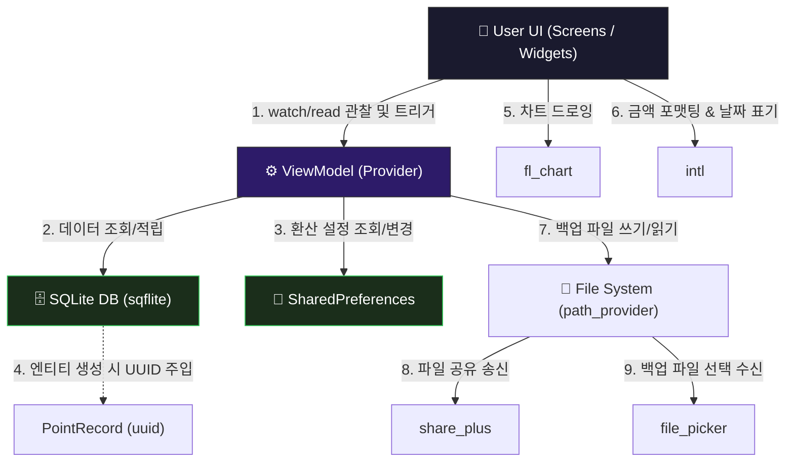

# 핵심 라이브러리 & 외부 패키지 활용 🛠️

모바일 애플리케이션을 밑바닥부터 혼자 만드는 것은 비효율적이며 때로는 불가능에 가깝습니다. 특히 로컬 데이터베이스 제어, 파일 공유 창 띄우기, 디바이스 문서 경로 조회와 같은 기능들은 안드로이드와 iOS가 전혀 다른 네이티브 API(Java/Kotlin vs Swift/Objective-C)를 제공합니다.

Flutter 생태계는 이를 해결하기 위해 수많은 **외부 라이브러리(패키지)**들을 제공합니다. 이번 장에서는 WaWa Point 프로젝트에 도입된 핵심 패키지들의 목록과 이를 사용하는 이유, 그리고 아키텍처 상에서의 역할 분담을 설명합니다.

---

## 1. 외부 라이브러리를 왜 사용하나요? 🤔

1. **생산성 향상 (Don't Reinvent the Wheel)**:
   데이터베이스 엔진(SQLite)이나 복잡한 수학적 연산이 필요한 차트(Chart) 그라데이션 렌더링 코드를 직접 구현하려면 수개월의 리소스가 낭비됩니다. 검증된 오픈소스를 활용하면 비즈니스 로직에만 100% 집중할 수 있습니다.
2. **크로스 플랫폼 추상화 (Single Codebase)**:
   안드로이드와 iOS의 파일 시스템 경로는 상이합니다. 외부 패키지를 사용하면 Dart 코드 단 한 줄만으로 각 플랫폼의 올바른 시스템 디렉토리를 찾아내거나 공유창을 띄울 수 있습니다.
3. **커뮤니티 검증에 따른 안정성**:
   수만 명의 글로벌 개발자들이 함께 테스트하고 유지보수하여 다채로운 예외 상황(Exception) 및 메모리 누수 버그 등이 지속적으로 수정된 안정적인 코드를 사용할 수 있습니다.

### 💡 초보자용 핵심 용어 사전 📖

이 장과 이후 문서들에서 자주 등장할 컴퓨터 공학(CS) 개념들을 쉬운 일상 비유로 먼저 짚고 넘어가겠습니다.

* **추상화 (Abstraction)**:
  * **어려운 정의**: 복잡한 자료, 모듈, 시스템 등으로부터 핵심적인 개념 또는 기능만을 간추려 내는 것.
  * **쉬운 비유**: **"자동차 가속 페달"**입니다. 우리는 엔진의 실린더 피스톤 운동이나 연료 분사량 계산을 몰라도, 발로 페달만 밟으면 차가 앞으로 나아갑니다. 복잡한 기계 장치는 숨겨두고 편리한 인터페이스(페달)만 노출하는 것이 바로 추상화입니다.
* **네이티브 바인딩 (Native Binding)**:
  * **어려운 정의**: 하나의 프로그래밍 언어로 작성된 프로그램이 다른 언어로 작성된 라이브러리나 OS 고유 기능을 호출할 수 있게 연결해주는 기술.
  * **쉬운 비유**: **"외국어 동시통역사"**입니다. Flutter 개발자(Dart 언어 사용)가 스마트폰 OS(안드로이드: Java/Kotlin, iOS: Swift/Objective-C)의 복잡한 네이티브 기능(알림창 띄우기, 공유 시트 열기 등)을 호출할 때, 중간에서 다리를 놓아 통역해 주는 역할을 합니다.
* **JSON 직렬화 (JSON Serialization)**:
  * **어려운 정의**: 메모리 상의 복잡한 데이터 객체 구조를 파일 저장이나 네트워크 전송이 가능한 평평한 텍스트 문자열(JSON 형식) 형태로 변환하는 과정.
  * **쉬운 비유**: **"레고 완성품을 택배 박스에 넣어 배송하기 위해 분해하는 과정"**입니다. 3차원으로 완성된 성 모양의 레고(객체)를 그대로 택배로 보낼 수는 없습니다. 조각조각 해체하여 평평하게 상자(JSON 텍스트)에 넣어서 보낸 뒤, 받는 쪽에서 설명서를 보고 다시 조립(역직렬화, Deserialization)하는 원리입니다.
* **관계형 데이터베이스 (Relational Database, RDB)**:
  * **어려운 정의**: 행(Row)과 열(Column)로 구성된 2차원 테이블 형태로 데이터를 관리하고, 테이블 간의 관계(Relation)를 정의하여 저장하는 시스템.
  * **쉬운 비유**: **"서로 연결된 엑셀 시트들"**입니다. 고객 정보를 담은 엑셀 시트(Table)와 그 고객의 구매 이력을 담은 엑셀 시트가 있을 때, '고객 일련번호'를 연결 고리 삼아 데이터를 서로 찾아볼 수 있게 정밀하게 구조화해 놓은 데이터 저장 공간입니다.

---

## 2. WaWa Point 핵심 패키지 9종 명세서 📋

WaWa Point의 [pubspec.yaml](file:///Volumes/Development/Projects/Flutter/WaWa%20Point/wawapoint_flutter/pubspec.yaml)에 등록된 9개의 주요 라이브러리 상세입니다. 초보자분들의 빠른 이해를 위해 **현실 세계의 도구에 빗대어** 요약했습니다.

| 패키지명 (Package) | 초보자용 3초 요약 💡 | 프로젝트 내 역할 (Role) | 도입 및 사용 이유 (Why) |
| :--- | :--- | :--- | :--- |
| **`provider`** | **"소식 전달용 무전기"** | 전역 상태(`PointViewModel` 등)를 공유하고 화면에 연동 | 깊은 위젯 트리 구조에서 데이터를 일일이 손으로 넘기지 않고 원하는 곳에서 바로 꺼내 쓰기 위해 사용 |
| **`sqflite`** | **"철제 파일 캐비닛"** | 사용자의 거래 기록(`PointRecord`)을 로컬 SQLite 데이터베이스에 표 형태로 보관 | 앱이 꺼지거나 폰이 재부팅되어도 대량의 정형 데이터를 안전하게 보관하기 위해 사용 |
| **`shared_preferences`** | **"포스트잇 메모지"** | 포인트 환산율(`pointToKRWRate`) 같은 간단한 설정값 저장 | 거대한 데이터베이스를 띄우지 않고, 단순한 설정값을 빠르게 기록하고 꺼내 쓰기 편리함 |
| **`fl_chart`** | **"미술 시간의 화판"** | 일별 지출 추이를 눈에 보이는 막대그래프(BarChart)로 렌더링 | 복잡한 숫자 나열 대신 시각적으로 트렌드를 한눈에 보여주어 사용자 경험(UX)을 올리기 위해 사용 |
| **`uuid`** | **"중복 없는 번호표 기계"** | 새로운 거래를 기록할 때마다 겹치지 않는 36자리 `id` 값을 자동 생성 | 백업 데이터를 합치거나 DB에 저장할 때 아이디가 겹쳐 기존 기록이 지워지는 대참사를 막기 위함 |
| **`intl`** | **"국제 번역기 & 디자이너"** | 날짜 포맷팅 및 돈 표기법(세 자릿수 컴마: `1,000원`) 적용 | 작성 국가나 설정 언어에 상관없이 사용자 기기 언어에 알맞게 숫자와 날짜 형식을 맞춰주기 위해 사용 |
| **`path_provider`** | **"보안 폴더를 알려주는 나침반"** | 데이터베이스 및 백업 파일의 물리적인 저장 경로 획득 | 안드로이드와 아이폰의 복잡하고 상이한 운영체제(OS) 내부 폴더 경로를 Dart 코드 한 줄로 찾기 위해 사용 |
| **`file_picker`** | **"네이티브 파일 선택 비서"** | 스마트폰 저장소에서 사용자가 백업 JSON 파일을 찾을 수 있게 도우미 역할 | 사용자가 기기 내부 파일을 직접 선택하고 가져올 수 있도록 OS 탐색기 창을 호출해 줌 |
| **`share_plus`** | **"우체국 택배 창구"** | 내보낸 백업 파일을 카카오톡, 이메일 등으로 전달하는 OS 공유창 구동 | 내가 만든 파일을 다른 앱이나 클라우드 공간으로 간편하게 전송할 수 있는 창구를 제공함 |

---

## 3. 라이브러리 간 상호작용 아키텍처 🗺️

WaWa Point 앱에서 사용자의 조작에 따라 각 라이브러리들이 어떻게 맞물려 흘러가는지 도식화한 구조입니다.

각 장에서는 위 라이브러리 중 데이터 시각화의 정수인 **`fl_chart`**와, 유기적인 백업/공유 파이프라인을 형성하는 **`시스템 연동 패키지군(path_provider, file_picker, share_plus, uuid, intl)`**의 상세 실전 코드를 뜯어보며 연동 원리를 완벽히 파악해 봅니다.
