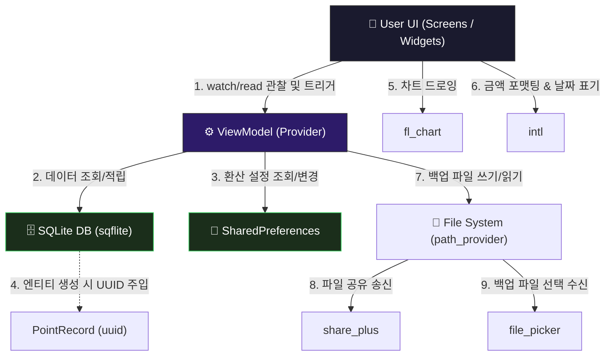

# 핵심 라이브러리 & 외부 패키지 활용 🛠️

모바일 애플리케이션을 밑바닥부터 혼자 만드는 것은 비효율적이며 때로는 불가능에 가깝습니다. 특히 로컬 데이터베이스 제어, 파일 공유 창 띄우기, 디바이스 문서 경로 조회와 같은 기능들은 안드로이드와 iOS가 전혀 다른 네이티브 API(Java/Kotlin vs Swift/Objective-C)를 제공합니다.

Flutter 생태계는 이를 해결하기 위해 수많은 **외부 라이브러리(패키지)**들을 제공합니다. 이번 장에서는 WaWa Point 프로젝트에 도입된 핵심 패키지들의 목록과 이를 사용하는 이유, 그리고 아키텍처 상에서의 역할 분담을 설명합니다.

---

## 1. 외부 라이브러리를 왜 사용하나요? 🤔

1. **생산성 향상 (Don't Reinvent the Wheel)**:
   데이터베이스 엔진(SQLite)이나 복잡한 수학적 연산이 필요한 차트(Chart) 그라데이션 렌더링 코드를 직접 구현하려면 수개월의 리소스가 낭비됩니다. 검증된 오픈소스를 활용하면 비즈니스 로직에만 100% 집중할 수 있습니다.
2. **크로스 플랫폼 추상화 (Single Codebase)**:
   안드로이드와 iOS의 파일 시스템 경로는 상이합니다. 외부 패키지를 사용하면 Dart 코드 단 한 줄만으로 각 플랫폼의 올바른 시스템 디렉토리를 찾아내거나 공유창을 띄울 수 있습니다.
3. **커뮤니티 검증에 따른 안정성**:
   수만 명의 글로벌 개발자들이 함께 테스트하고 유지보수하여 다채로운 예외 상황(Exception) 및 메모리 누수 버그 등이 지속적으로 수정된 안정적인 코드를 사용할 수 있습니다.

---

## 2. WaWa Point 핵심 패키지 9종 명세서 📋

WaWa Point의 [pubspec.yaml](file:///Volumes/Development/Projects/Flutter/WaWa%20Point/wawapoint_flutter/pubspec.yaml)에 등록된 9개의 주요 라이브러리 상세입니다.

| 패키지명 (Package) | 사용 분야 | 프로젝트 내 역할 (Role) | 도입 및 사용 이유 (Why) |
| :--- | :--- | :--- | :--- |
| **`provider`** | 상태 관리 | 전역 상태(`PointViewModel`, `BackupViewModel` 등)를 공유하고 위젯에 바인딩 | Flutter 공식 추천이자 가장 직관적이고 보편적인 InheritedWidget 기반 상태 관리 패키지 |
| **`sqflite`** | 로컬 데이터베이스 | 사용자의 거래 기록(`PointRecord`)을 로컬 SQLite 파일에 테이블 형태로 저장 및 쿼리 | 모바일 디바이스에 대량의 관계형 데이터를 안정적으로 영속 보관하기 위한 최적의 표준 DB 솔루션 |
| **`shared_preferences`** | 경량 설정 보관 | 포인트 환산율(`pointToKRWRate`)과 같은 소규모 Key-Value 형태의 설정값 저장 | 속도가 매우 빠르고 별도의 SQL 문 없이 간단한 원시값(int, double, bool)을 영속 저장하기 편리함 |
| **`fl_chart`** | 데이터 시각화 | 월별/주별 지출 추이를 막대그래프(BarChart)로 렌더링 | Flutter 환경에서 성능이 가장 뛰어나며 터치 피드백, 그라데이션 등 풍부한 커스터마이징을 제공 |
| **`uuid`** | 식별자 생성 | 새로운 거래 기록이 추가될 때마다 전 세계 유일한 36자리 `id` 값 생성 | 로컬 데이터베이스 저장 및 클라우드 백업 시 식별자가 중복되는 결함을 완전 차단 |
| **`intl`** | 다국어 & 포맷터 | 거래 날짜 포맷팅 및 화폐 단위 세 자릿수 컴마(`,`) 표시 (`NumberFormat`, `DateFormat`) | 날짜와 숫자를 사용자의 국가/지역 규격(Locale)에 맞게 안전하게 변경하기 위한 필수 코어 패키지 |
| **`path_provider`** | 파일 경로 조회 | 데이터베이스 파일 및 백업 JSON 파일의 디렉토리 경로 획득 | 플랫폼 독립적인 방식으로 안드로이드의 `App Documents` 폴더와 iOS의 `NSDocumentDirectory`를 동일하게 접근 가능 |
| **`file_picker`** | 파일 선택 UI | 로컬 저장소에 보관된 백업 JSON 파일을 탐색하고 불러오기 | 모바일 플랫폼 네이티브 파일 탐색기 화면을 호출하여 사용자가 백업 파일을 쉽게 선택하도록 유도 |
| **`share_plus`** | 데이터 전송/공유 | 생성된 백업 JSON 파일을 이메일, 카카오톡, 클라우드 등으로 내보내는 시스템 시트 구동 | 기기에 설치된 외부 공유 가능한 애플리케이션으로 임시 파일을 안전하게 전달하는 브릿지 역할 |

---

## 3. 라이브러리 간 상호작용 아키텍처 🗺️

WaWa Point 앱에서 사용자의 조작에 따라 각 라이브러리들이 어떻게 맞물려 흘러가는지 도식화한 구조입니다.

각 장에서는 위 라이브러리 중 데이터 시각화의 정수인 **`fl_chart`**와, 유기적인 백업/공유 파이프라인을 형성하는 **`시스템 연동 패키지군(path_provider, file_picker, share_plus, uuid, intl)`**의 상세 실전 코드를 뜯어보며 연동 원리를 완벽히 파악해 봅니다.
