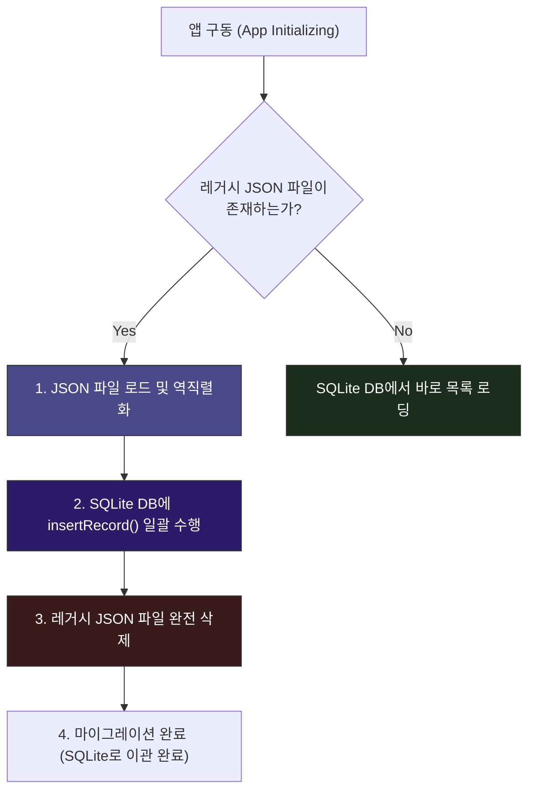

# JSON 백업 전략 및 마이그레이션 🛡️

모바일 앱의 수명 주기에서 가장 위험한 순간 중 하나는 **"앱 업데이트 시 기존 사용자 데이터를 잃어버리는 것"**입니다. 

WaWa Point 프로젝트는 안정적인 로컬 SQLite 데이터베이스를 도입하기 전에, 원시 JSON 파일에 거래 내역을 백업하던 레거시 버전이 있었습니다. 

이번 장에서는 왜 DB 파일 통째 백업 대신 JSON 포맷 백업을 채택했는지 설명하고, 구버전 JSON 데이터를 새로 도입된 SQLite 데이터베이스로 안전하게 이관하는 **마이그레이션 파이프라인(Migration Pipeline)**을 알아봅니다.

---

## ❓ 왜 .db 파일 대신 JSON 백업인가요?

로컬 SQLite의 데이터베이스 파일(`.db`)을 그대로 복사하여 백업하지 않고, 굳이 객체를 뜯어 JSON 텍스트 파일로 내보내는 데는 명확한 아키텍처적 이유가 있습니다.

1. **크로스 플랫폼 호환성 (iOS ➔ Android)**:
   * iOS와 Android는 SQLite DB 파일을 저장하는 내부 뼈대 및 인코딩 세부 구현이 미세하게 다를 수 있어, 직접 복사본 이관 시 깨짐 현상이 발생할 수 있습니다. 반면, JSON 텍스트는 표준 규격이므로 완벽하게 이식됩니다.
2. **스키마 변경 및 하위 호환성 (Schema Migration)**:
   * 데이터베이스 구조(Table Schema)가 버전업되어 필드가 추가되더라도, JSON 데이터는 유연하게 읽어와 기본값(Default Value)을 채우는 방식으로 유연한 파싱이 가능합니다.
3. **병합 및 정합성 검사 (Merge & Validation)**:
   * 복원하기 전에 JSON 데이터를 먼저 파싱하여 데이터가 위변조되었는지 미리 확인(Validation)할 수 있고, 기존 기기에 들어있는 거래 내역 뒤에 덧붙여 병합(Merge)하는 연산도 손쉽게 구현할 수 있습니다.

---

## 🛣️ 레거시 JSON ➔ SQLite 마이그레이션 파이프라인

앱이 최초 구동될 때, 리포지토리(`PointRepository`)는 기기 내부 저장소에 구버전 백업 파일(`wawapoint_records.json`)이 남아있는지 검사하여 마이그레이션을 자동으로 시작합니다.



---

## 🛠️ 실전 마이그레이션 소스코드 구현

이 이관 작업은 [point_repository.dart](file:///Volumes/Development/Projects/Flutter/WaWa%20Point/wawapoint_flutter/lib/src/repositories/point_repository.dart) 계층에서 SQLite 조회 전에 자동으로 수행됩니다.

### 📍 실제 마이그레이션 코드 예시
```dart
class PointRepository {
  final RecordDatabase _db = RecordDatabase.instance;

  Future<List<PointRecord>> getAllRecords() async {
    // 1. 데이터 조회 전에 반드시 레거시 이관 작업을 먼저 실행합니다.
    await _migrateLegacyJsonIfNeeded();
    return await _db.getAllRecords();
  }

  Future<void> _migrateLegacyJsonIfNeeded() async {
    try {
      final directory = await getApplicationDocumentsDirectory();
      // 옛날에 쓰던 로컬 JSON 파일 경로
      final legacyFile = File('${directory.path}/wawapoint_records.json');

      // 레거시 파일이 존재할 때만 이관 실행
      if (await legacyFile.exists()) {
        print("💡 레거시 JSON 데이터 발견! SQLite 마이그레이션을 시작합니다.");
        
        final jsonString = await legacyFile.readAsString();
        final Map<String, dynamic> jsonMap = jsonDecode(jsonString);
        final backupData = BackupData.fromJson(jsonMap);

        // SQLite DB에 일괄 저장
        for (var record in backupData.records) {
          await _db.insertRecord(record);
        }

        // ⚠️ 성공적으로 옮겼으므로 원본 JSON 파일을 지워 중복 이관을 원천 차단합니다.
        await legacyFile.delete();
        print("✅ 마이그레이션 완료! 원본 레거시 파일을 삭제했습니다.");
      }
    } catch (e) {
      // 🚨 파일 읽기 실패나 DB 오류 발생 시 로그를 남겨 추적합니다.
      print("❌ 마이그레이션 중 오류 발생: $e");
    }
  }
}
```

> [!CAUTION]
> **트랜잭션(Transaction) 또는 안전장치 확보 필수**
> 마이그레이션 수행 시 100건 중 50건만 SQLite에 들어가고 도중에 에러가 나서 중단되었는데 원본 JSON 파일을 지워버리면, 나머지 50건의 데이터는 영원히 소실되는 파괴적인 버그가 발생합니다.
> 따라서, 반드시 **DB 일괄 삽입이 완벽히 성공(Try 블록 완료)한 후에만 원본 레거시 파일을 삭제(`delete()`)하도록 코드를 작성**해야 데이터 증발 사고를 예방할 수 있습니다.
