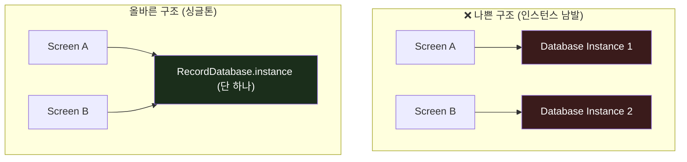

# SQLite 래퍼와 CRUD 패턴 💾

앱을 종료해도 데이터가 유지되게 하려면 모바일 기기의 내부 저장소에 이를 저장해야 합니다. 

WaWa Point 프로젝트는 구조화된 금융 데이터를 빠르고 정밀하게 쿼리할 수 있도록 로컬 데이터베이스 엔진인 <strong>SQLite</strong>(`sqflite` 패키지)를 사용합니다. 

이번 장에서는 데이터베이스 연결을 하나로 안전하게 유지하는 <strong>싱글톤(Singleton)</strong> 패턴과 안전한 <strong>CRUD(생성, 읽기, 수정, 삭제) 코드 패턴</strong>을 알아봅니다.

---

## 🔒 싱글톤 패턴과 지연 초기화 (Lazy Initialization)

데이터베이스를 열고 닫는 연산은 매우 무겁습니다. 또한 앱 여기저기서 데이터베이스 연결 파일을 무분별하게 여러 개 열면 데이터가 꼬이거나 파일 락(Lock) 에러가 발생합니다.

이를 방지하기 위해 데이터베이스 클래스는 <strong>반드시 앱 전체에서 딱 1개의 인스턴스만 갖도록 제약하는 싱글톤 패턴</strong>으로 구현해야 합니다.



### 📍 실제 데이터베이스 클래스 구조 ([record_database.dart](file:///Volumes/Development/Projects/Flutter/WaWa%20Point/wawapoint_flutter/lib/src/data/record_database.dart))

```dart
import 'package:sqflite/sqflite.dart';
import 'package:path/path.dart';

class RecordDatabase {
  // 1. static final로 오직 하나의 private 인스턴스를 클래스 메모리에 올립니다.
  static final RecordDatabase instance = RecordDatabase._init();

  // 2. 외부에서 생성자 호출을 차단하기 위해 private 명명 생성자를 만듭니다.
  RecordDatabase._init();

  static Database? _database;

  // 3. 지연 초기화(Lazy Initialization) Getter
  // 최초로 데이터베이스를 사용할 때만 연결 파일을 오픈하여 앱 초기 시작 시간을 단축합니다.
  Future<Database> get database async {
    if (_database != null) return _database!;
    _database = await _initDB('wawapoint.db');
    return _database!;
  }

  Future<Database> _initDB(String fileName) async {
    final dbPath = await getDatabasesPath();
    final path = join(dbPath, fileName);

    return await openDatabase(
      path,
      version: 1,
      onCreate: _createDB, // 최초 생성 시 테이블 스키마 실행
    );
  }

  Future _createDB(Database db, int version) async {
    await db.execute('''
      CREATE TABLE records (
        id TEXT PRIMARY KEY,
        date TEXT NOT NULL,
        type TEXT NOT NULL,
        amount REAL NOT NULL,
        reason TEXT NOT NULL,
        balanceAfter REAL NOT NULL
      )
    ''');
  }
}
```

---

## 🛠️ 안전한 SQLite CRUD 구현 패턴

데이터를 입출력할 때 직접 원시 문자열을 연결하여 쿼리를 작성하면(예: `where id = '` + `id` + `'`), 해커가 변수에 SQL 조작 구문을 삽입하는 <strong>SQL Injection</strong> 위협에 노출됩니다. 

이를 막기 위해 항상 플레이스홀더(`?`)와 `whereArgs` 배열을 사용해야 합니다.

```mermaid
graph LR
    Object["Dart 객체<br/>(PointRecord)"]
    Map["데이터 맵<br/>(Map&lt;String, dynamic&gt;)"]
    DB[("SQLite Table<br/>(records)")]

    Object -->|toJson()| Map -->|db.insert()| DB
    DB -->|db.query()| Map -->|fromJson()| Object
```

### 📍 1. 데이터 추가 (Create)
```dart
Future<void> insertRecord(PointRecord record) async {
  final db = await instance.database;
  await db.insert(
    'records',
    record.toJson(), // 객체를 Map으로 직렬화하여 삽입
    // 만약 이미 동일한 id가 존재하면 덮어씌웁니다. (안전장치)
    conflictAlgorithm: ConflictAlgorithm.replace, 
  );
}
```

### 📍 2. 데이터 조회 (Read)
```dart
Future<List<PointRecord>> getAllRecords() async {
  final db = await instance.database;
  // 최신 거래가 맨 위에 오도록 날짜 역순(DESC) 정렬
  final result = await db.query('records', orderBy: 'date DESC');
  
  // 조회한 Map 리스트를 다시 PointRecord 객체 리스트로 변환 (역직렬화)
  return result.map((json) => PointRecord.fromJson(json)).toList();
}
```

### 📍 3. 데이터 수정 (Update — SQL Injection 방지)
```dart
Future<void> updateRecord(PointRecord record) async {
  final db = await instance.database;
  await db.update(
    'records',
    record.toJson(),
    // ⚠️ id를 쿼리 문자열에 바로 넣지 않고 '?' 기호로 대체합니다.
    where: 'id = ?',
    // ? 자리에 들어갈 인자를 배열로 안전하게 전달합니다. (SQL Injection 방지)
    whereArgs: [record.id], 
  );
}
```

### 📍 4. 데이터 삭제 (Delete)
```dart
Future<void> deleteRecord(String id) async {
  final db = await instance.database;
  await db.delete(
    'records',
    where: 'id = ?',
    whereArgs: [id],
  );
}
```

> [!WARNING]
> <strong>초보자가 자주 놓치는 데이터 직렬화/역직렬화 오류</strong>
> SQLite는 복잡한 Dart 객체(`PointRecord`)나 `DateTime` 객체 타입을 이해하지 못합니다. 
> 반드시 데이터 삽입 시에는 객체를 `Map<String, dynamic>` 형태로 바꿔서 넘겨주고, `DateTime`은 `.toIso8601String()`을 호출해 텍스트 형태로 변환하여 집어넣어야 합니다. 
> 읽어올 때 역시 파싱에 실패하면 화면 전체가 에러 레이아웃으로 변하니, `fromJson` 파트에서는 반드시 예외 처리에 신경 써야 합니다.
