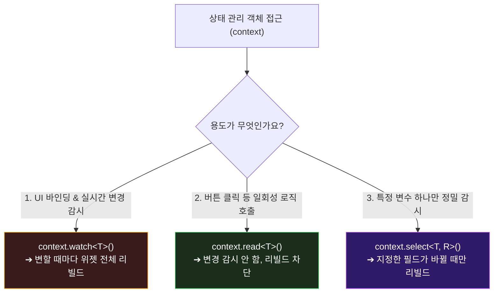
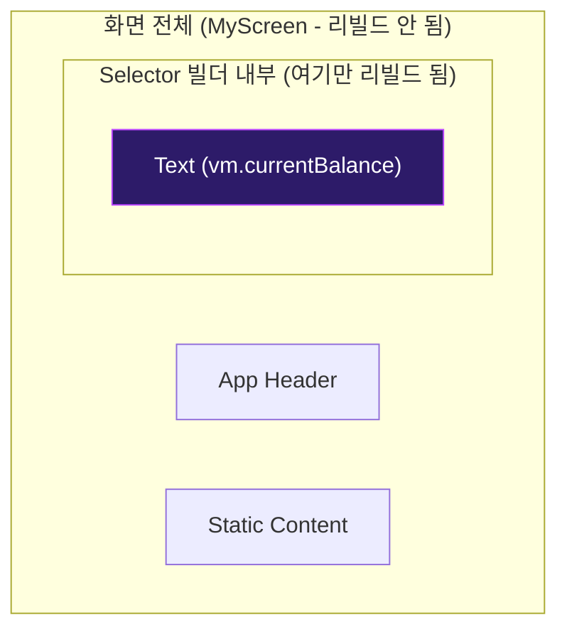

# Provider 상태 관리 최적화 📡

Flutter 앱을 개발할 때 화면이 늘어나고 비즈니스 로직이 복잡해질수록, 위젯 깊은 곳까지 일일이 데이터를 전달하는 일(Prop Drilling)은 지옥이 됩니다. 

이를 해결하기 위해 등장한 <strong>Provider</strong>는 상태 객체를 트리 상단에 띄우고 아래의 필요한 위젯들만 쏙쏙 골라 구독할 수 있게 돕는 가장 대중적인 상태 관리 패키지입니다.

하지만 제대로 사용하지 않으면 사소한 데이터 변경 하나 때문에 화면 전체의 수만 개 위젯이 다시 그려지는 대참사가 발생합니다. 이번 장에서는 Provider의 핵심 접근 API와 리빌드 최적화 요령을 살펴봅니다.

---

## 🔍 Provider 세 가지 접근 API 한눈에 보기

개발자가 `BuildContext`를 통해 Provider(ViewModel)에 접근하는 방법은 크게 3가지가 있습니다.



### 🆚 API 비교 및 사용 지침

| API | 동작 방식 | 주요 사용처 | 금지된 사용처 |
| :--- | :--- | :--- | :--- |
| <strong>`context.watch<T>()`</strong> | 대상의 데이터가 바뀌면 이 메서드가 포함된 <strong>위젯 전체를 다시 빌드</strong>합니다. | `build` 메서드 안에서 전체 화면을 갱신해야 하는 데이터를 읽을 때 | `initState()`, 클릭 이벤트 핸들러 내부 |
| <strong>`context.read<T>()`</strong> | 대상 데이터를 읽어오기만 하며, 데이터가 바뀌어도 <strong>리빌드를 일으키지 않습니다</strong>. | `onTap` 같은 이벤트 핸들러 함수 내부, `initState` 내 초기화 로직 | <strong>`build` 메서드 바로 밑에서 화면 출력용 데이터 읽기</strong> (값 갱신 불가!) |
| <strong>`context.select<T, R>()`</strong> | 위젯 전체 필드 중 <strong>특정 프로퍼티 `R`만 관찰</strong>하여 해당 값만 변경될 때 리빌드합니다. | 거대한 뷰모델의 특정 일부 정보(예: `isLoading`)만 갱신하는 텍스트나 로딩 위젯 | - |

---

## ⚡ Selector 위젯을 활용한 정밀 렌더링 최적화

`context.select` 보다 한층 더 렌더링 스코프(범위)를 좁게 통제하고 싶을 때 <strong>`Selector` 위젯</strong>을 사용합니다. 
`Selector`는 특정 데이터 속성이 변할 때 오직 그 하위 빌더(`builder`) 내부의 위젯만을 타깃 리빌드합니다.



### 📍 실전 최적화 예시 코드
```dart
// MyScreen 위젯은 리빌드되지 않고, 오직 Selector 내부의 Text만 갱신됩니다.
@override
Widget build(BuildContext context) {
  return Scaffold(
    body: Column(
      children: [
        const HeaderWidget(), // 리빌드 대상 제외 (const)
        const Description(),  // 리빌드 대상 제외 (const)
        
        // 정밀 타깃 갱신
        Selector<PointViewModel, double>(
          // 1. 관찰할 속성을 콕 집어 명시 (currentBalance가 변경될 때만 트리거)
          selector: (context, vm) => vm.currentBalance,
          // 2. 바뀐 값(balance)을 받아서 그 부위만 빌드
          builder: (context, balance, child) {
            return Text(
              "현재 잔액: $balance 원",
              style: const TextStyle(fontSize: 24),
            );
          },
        ),
      ],
    ),
  );
}
```

---

## 🛠️ WaWa Point 실전 프로젝트 분석: watch vs read

WaWa Point의 [dashboard_screen.dart](file:///Volumes/Development/Projects/Flutter/WaWa%20Point/wawapoint_flutter/lib/src/ui/screens/dashboard_screen.dart) 및 입력 폼에서는 상황에 맞춰 `watch`와 `read`를 엄격하게 나누어 씁니다.

### 📍 1. 사용자의 실시간 잔액 표시 (watch)
```dart
// build 내부에서 데이터를 가져와 화면에 그려줘야 하므로 watch를 사용합니다.
// PointViewModel에서 notifyListeners()가 날아오면 이 위젯은 다시 리빌드됩니다.
@override
Widget build(BuildContext context) {
  final pointVM = context.watch<PointViewModel>();
  return Text(pointVM.formattedBalance);
}
```

### 📍 2. 데이터 저장 버튼 이벤트 처리 (read)
```dart
// 사용자가 탭했을 때 단발성으로 저장을 요청하므로 read를 사용합니다.
// 뷰모델 데이터가 변경되더라도 저장 버튼 위젯 자체가 리빌드되는 것을 완벽히 방어합니다.
Widget build(BuildContext context) {
  return ElevatedButton(
    onPressed: () async {
      // ⚠️ read는 비동기 클릭 핸들러 안에서 안전하게 사용됩니다.
      final pointVM = context.read<PointViewModel>();
      await pointVM.addPointIncome(10, "적립금");
    },
    child: const Text("적립"),
  );
}
```

> [!WARNING]
> <strong>초보자가 가장 많이 범하는 2대 Provider 버그!</strong>
> 1. <strong>버그 1: `build` 메서드 안에 `context.read` 도배하기</strong>
>    "리빌드가 안 일어나니 성능 향상이 되겠지?" 라며 build 안에 `read`를 써두면, 데이터가 바뀌어도 화면이 전혀 업데이트되지 않아 앱이 멈춘 것처럼 보입니다.
> 2. <strong>버그 2: 클릭 리스너(`onPressed`)에 `context.watch` 넣기</strong>
>    `initState`나 클릭 콜백 함수 내부에 `watch`를 사용하면 "watch를 이 위치에서 호출하면 안 된다"는 에러 경고를 내뿜으며 앱이 비정상 종료됩니다.
