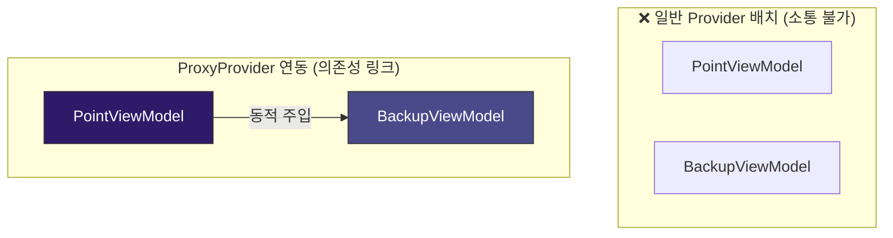
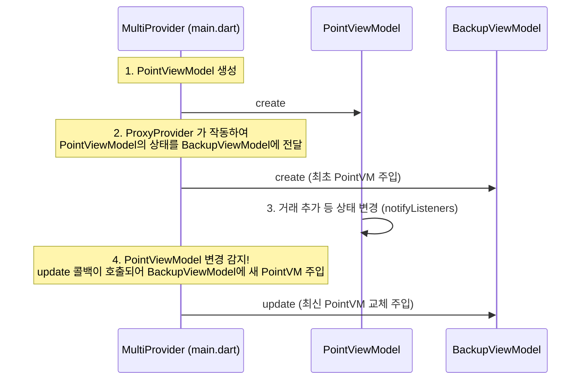

# ProxyProvider 의존성 주입 🔌

앱이 조금만 커져도 <strong>"ViewModel A의 데이터가 변경되었을 때, ViewModel B의 값도 알아서 동기화되어야 하는 상황"</strong>이 빈번하게 발생합니다.

예를 들어, WaWa Point에서는 사용자가 백업 파일을 복원하여 데이터가 통째로 바뀌었을 때, 복원 기능 담당인 `BackupViewModel`이 변경 사실을 메인 데이터 담당인 `PointViewModel`에게 갱신 지시를 내려주어야 합니다.

이처럼 <strong>하나의 Provider가 다른 Provider의 상태(State)에 의존하고 있을 때</strong> 유용하게 쓰이는 도구가 바로 <strong>ProxyProvider</strong>입니다.

---

## 🧩 왜 일반 Provider로는 부족할까요?

일반 `ChangeNotifierProvider`들은 위젯 트리 상에 병렬로 위치하기 때문에 서로의 존재를 모릅니다.



만약 `BackupViewModel`이 생성 시점에만 `PointViewModel`을 한 번 인스턴스로 전달받고 끝난다면, 앱이 구동되는 중간에 `PointViewModel` 내부에서 변경된 거래 내역 정보가 `BackupViewModel`에 실시간으로 동기화되지 않는 심각한 싱크(Sync) 오류가 발생합니다.

---

## 🛠️ WaWa Point 실전 프로젝트 분석

WaWa Point는 `MultiProvider` 구조에서 <strong>`ChangeNotifierProxyProvider`</strong>를 활용하여 `PointViewModel`의 최신 인스턴스를 `BackupViewModel`로 계속 갱신 주입해 줍니다.



### 1. MultiProvider 등록 코드 ([main.dart](file:///Volumes/Development/Projects/Flutter/WaWa%20Point/wawapoint_flutter/lib/main.dart))

```dart
MultiProvider(
  providers: [
    // 1. 의존성의 원천이 되는 핵심 ViewModel을 먼저 등록합니다.
    ChangeNotifierProvider<PointViewModel>(
      create: (context) => PointViewModel(PointRepository()),
    ),
    
    // 2. PointViewModel을 주입받아 작동하는 BackupViewModel을 등록합니다.
    ChangeNotifierProxyProvider<PointViewModel, BackupViewModel>(
      // create: 최초 1회 BackupViewModel을 생성할 때 PointViewModel의 인스턴스를 주입합니다.
      create: (context) => BackupViewModel(context.read<PointViewModel>()),
      
      // update: PointViewModel에 어떤 변경사항(notifyListeners)이 일어날 때마다 호출됩니다.
      // 뷰모델 간의 다리(Bridge) 역할을 하여 항상 최신의 PointViewModel을 수신하게 보장합니다.
      update: (context, pointVM, prevBackupVM) {
        if (prevBackupVM == null) {
          return BackupViewModel(pointVM);
        }
        // 기존 BackupViewModel의 참조 PointViewModel을 업데이트
        return prevBackupVM..updatePointViewModel(pointVM);
      },
    ),
  ],
  child: const MyApp(),
)
```

### 2. 의존성을 받는 ViewModel 코드 ([backup_view_model.dart](file:///Volumes/Development/Projects/Flutter/WaWa%20Point/wawapoint_flutter/lib/src/providers/backup_view_model.dart))

```dart
class BackupViewModel extends ChangeNotifier {
  // 의존하고 있는 PointViewModel을 private 변수로 보관합니다.
  PointViewModel _pointViewModel;

  BackupViewModel(this._pointViewModel);

  // ProxyProvider의 update 콜백에 의해 실시간으로 최신 인스턴스가 주입되는 통로입니다.
  void updatePointViewModel(PointViewModel pointVM) {
    _pointViewModel = pointVM;
  }

  // 📍 실전 활용: 백업 데이터 복원 처리
  Future<void> restoreBackup(String fileContent) async {
    // 1. 데이터 파싱 및 정합성 검사...
    // 2. SQLite 데이터 삽입 완료...
    
    // 3. 복원이 완전히 끝났으므로, PointViewModel에게 DB에서 데이터 재로드를 지시합니다.
    // ProxyProvider 덕분에 항상 올바른 PointViewModel 인스턴스를 참조하고 있음이 보장됩니다.
    await _pointViewModel.loadRecords(); 
  }
}
```

> [!IMPORTANT]
> <strong>ProxyProvider 작성 시 지켜야 할 기본 룰</strong>
> 1. `MultiProvider` 리스트 내에서 <strong>의존 관계의 기준이 되는 클래스(`PointViewModel`)가 먼저 정의</strong>되어 있어야 합니다. 그 밑에 의존하는 자식 클래스(`BackupViewModel`)가 와야 자식을 만들 때 부모의 인스턴스를 찾아 주입할 수 있습니다.
> 2. `update` 콜백은 단순히 인스턴스를 전달하는 공간이어야 합니다. `update` 내부에서 새로운 비즈니스 데이터 연산을 실행하여 상태 변경(`notifyListeners`)을 일으키면 무한 루프가 발생하므로 주의해야 합니다.
