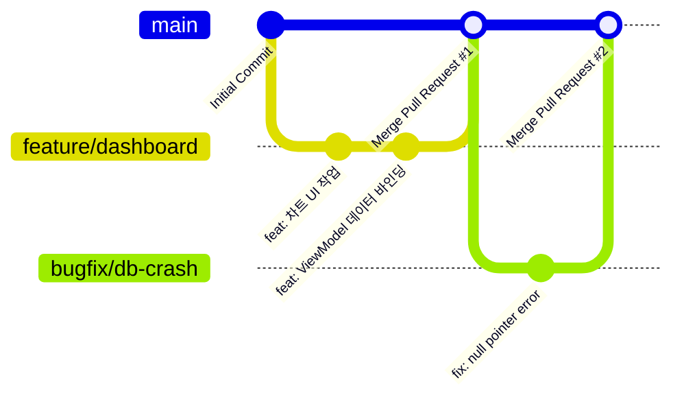

# Git 커밋 & 브랜치 전략 🌿

여러 명의 개발자가 하나의 프로젝트를 같이 작업할 때, 소스코드 저장소(Git Repository)가 엉망진창으로 꼬이는 것을 방지하기 위해 엄격한 **커밋 규칙**과 **브랜치 흐름 모델**을 지켜야 합니다.

WaWa Point 프로젝트는 글로벌 표준 규격인 **Conventional Commits**와 효율적인 브랜치 전략을 사용합니다.

---

## 🧭 Conventional Commits 커밋 규격

커밋 메시지는 다음 형식의 규칙을 지켜 한 줄로 간결히 작성합니다.

`타입(선택사항_범위): 커밋_설명`

### 📍 대표적인 7대 타입 (Commit Types)

* **`feat` (Feature)**:
  * **설명**: 새로운 비즈니스 기능의 개발 및 추가
  * **예시**: `feat(dashboard): 대시보드 지출 내역 차트 추가`
* **`fix` (Bug Fix)**:
  * **설명**: 오작동이나 예외 에러 버그 해결
  * **예시**: `fix(db): SQLite 인서트 시 중복 키 충돌 에러 수정`
* **`refactor` (Refactoring)**:
  * **설명**: 성능 향상이나 구조 개선을 위한 코드 정리 (기능 동작 변화 없음)
  * **예시**: `refactor(viewmodel): PointViewModel 비대화 방지를 위한 로직 분리`
* **`style` (Formatting)**:
  * **설명**: 포맷터 정렬, 세미콜론 수정, 변수명 변경 등 (실제 비즈니스 로직 영향 없음)
  * **예시**: `style(formatting): 스타일 가이드에 맞춘 trailing comma 추가`
* **`docs` (Documentation)**:
  * **설명**: 마크다운 파일, 문서, 주석의 작성 및 수정
  * **예시**: `docs(mdbook): 8장 스타일 가이드 목차 추가`
* **`test` (Test Code)**:
  * **설명**: 유닛 테스트나 UI 테스트 코드의 추가 및 수정
  * **예시**: `test(model): PointRecord 직렬화 역직렬화 유닛 테스트 구현`
* **`chore` (Maintenance)**:
  * **설명**: 빌드 설정 수정, `pubspec.yaml` 패키지 추가/변경 등
  * **예시**: `chore(package): fl_chart 패키지 버전 최신화`

---

## 🌿 약식 Git Flow 브랜치 전략

WaWa Point는 프로젝트의 안정적인 배포와 병렬 개발을 지원하기 위해 다음 세 부류의 브랜치만을 엄격히 나누어 운영합니다.

### 1. `main` 브랜치
* **역할**: 프로덕션 배포가 항상 가능한 상태를 유지하는 **최상위 안정 브랜치**입니다. 
* **규칙**: 개발자가 직접 `main` 브랜치에 코드를 밀어 넣는(Push) 일은 절대 없어야 합니다. 오직 `feature`나 `bugfix` 개발 완료 후 코드 리뷰를 거친 풀 리퀘스트(PR) 병합으로만 수정할 수 있습니다.

### 2. `feature/기능명` 브랜치
* **역할**: 새로운 기능 개발을 진행하는 **작업 전용 임시 브랜치**입니다.
* **예시**: `feature/history-filter`, `feature/sqlite-storage`
* **규칙**: 기능 구현이 완전히 완료되어 로컬 테스트를 통과하면 `main` 브랜치로 병합 요청을 날리고 삭제합니다.

### 3. `bugfix/버그명` 브랜치
* **역할**: 운영 중이거나 개발 테스트 중에 발견된 급박한 오류/버그를 해결하는 **긴급 패치 브랜치**입니다.
* **예시**: `bugfix/json-parse-crash`

---

## 💡 초보자를 위한 팁: 의미 있는 단위로 커밋 쪼개기

> [!TIP]
> **하루 작업 분량을 한 번에 커밋하지 마세요!**
> "오늘의 삽질 일기"처럼 수십 개의 파일 수정을 `feat: 하루 작업 끝`이라는 단 하나의 커밋으로 묶어 올리면, 나중에 특정 기능에서 버그가 발견되었을 때 어떤 파일의 어떤 줄 때문에 에러가 생겼는지 추적하는 것이 거의 불가능해집니다.
> **"하나의 파일 세트 혹은 하나의 최소 실행 기능 단위"**로 쪼개어 자주 커밋하는 습관을 들이세요. 
> 예를 들어, `PointRecord Model 개발 ➔ 커밋`, `Database Schema 추가 ➔ 커밋`, `ViewModel 연동 ➔ 커밋` 순으로 쪼개서 점진적으로 빌드해 나가는 것이 협업의 지름길입니다.
