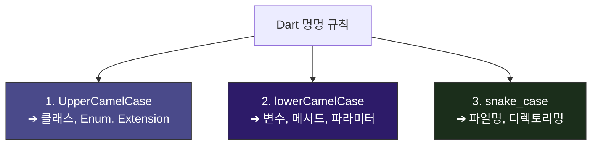

# 명명 규칙 및 private 캡슐화 🎨

동료 개발자가 작성한 코드를 읽을 때 파일명, 변수명, 클래스명이 자기 마음대로 적혀 있다면 로직을 파악하는 데 엄청난 피로감이 동반됩니다. 

WaWa Point 프로젝트는 Dart 공식 코딩 규칙([Effective Dart](https://dart.dev/guides/language/effective-dart))을 바탕으로 한 명명 규칙을 철저하게 고수하고 있습니다. 

이번 장에서는 3대 명명 규칙과 데이터 오염을 완벽히 방어하는 **private 캡슐화**에 대해 배웁니다.

---

## 📐 Dart의 3대 명명 규칙 (Naming Conventions)



### 1. `UpperCamelCase` (첫 글자 대문자)
* **대상**: 클래스(Class), 열거형(Enum), 확장(Extension), 타입 정의(Typedef)
* **예시**: `PointViewModel`, `TransactionType`, `TimePeriodExt`

### 2. `lowerCamelCase` (첫 글자 소문자, 단어 경계 대문자)
* **대상**: 변수명, 메서드(함수)명, 매개변수(Parameter)명, 로컬 상수
* **예시**: `currentBalance`, `loadRecords()`, `defaultPadding = 16.0`

### 3. `snake_case` (모두 소문자, 언더바로 연결)
* **대상**: 파일 이름(파일명), 디렉토리(폴더) 이름, 패키지 라이브러리명
* **예시**: `dashboard_screen.dart`, `point_repository.dart`
* **⚠️ 금지**: `DashboardScreen.dart` 또는 `point-repository.dart` 형태로 파일명을 생성해서는 안 됩니다.

---

## 🔒 Private 식별자 (`_`)를 사용한 상태 은닉 (Encapsulation)

객체지향 설계에서 가장 중요한 원칙 중 하나는 **"내부 상태는 나만 변경하고 외부에는 읽기 전용으로 제공한다"**는 것입니다. 

만약 외부(View)에서 ViewModel의 핵심 리스트를 직접 지우거나 변경할 수 있다면 데이터 정합성이 순식간에 무너집니다. Dart는 변수나 클래스명 앞에 **언더바(`_`)**를 붙이면 자동으로 **해당 파일 내부에서만 접근 가능한 `private` 성질**을 가지게 됩니다.

```mermaid
graph LR
    View["View (외부 화면)"]
    subgraph "PointViewModel (캡슐화)"
        State["_records (private 상태 변수)<br/>- 외부 수정 불가"]
        Getter["records (public Getter)<br/>- 읽기 전용으로만 반환"]
    end

    View -->|1. 읽기 요청| Getter -->|2. 데이터 맵핑| View
    View -.->|3. 직접 수정 시도 (에러!)| State

    style State fill:#3A1B1B,stroke:#333,color:#fff
    style Getter fill:#1B2E1B,stroke:#333,color:#fff
```

### 🆚 캡슐화 Before vs After

#### ❌ 상태 오염 위험에 노출된 코드 (Bad)
```dart
class PointViewModel extends ChangeNotifier {
  // 언더바가 없어 외부(View)에서 직접 이 리스트에 접근하여 데이터를 망가뜨릴 수 있음
  List<PointRecord> records = []; 
}

// 외부에서의 오용 예시
void main() {
  final vm = PointViewModel();
  // ⚠️ 뷰모델의 규칙(notifyListeners)을 무시하고 데이터를 강제 삭제함
  // 이로 인해 UI는 새로고침 되지 않고 데이터만 망가지는 버그 유발!
  vm.records.clear(); 
}
```

####  안전하게 은닉된 상태 관리 코드 (Good)
```dart
class PointViewModel extends ChangeNotifier {
  // 1. 내부 상태 변수는 private(_)으로 감추어 외부 접근 차단
  List<PointRecord> _records = [];

  // 2. 외부에서는 오직 읽기 전용(List.unmodifiable) Getter를 통해서만 데이터에 접근 가능
  List<PointRecord> get records => List.unmodifiable(_records);
  
  // 3. 상태 변경은 오직 명확하게 약속된 퍼블릭 메서드로만 제어
  void addRecord(PointRecord record) {
    _records.add(record);
    notifyListeners(); // UI 자동 갱신 보장
  }
}
```

> [!IMPORTANT]
> **List.unmodifiable()의 마법**
> 그냥 `get records => _records;` 라고 쓰면 외부에서 `vm.records.add()`나 `vm.records.removeAt()`을 호출했을 때 여전히 내부 리스트가 변경되어 버립니다(참조 전달 때문). 
> 완벽한 방어적 프로그래밍을 위해 Getter를 반환할 때 **`List.unmodifiable(_records)`**로 포장하여 반환하세요. 
> 이렇게 하면 외부에서 컬렉션을 임의로 조작하려고 시도할 때 컴파일러나 런타임이 에러를 뿜으며 조작을 원천 차단해 줍니다.
