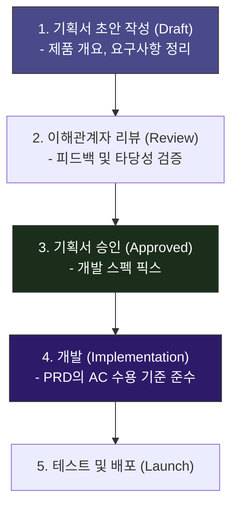

# 기획서 (PRD) 작성 가이드 📝

코드를 짜다 보면 "이 기능은 원래 지출 한도 경고 창이 떴어야 했나?", "화면 뒤로 가기를 누르면 데이터가 자동 저장되어야 하나?" 처럼 기능 상세 스펙이 헷갈리는 순간이 찾아옵니다.

이를 방지하기 위해 코딩에 착수하기 전, 개발할 범위와 상세 기능을 미리 설계도로 명시해 두는 약속 문서를 <strong>PRD(Product Requirements Document, 제품 요구사항 명세서)</strong>라고 합니다.

이번 장에서는 기획서의 작성 단계와 WaWa Point의 PRD 템플릿 작성 노하우를 알아봅니다.

---

## 🧭 PRD 승인 및 개발 수명 주기

잘 작성된 기획서는 무의미한 기능 변경이나 개발 도중의 요구사항 번복(Scope Creep)을 전면 차단합니다.

---

## 🧩 PRD 템플릿의 핵심 구성 요소 및 작성 팁

WaWa Point의 [PRD_TEMPLATE.md](file:///Volumes/Development/Projects/Flutter/WaWa%20Point/wawapoint_flutter/docs/PRD_TEMPLATE.md)는 초보 기획자 및 개발자도 누수 없는 기획서를 만들 수 있도록 정교한 목차를 제공합니다.

### 1. 목표 및 성공 지표 (KPI / KSI)
* <strong>내용</strong>: 앱이 성공적이라는 것을 무엇으로 입증할지 정량적인 수치로 적습니다.
* <strong>꿀팁</strong>: 단순히 "사람들이 많이 쓰는 앱" 보다는 <strong>"앱 리텐션 50% 이상"</strong>, <strong>"Firebase Crashlytics 기준 크래시율 0.1% 미만"</strong> 처럼 데이터로 증명할 수 있는 정밀한 성공 조건(Metric)을 세우는 것이 좋습니다.

### 2. 타겟 사용자 & 사용 시나리오
* <strong>내용</strong>: 이 기능을 가장 절실히 쓸 대상(Persona)을 묘사하고, 하루 일과 중 이 앱을 어떻게 사용하는지 시나리오를 작성합니다.
* <strong>꿀팁</strong>: "20대 청년" 보다는 <strong>"신용카드를 처음 발급받아 지출을 1,000원 단위로 통제하고 싶지만 복잡한 가계부는 쓰기 싫은 24세 대학생 이영희"</strong>처럼 인물을 아주 구체적으로 가상 정의하면 개발 시 버튼 배치나 텍스트 톤앤매너를 결정하기 수월해집니다.

### 3. 기능 요구사항 (Feature List)
* <strong>내용</strong>: 구현해야 할 각 스펙에 유일 번호(F01, F02 등)를 매기고 구체적인 동작 방식을 적습니다.
* <strong>우선순위</strong>:
  * `P0` (Must Have): MVP(최소 기능 제품) 구현에 필수인 핵심 가치 (예: 포인트 저장)
  * `P1` (Should Have): 없으면 매우 불편한 중요 기능 (예: 기간 필터링)
  * `P2` (Nice to Have): 있으면 좋지만 나중에 개발해도 무방한 마이너 기능 (예: 테마 변경)

> [!IMPORTANT]
> <strong>수용 기준 (Acceptance Criteria, AC) 작성하기</strong>
> 기능 상세 정의서 아래에는 항상 <strong>AC(수용 기준)</strong>라는 체크박스를 달아두어야 합니다.
> * `[ ]` 사용자가 포인트 입력란에 숫자가 아닌 문자를 입력하면 에러 가이드를 노출한다.
> * `[ ]` 잔액이 지출액보다 적으면 저장 버튼이 비활성화되거나 경고 팝업이 뜬다.
> 
> 이 체크박스들을 전부 완수했는지가 <strong>"기능 개발이 완전히 완료되었음"을 선언하는 공통의 최종 합격 기준</strong>이 됩니다.

### 4. 비기능 요구사항
* <strong>내용</strong>: 눈에 보이는 UI 버튼은 아니지만 사용성 향상에 절대적인 물리적 스펙을 명시합니다.
* <strong>예시</strong>:
  * <strong>성능</strong>: 앱 콜드 스타트 3초 이내, 로컬 DB 응답속도 100ms 이내
  * <strong>보안</strong>: 민감 데이터의 암호화 처리 방안
  * <strong>플랫폼</strong>: 지원할 최소 OS 버전 범위 (예: iOS 15+, Android API 26+)

---

## 🛠️ 실전 활용 안내

새로운 사이드 프로젝트나 신규 피처 개발에 들어갈 때는 언제든지 제공되는 [PRD_TEMPLATE.md](file:///Volumes/Development/Projects/Flutter/WaWa%20Point/wawapoint_flutter/docs/PRD_TEMPLATE.md) 파일을 복사하여 작성해 보세요. 

개발 중간에 기획이 흔들리고 코드가 산으로 가는 개발 피로를 획기적으로 줄여줄 것입니다!
