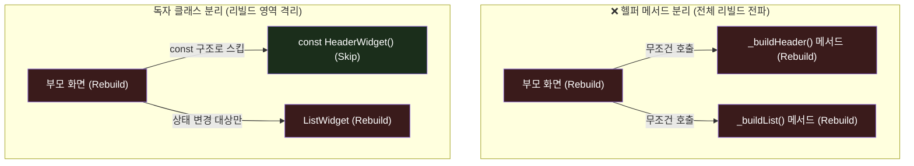

# 위젯 분리 및 성능 최적화 🖼️

Flutter UI 개발을 하다 보면 단일 위젯 클래스의 `build()` 메서드 길이가 500줄이 넘어가는 현상을 흔히 겪습니다. 가독성이 나빠지니 개발자들은 코드를 쪼개기 시작합니다.

이때 가장 쉽다는 이유로 **"위젯을 반환하는 헬퍼 메서드(`Widget _buildHeader()`)로 쪼개는 것"**은 성능 최적화의 관점에서 최악의 결과를 부를 수 있는 **안티패턴**입니다.

이번 장에서는 왜 헬퍼 메서드가 아닌 **독립된 Widget 클래스로 코드를 분리**해야 하는지 알아봅니다.

---

## 🆚 헬퍼 메서드 vs 클래스 분리의 리빌드 스코프 비교

위젯 변경(예: 카운터 숫자 갱신)으로 화면의 일부 영역에 리빌드가 발생했을 때, 두 분리 방식에 따라 렌더링 엔진이 다시 그리는 범위가 완전히 다릅니다.



### 1. 헬퍼 메서드 분리가 나쁜 이유
* `Widget _buildHeader()` 와 같이 함수 형태로 쪼갠 위젯은 부모 위젯의 `build()` 함수가 재시작될 때 그냥 **일반 Dart 함수 호출**로 인식됩니다.
* 따라서 부모 화면이 갱신되면, 헤더와 리스트가 바뀔 필요가 없더라도 **무조건 함수가 다시 실행되어 인스턴스를 재생성**합니다. `const` 키워드도 붙일 수 없습니다.

### 2. 별도 Widget 클래스로 분리해야 하는 이유
* 독립된 클래스(`class HeaderWidget extends StatelessWidget`)로 선언하면 생성자 앞에 **`const`**를 명시할 수 있습니다.
* 이렇게 하면 부모 화면이 아무리 지우고 새로 그려져도, Flutter 엔진은 메모리 주소가 완벽히 동일한 `HeaderWidget` 내부의 `build` 함수 호출을 **통째로 통과(Skip)**시킵니다. 
* 상태가 변경되어 빌드를 실행하는 타깃 위젯만 아주 정밀하게 새로 그릴 수 있게 됩니다.

---

## 🆚 Before vs After: 코드 비교

### ❌ 헬퍼 메서드로 쪼갠 안티패턴 코드 (Bad)
```dart
class CounterScreen extends StatefulWidget {
  const CounterScreen({super.key});
  @override
  State<CounterScreen> createState() => _CounterScreenState();
}

class _CounterScreenState extends State<CounterScreen> {
  int _counter = 0;

  @override
  Widget build(BuildContext context) {
    return Scaffold(
      body: Column(
        children: [
          _buildStaticHeader(), // ⚠️ 버튼 누를 때마다 이 함수가 매번 헛돌며 실행됨
          Text('$_counter'),
          ElevatedButton(
            onPressed: () => setState(() => _counter++),
            child: const Text('증가'),
          ),
        ],
      ),
    );
  }

  // 헬퍼 메서드 분리 방식 (const 지정 불가)
  Widget _buildStaticHeader() {
    return const Padding(
      padding: EdgeInsets.all(16.0),
      child: Text("절대 바뀌지 않는 고정 헤더 제목"),
    );
  }
}
```

###  별도의 StatelessWidget 클래스로 분리한 코드 (Good)
```dart
class CounterScreen extends StatefulWidget {
  const CounterScreen({super.key});
  @override
  State<CounterScreen> createState() => _CounterScreenState();
}

class _CounterScreenState extends State<CounterScreen> {
  int _counter = 0;

  @override
  Widget build(BuildContext context) {
    return Scaffold(
      body: Column(
        children: [
          const StaticHeaderWidget(), //  const 선언으로 리빌드 스코프 전면 격리
          Text('$_counter'),
          ElevatedButton(
            onPressed: () => setState(() => _counter++),
            child: const Text('증가'),
          ),
        ],
      ),
    );
  }
}

// 1. 별도의 독자적인 위젯 클래스로 분리합니다.
class StaticHeaderWidget extends StatelessWidget {
  // 2. const 생성자를 열어둡니다.
  const StaticHeaderWidget({super.key});

  @override
  Widget build(BuildContext context) {
    return const Padding(
      padding: EdgeInsets.all(16.0),
      child: Text("절대 바뀌지 않는 고정 헤더 제목"),
    );
  }
}
```

> [!TIP]
> **또 다른 부가 효과: BuildContext의 정교함**
> 독립된 클래스로 분리하면 해당 위젯만의 고유한 `BuildContext`를 따로 가지게 됩니다. 
> 뷰포트 크기를 조회(`MediaQuery.of`)하거나 테마를 찾을 때(`Theme.of`), 화면 최상단 부모의 거대한 Context가 아니라 쪼개진 자식 위젯의 작고 한정된 Context를 탐색하므로 검색 속도 및 반응 구조가 훨씬 빨라집니다.
